# Cailyx — Complete Frontend Design Plan

Version 1.0 · 16 September 2026 · Review begun 15 September · Design proposal, not an implementation or tool-selection approval

## Contents

1. [Scope, evidence, and product direction](#1-scope-evidence-and-product-direction)
2. [Users, permissions, and information architecture](#2-users-permissions-and-information-architecture)
3. [Visual and interaction design](#3-visual-and-interaction-design)
4. [Complete screen inventory](#4-complete-screen-inventory)
5. [End-to-end user flows](#5-end-to-end-user-flows)
6. [Report design and metric definitions](#6-report-design-and-metric-definitions)
7. [Team operating model and cadence](#7-team-operating-model-and-cadence)
8. [State models](#8-state-models)
9. [Sequence diagrams](#9-sequence-diagrams)
10. [Frontend architecture and API behavior](#10-frontend-architecture-and-api-behavior)
11. [Build sequence and acceptance criteria](#11-build-sequence-and-acceptance-criteria)
12. [Appendix A — Backend work required](#appendix-a--backend-work-required)
13. [Appendix B — Documentation and implementation differences](#appendix-b--documentation-and-implementation-differences)
14. [Appendix C — Every endpoint mapped to the design](#appendix-c--every-endpoint-mapped-to-the-design)

## 1. Scope, evidence, and product direction

### 1.1 What this plan covers

A fresh product design for Cailyx: a service platform that helps a client understand its visibility in search and AI answers, agree on priorities, get improvements delivered, and see evidence of progress. It includes the operator workspace, client portal, administration, commercial handoff, research, content production, reporting, recurring delivery, and failures/recovery.

No existing frontend application, component, route, screenshot, or frontend flow/design document was used as a design reference. Backend documentation sometimes mentions old UI names; those names and flows are not adopted here. All routes and screen IDs below are new proposals.

The primary requested artifact is this file. No application code, dependencies, credentials, running jobs, or external accounts were changed. Existing uncommitted backend changes were treated as part of the inspected source and left intact.

### 1.2 Evidence and completeness


| Source                                          | How it was used                                                                                                                                                                                                        |
| ----------------------------------------------- | ---------------------------------------------------------------------------------------------------------------------------------------------------------------------------------------------------------------------- |
| [OpenAPI](backend/openapi.json)                 | Reviewed all **261 method/path operations across 44 tag groups**, including request fields, query parameters, response descriptions, and access metadata.                                                              |
| [HTML API documentation](backend/api-docs.html) | Inspected its reference content and loader. It fetches `openapi.json`; it is another presentation of the same contract, not an independent API specification.                                                          |
| [Backend source](backend/src/modules)           | Compared controller routes with OpenAPI; inspected auth/guards, client/portal, Google, onboarding, audits, measurement/scoring, reports, generation, scheduling, and relevant DTOs/types/services to resolve behavior. |
| [Database schema](backend/prisma/schema.prisma) | Checked persisted entities, relations, status fields, and whether proposed workflows have durable storage. No database/customer records were queried.                                                                  |
| [Project guidelines](AGENTS.md)                 | Preserve modular architecture; analysis and tool approval precede implementation.                                                                                                                                      |


Static controller extraction found **264 application operations**: all 261 OpenAPI operations exist, plus **three competitor-candidate operations absent from OpenAPI**. Appendix C accounts for all 264. Swagger-serving infrastructure such as `/api/docs` is not a business screen/operation in this count.

This is a static contract/source review. It does not claim that all endpoints were exercised live, that vendors are configured, or that deployment behavior matches the working copy. Important source/spec differences are in Appendix B. Implementation must verify actual responses before binding UI fields.

### 1.3 Capability legend

- **E — Existing:** an API/source capability supports the core behavior, subject to integration testing.
- **P — Partial:** useful behavior exists, but the full proposed screen/workflow needs an extension. Each missing part points to an Appendix A gap ID.
- **N — New:** no supporting business endpoint/storage found. This is a design requirement, not a claim of implementation.
- **F — Frontend-only:** navigation, presentation, local filtering, copy/download of already accessible data, or other behavior requiring no new business endpoint.

“Existing” does not mean enabled for clients. Almost every business API is operator-only; only five `/api/portal/*` operations are currently available to client users.

### 1.4 Product structure

Design around this service loop:

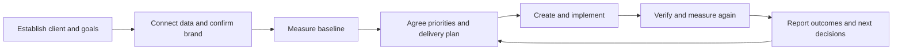
```mermaid
flowchart LR
    A[Establish client and goals] --> B[Connect data and confirm brand]
    B --> C[Measure baseline]
    C --> D[Agree priorities and delivery plan]
    D --> E[Create and implement]
    E --> F[Verify and measure again]
    F --> G[Report outcomes and next decisions]
    G --> D
```


The client should always be able to answer:

1. What are we trying to improve, and why?
2. What did Cailyx actually measure? When, and with what limitations?
3. What is the team doing now? Who owns it, and when is it due?
4. What do you need from me?
5. What shipped, what changed, and what happens next?

The operator should be able to answer those questions for one client and across the entire portfolio.

### 1.5 Separate concepts that must not become one score


| Concept             | Meaning                                                                                    | Current support                                                                                    |
| ------------------- | ------------------------------------------------------------------------------------------ | -------------------------------------------------------------------------------------------------- |
| Client status       | Commercial relationship: active, paused, churned                                           | E: `Client.status`; manually set, not inferred from metrics                                        |
| Project lifecycle   | Scorecard, diagnostic, sprint, retainer, archived                                          | E: project lifecycle API; not the same as onboarding                                               |
| Onboarding progress | Which initial pipeline stage is running                                                    | P: current stage/status; no durable step ledger, completion checklist, or safe full-pipeline retry |
| Evidence coverage   | Which agreed measurements succeeded, failed, or remain unmeasured                          | P: can derive portions from run results; full baseline manifest missing                            |
| Delivery progress   | Agreed work completed and verified within a delivery cycle                                 | N: tasks, cycles, milestones, assignments, verification ledger                                     |
| Outcome             | Changes in visibility, organic performance, earned mentions, or validated business signals | P: many sources exist, unified comparable periods and client projections missing                   |


Never show a fabricated “78% complete” based on seven asynchronous stage names or a brand score. Show the named stage now; use a real checklist denominator only once it is persisted.

### 1.6 Assumptions for the proposed design

- Cailyx initially operates as one service organization serving many clients. Independent agencies/organizations and white-label tenancy would be an additional product decision.
- One client can own multiple website/domain projects. A project is the unit of audit evidence and execution.
- The backend currently makes `Project.domain` globally unique. A second client cannot independently onboard the same domain without a domain/ownership-model extension.
- Operators run expensive research and approve delivery. Clients connect their own data, supply facts, approve work, and inspect approved results in the target experience.
- Client self-service signup, purchases, and scheduled publishing are target capabilities only where explicitly marked; the initial experience can be assisted by a delivery lead.
- Proposed weekly/monthly routines are operating defaults, not promises that the current scheduler performs them.
- No new vendor, paid library, or dependency is selected by this document. Use the established Next.js/TypeScript/Tailwind stack as the starting constraint; evaluate additional tools in approved module analysis before building.

## 2. Users, permissions, and information architecture

### 2.1 Personas and destinations


| User                          | Primary need                                      | Start destination          | Primary actions                                                        |
| ----------------------------- | ------------------------------------------------- | -------------------------- | ---------------------------------------------------------------------- |
| Client sponsor/owner          | Business progress, accountability, next decision  | Client Home                | See report; approve plan/budget; provide access; message lead          |
| Client marketing collaborator | Review copy and maintain brand accuracy           | Client Home / Approvals    | Comment, request revisions, supply facts, review content               |
| Client technical collaborator | Implement and verify technical changes            | Client Work detail         | Read implementation guidance; submit deployment evidence               |
| Delivery lead                 | Coordinate an engagement and protect quality      | Operations Today           | Triage clients, plan cycles, assign work, review reports               |
| Content specialist            | Produce accurate, useful content                  | My Work                    | Research, brief, generate, edit, fact-check, request approval          |
| Technical specialist          | Diagnose and resolve site issues                  | My Work                    | Audit, investigate page evidence, implement outside Cailyx, verify     |
| Outreach specialist           | Earn and maintain legitimate third-party mentions | My Work / Authority        | Qualify targets, track manual outreach, check placements               |
| Sales operator                | Qualify prospects and hand them into delivery     | Sales Pipeline             | Intake, scorecard, discovery math, report delivery, handoff            |
| Administrator                 | Operate the service organization                  | Portfolio / Administration | Manage clients/operators, permissions, integrations, workload, budgets |


The three client personas are proposed permission profiles. The current backend has only `type=client` with a client ID; it has no separate client-owner/editor/viewer roles. Existing operator roles are `admin`, `delivery-lead`, `content`, `technical`, `outreach`, and `sales`.

### 2.2 Current permissions versus intended policy

Current guard behavior is explicit: client users can access only routes marked `@ClientPortal`; operators cannot access those routes. All other authenticated routes allow every operator unless they have a role restriction. Admin passes all operator role checks. Client mutations are restricted to delivery-lead/admin; user administration and project deletion are admin-only. Most audit, generation, report visibility, claim approval, and rubric operations do **not** have specialist-role enforcement today.

Proposed policy:


| Capability               | Admin | Delivery lead        | Content           | Technical               | Outreach           | Sales                        | Client                                 |
| ------------------------ | ----- | -------------------- | ----------------- | ----------------------- | ------------------ | ---------------------------- | -------------------------------------- |
| View clients/projects    | All   | Assigned portfolio   | Assigned          | Assigned                | Assigned           | Sales scope                  | Own client only                        |
| Create/manage client     | Yes   | Yes                  | No                | No                      | No                 | Request handoff              | No                                     |
| Connect Google resource  | Yes   | Assigned project     | If delegated      | If delegated            | No                 | No                           | Own project, delegated role            |
| Run audits/research      | Yes   | Within budget        | Relevant research | Technical/SEO/AEO       | Authority research | Scorecard scope              | Request run                            |
| Edit delivery work       | Yes   | All assigned         | Own work          | Own work                | Own work           | Handoff work                 | Submit requested evidence              |
| Generate/edit content    | Yes   | Yes                  | Yes               | Technical guidance only | Outreach briefs    | No                           | Review approved-for-review version     |
| Approve claims/report    | Yes   | Designated reviewer  | Submit for review | Submit for review       | Submit for review  | No                           | Approve business release when required |
| Publish client report    | Yes   | Yes                  | No                | No                      | No                 | Deliver approved report only | Read                                   |
| Change service budgets   | Yes   | Within delegated cap | No                | No                      | No                 | Offer approved package       | Approve commercial change              |
| Manage operators/rubrics | Yes   | No                   | No                | No                      | No                 | No                           | No                                     |


Assigned-project access, delegated permissions, and release rights require **G02/G03/G05**. Hiding a button does not enforce this policy. Until backend enforcement exists, do not advertise specialist isolation or assigned-only access.

### 2.3 New navigation model

```text
Shared entry
  Sign in / Accept invitation / Recover access
  Public report or scorecard link

Operator workspace
  Today
  Clients
    Client overview / Projects / Messages / Access / Engagement
  My Work
  Team Calendar
  Reports
  Sales
  Administration
    People / Service connections / Rubrics / Budgets / Audit log

Within a project
  Overview
  Plan & Work
    Priorities / Roadmap / Cycle board / Calendar
  Research & Audits
    Website health / Search performance / AI visibility
    Brand & entities / Competitors / Keywords / Buyer research
  Content
    Opportunities / Briefs & drafts / Refreshes / Data assets
  Authority
    Discovery / Outreach / Backlinks / Mention health
  Reports
  Monitoring
  Connections & Settings

Client portal
  Home
  My Projects
    Overview / Plan / Results / Content / Connections
  Approvals
  Reports
  Messages
  Account
```

Global selectors: current workspace type, client (operators), project, and date/run context where supported. Client navigation never contains an all-clients selector. One-project clients land directly in that project's home context; multi-project clients see a concise portfolio first.

Use progressive disclosure: raw observations, engine configuration, costs, synthetic persona debates, and crawl logs live under research/evidence views. The client sees the conclusion and can expand the supporting evidence permitted by its release snapshot.

## 3. Visual and interaction design

### 3.1 Design direction

Create a calm, precise workspace that reads like a well-organized consulting engagement. Use generous spacing around decisions and denser tables for evidence. Emphasize the next action, the owner, and the date. Avoid decorating every API module as an autonomous agent; the `/agents` response is a capability summary, not proof of an always-running team.

```
Proposed visual tokens, to validate during implementation:
```


| Token                      | Value / behavior                                                                                                       |
| -------------------------- | ---------------------------------------------------------------------------------------------------------------------- |
| Canvas                     | `#F5F7FA`                                                                                                              |
| Surface / elevated surface | `#FFFFFF`; subtle shadow only for overlays                                                                             |
| Main text / secondary text | `#172033` / `#526075`                                                                                                  |
| Borders                    | `#DCE3EC`; use stronger contrast for essential input boundaries                                                        |
| Primary action             | `#2449C7`, white text                                                                                                  |
| Success                    | `#176B46` with pale green fill and text/icon label                                                                     |
| Warning                    | `#855A00` with pale amber fill and text/icon label                                                                     |
| Error / risk               | `#AD2838` with pale red fill and text/icon label                                                                       |
| Informational / unknown    | Blue information; neutral gray for unmeasured                                                                          |
| Type                       | System sans-serif initially; tabular numerals for metrics; system monospace for raw evidence                           |
| Scale                      | 12 metadata, 14 table/body, 16 reading body, 20 subsection, 28 page title, 36 selected KPI                             |
| Spacing                    | 4 px base; 8/12/16 within components; 24/32 between blocks; 48 between report sections                                 |
| Radius                     | 8 inputs, 12 cards, 16 dialogs; restrained pills for statuses                                                          |
| Layout                     | 240 px navigation, 64 px top bar, flexible 12-column main area; content max width 1440 px, report reading width 920 px |


Check contrast in actual combinations before release; the token list alone is not an accessibility certification. Dark mode can follow after the core experience; initial design must work without it.

### 3.2 Page anatomy

Every working page has: breadcrumb → title/context → one primary action → summary/status → tabs or filters → main content → contextual evidence/detail panel. Long documents get a sticky section index. Keep filters in the URL so copied links reproduce the same project/run view.

Client Home, desktop:

```text
┌──────────────────┬────────────────────────────────────────────────────┐
│ Cailyx           │ Acme / acme.example                  Messages  User│
│ Home             ├────────────────────────────────────────────────────┤
│ Projects         │ Your visibility program                            │
│ Approvals (2)    │ Current cycle: 1–14 Oct    Lead: Jordan             │
│ Reports          │ [Review 2 requests]                                 │
│ Messages         ├────────────────────────────┬───────────────────────┤
│ Account          │ Latest approved results    │ We need from you      │
│                  │ Score + coverage + date    │ Approve article       │
│                  │ Mention/citation rates     │ Confirm GSC property  │
│                  │ [Open September report]    │ Due dates and impact  │
│                  ├────────────────────────────┼───────────────────────┤
│                  │ This cycle                 │ Recently delivered    │
│                  │ Work, owner, due, status   │ Live URL + verified on│
│                  ├────────────────────────────┴───────────────────────┤
│                  │ Next review / latest message from delivery lead    │
└──────────────────┴────────────────────────────────────────────────────┘
```

The cycle, approval counts, and delivered-work widgets above require extensions. The initial supported client Home uses project status, latest report, and messages with equally clear empty states.

Operator Portfolio:

```text
┌──────────────────┬────────────────────────────────────────────────────┐
│ Today            │ Clients                              [+ Add client]│
│ Clients          │ [Search] [Owner] [Status] [Attention] [Saved view] │
│ My Work          ├────────────────────────────────────────────────────┤
│ Calendar         │ Client | Projects | Evidence | Delivery | Next step│
│ Reports          │ Acme   | 2        | Partial  | Blocked  | Access   │
│ Sales            │ North  | 1        | Current  | On track | Review   │
│ Administration   ├────────────────────────────────────────────────────┤
│                  │ Selected client panel: lead, open risks, latest    │
│                  │ report, projects, pending decisions, messages      │
└──────────────────┴────────────────────────────────────────────────────┘
```

Content detail/editor:

```text
┌───────────────────────────────────────────────────────────────────────┐
│ Project / Content / Article title     Revision 3   Saved  [Send to QA]│
├────────────────┬─────────────────────────────────┬────────────────────┤
│ Brief          │ Title / meta / slug             │ Checks             │
│ Target query   │                                 │ Claims & sources   │
│ Audience       │ Article editor / rendered view  │ Brand accuracy     │
│ Intent         │                                 │ Word count         │
│ Source gap     │ H2 / paragraph / FAQ            │ Links / schema     │
│ References     │                                 │ Comments / decision│
├────────────────┴─────────────────────────────────┴────────────────────┤
│ Revision history / review trail / handoff URL / verification evidence │
└───────────────────────────────────────────────────────────────────────┘
```

Persistent editing/revisions/review are **G09/G10**; existing generated content can initially be inspected and exported, with no misleading “Saved” indicator.

### 3.3 Shared components


| Component           | Required behavior                                                                                                          |
| ------------------- | -------------------------------------------------------------------------------------------------------------------------- |
| Metric tile         | Value + unit, window/run, source date, coverage, delta only when comparable, evidence link                                 |
| Evidence drawer     | Source URL/run, captured time, observed fact, interpretation, raw answer/check, confidence, related gap/work               |
| Run configurator    | Prerequisites, parameters, observed configuration availability, estimated requests/cost, explicit start                    |
| Run status strip    | Queued/running/partial/completed/failed; named stage, counts when provided, last successful data remains readable          |
| Scope banner        | Client, domain, market, project, run/version, report snapshot or live mode                                                 |
| Work row            | Deliverable, owner, due, status, blocker, linked evidence, next action                                                     |
| Approval card       | Exact version, requestor, reviewer, due date, decision requested, consequence of delay                                     |
| Provenance badge    | Measured / model interpretation / operator supplied / discovered candidate / derived / unmeasured                          |
| Data table          | Search, filter, sort, column visibility, keyboard access, empty/error states, row detail; server pagination when available |
| Confirmation dialog | Exact target, effect, scope, cost if known; explicit destructive wording                                                   |
| Coverage panel      | Expected versus successful checks; failed/deferred sources and why; optional next run action                               |
| Change comparison   | Before/after IDs and dates, absolute change, unit, methodology compatibility, relevant deployments                         |


### 3.4 Responsive and accessibility behavior

- Desktop ≥1200 px: full navigation and optional evidence panel. Tablet 768–1199 px: collapsible navigation, evidence in an overlay. Mobile <768 px: single column, compact project header, menu drawer, cards for work lists; data tables can scroll in a labeled region.
- Client mobile priorities: report reading, approval decisions, messages, connection status. Dense technical comparison/editor tools remain usable with stacked panels; do not require drag-and-drop.
- Keyboard support for every action; visible focus; skip link; semantic headings/tables; focus trapped in dialogs and returned to the invoker; status announcements without announcing each polling tick.
- Error summaries link to invalid form fields. Required fields are textual, not color-only. Chart tables provide the same information without relying on hover or color.
- Honor reduced-motion preference. Use brief transitions for overlays and state changes, no simulated progress animation implying measured completion.
- Date/time displays identify the timezone. Percentages use the correct unit; distinguish percentage points from relative percentage changes.
- Print reports with repeated section headings, unbroken evidence rows where possible, page numbers, and explicit snapshot/date context. Browser print is the initial PDF workaround; a generated PDF artifact is a separate feature.

### 3.5 Common states and copy


| State                                         | Design response                                                                                      |
| --------------------------------------------- | ---------------------------------------------------------------------------------------------------- |
| No projects                                   | Explain who creates one; operator “Add project”; client “Contact your lead”                          |
| Source never measured                         | “Not measured yet” with prerequisite/action, never a zero-score pass/fail claim                      |
| OAuth connected, resource unmapped            | “Choose the site/property for this project”                                                          |
| Credentials configured but runtime unverified | “Configured; last successful run unknown”                                                            |
| Partial audit                                 | Display successful evidence plus failed/deferred checks; never label the whole run healthy           |
| Run takes longer than expected                | Show last known state and safe leave/return; do not start a duplicate run automatically              |
| No reports                                    | “Your first report is being prepared” only when a run exists; otherwise “No report has been created” |
| Failed send                                   | Keep content, distinguish saved message/login/report from failed email delivery                      |
| Concurrent update                             | Preserve local draft, show changed server version, offer compare/reload after G09                    |
| Insufficient role                             | Explain restricted action and permitted path; do not repeatedly refresh on 403                       |
| No comparison baseline                        | “First measurement — a comparison will appear after a comparable run”                                |
| Stale source                                  | Show timestamp and agreed refresh expectation; staleness is not a failed result                      |


## 4. Complete screen inventory

The inventory below applies these reusable layout specifications in addition to §3's shared states and components:

| Screen family | Layout, decision hierarchy and interaction contract |
|---|---|
| Access forms (AU) | Centered narrow form; identity/context first, fields second, single submit; inline validation plus summary; preserve non-secret inputs after failure; mobile full-width. |
| Portfolio/libraries (OP02/OP10/OP14/SL02/CT02/RP01/CP11) | Title/action, summary strip, filter bar, sortable table; selected row opens routed detail; retain search/filter/scroll on return; destructive actions in row menu, not primary button. |
| Client/project overview (OP04/PJ01/CP01/CP03) | Context/lead/status, decision-needed panel, evidence/result cards, work commitments, recent report/message; each number links to its scoped evidence; unavailable target widgets remain absent or explicitly unavailable. |
| Onboarding/setup (OP03/OP06/OP07/CP04) | Step list with saved-state indicators, main form, right-hand scope/prerequisite summary; disclose the exact step that starts work; current progress screen uses named stages without invented ETA/percentage. |
| Connections (PJ03/PJ04/CP05) | Service cards show authorization, mapped resource and last tested read independently; selection dialog shows exact property/site identifier; disconnect flow presents known impact; manual profile URLs appear in a separate section. |
| Audit hubs (TA01/SE01/AE01/DP01/CO01/SP01) | Source/readiness strip, selected run and freshness, limited headline metrics, chart/table tabs, prioritized evidence; run configuration is a deliberate drawer/page, never triggered on tab load. |
| Run/evidence detail (TA02/TA03/SE02/AE03/AE04/EN02/JO02) | Sticky scope/run header, status or comparison pair, section index, evidence table, detail drawer; raw answer/check behind disclosure; copy URL/reproduction text with clear source. |
| Planning (PJ05–PJ10/OP11–OP13/CP06) | List is canonical accessible view; board/calendar are alternate views of the same persisted items; owner/due/status/dependency visible; changing schedule prompts effect on dependent work and budget. |
| Content (CT01–CT09/CP08) | Opportunity → brief → draft header; editor uses §3 wireframe; source/QA panel collapses on mobile; exact revision displayed during review; generated draft, external edit and published URL remain distinct. |
| Approvals (CT05/RP04/CP09/CP10) | Decision summary, exact artifact/version preview, change summary, evidence and discussion; sticky approve/request-changes actions with confirmation of scope; read-only after recorded decision. |
| Reports (RP03/CP12/PB01) | Reading-first layout, cover/period, executive opening, sticky section index, detailed/evidence tabs, print action; public sharing controls only for authorized operators; no operational vendor buttons in client report. |
| Conversations (OP09/CP13) | Client/project context, chronological thread, visible author type/time, optional project tag, persistent composer draft for current session; label operator messages visible to client; failed send stays retryable without pretending delivered. |
| Administration (OP15–OP21) | Settings sections by permission, explanation above high-impact actions, explicit save/test; no client-facing secrets/config hints; separate saved configuration from observed runtime health. |

Screen-specific fields/actions below override these templates; target-only controls require the listed backend gaps. This permits consistent implementation of all screen states without treating each endpoint as a separate navigation item.

Screen IDs are permanent cross-references for endpoint mapping and implementation tickets. Route prefixes: `/ops` operator workspace; `/client` client portal; `/p/:projectId` below means `/ops/projects/:projectId`. Detail drawers have shareable routes so browser back/forward and deep links work. “Core E; extras Gxx” means only the listed extras are unsupported.

### 4.1 Access and public surfaces


| ID   | Screen / proposed route                                           | Contents and actions                                                                                          | Support                                                                        |
| ---- | ----------------------------------------------------------------- | ------------------------------------------------------------------------------------------------------------- | ------------------------------------------------------------------------------ |
| AU01 | Sign in `/sign-in`                                                | Email/password, show password, submit, safe return destination, account-type routing, expired-session message | E; recovery links G01                                                          |
| AU02 | Accept invitation `/invite/:token`                                | Organization/client identity, invitation expiry, set password, accept terms if product requires them          | N G01/G02                                                                      |
| AU03 | Recover access `/recover` and `/reset/:token`                     | Email request, generic success, expiring reset, return to sign in                                             | N G01                                                                          |
| AU04 | First-login security `/welcome/security`                          | Replace temporary password; confirm name; recovery setup                                                      | N G01; temporary credential issue exists                                       |
| AU05 | Account & sessions `/account`                                     | Name, password change, active sessions, sign out everywhere, notification preferences                         | P: operator profile/logout E; G01/G08                                          |
| AU06 | Bootstrap administration `/setup`                                 | First admin credentials for controlled initial installation; no public operator signup after setup            | E via register; bootstrap-state discovery G01                                  |
| PB01 | Shared report `/shared/reports/:projectId/:slug`                  | Restricted/public resolution, executive/detailed HTML, source date, print                                     | E render; expiry/release G05                                                   |
| PB02 | Shared scorecard `/shared/scorecards/:projectId/:token`           | Score, coverage disclaimer, exactly three problems, clear CTA                                                 | E behind public-scorecard flag; public CTA capture G16                         |
| PB03 | Request diagnostic `/request-audit`                               | Domain, contact, intended goal, submission receipt                                                            | N public intake G16; operator intake exists                                    |
| PB04 | Checkout return `/checkout/result`                                | Pending/verified payment, purchased offer, next action                                                        | N verified entitlement G16; existing checkout-link generation is operator-side |
| PB05 | Error/access pages `/not-found`, `/access-denied`, `/unavailable` | Neutral unknown/private resource, session recovery, retry without duplicate writes                            | F                                                                              |


### 4.2 Operator portfolio, client management, and administration


| ID   | Screen / route                                                | Contents and primary actions                                                                            | Support                                                            |
| ---- | ------------------------------------------------------------- | ------------------------------------------------------------------------------------------------------- | ------------------------------------------------------------------ |
| OP01 | Today `/ops`                                                  | Assigned work, clients needing attention, failed runs, approvals, today's commitments                   | P: project/client/module reads; cross-client work G06/G07/G14      |
| OP02 | Clients `/ops/clients`                                        | Searchable client table, status, owner, project count, score provenance, open gaps, onboarding; create  | Core E; pagination/health/saved views G14                          |
| OP03 | Add client `/ops/clients/new`                                 | Client name, contact name/email, lead, internal notes; separate create from start-project step          | E; non-admin owner directory G03                                   |
| OP04 | Client overview `/ops/clients/:clientId`                      | Contact/lead/status, project rows, separate delivery and outcome indicators, latest reports, messages   | Core E; engagement/health G06/G14                                  |
| OP05 | Client settings `/ops/clients/:clientId/settings`             | Edit contact/status/owner/notes; pause/churn explanation                                                | Core E; enforce downstream pause policy G06/G07                    |
| OP06 | Add project `/ops/clients/:clientId/projects/new`             | Name/domain, duplicate check via submit, optional research toggles, prerequisites and run summary       | E source flags; durable preflight/setup G04/G07                    |
| OP07 | Onboarding run `/ops/clients/:clientId/onboarding/:projectId` | Named stage, elapsed time, artifacts produced, partial-result warnings, report link                     | P: status/step E; step ledger/retry/cancel G07                     |
| OP08 | Client access `/ops/clients/:clientId/access`                 | Create login; one-time password handoff and email result; target seat list/invites/revoke               | P: create login E; lifecycle G01/G02                               |
| OP09 | Client conversation `/ops/clients/:clientId/messages`         | One chronological client-wide thread, project tag, composer, visible-to-client label                    | Core E; attachments/read receipts/threads G08                      |
| OP10 | All projects `/ops/projects`                                  | Name/domain/lifecycle search, client link, artifacts, archived projects, open project                   | E; assignment filtering and client attachment G03/G04              |
| OP11 | My Work `/ops/work`                                           | Due/overdue/blocked work, list/board, filters, update status, submit evidence                           | N G06                                                              |
| OP12 | Team capacity `/ops/team`                                     | People by role, allocated hours, leave, cycles, overloaded handoffs                                     | N G06; user admin list is not capacity data                        |
| OP13 | Team calendar `/ops/calendar`                                 | Work due dates, reviews, releases, automated runs, timezone, drag-to-reschedule alternative form        | N G06/G07; three schedule readers can seed a limited run-only view |
| OP14 | Report center `/ops/reports`                                  | Cross-client report list, pending QA/release, due reports, delivery status                              | P: per-project reports E; aggregation G14, lifecycle G05           |
| OP15 | Service connections `/ops/admin/connections`                  | Provider readiness, last error, dependency explanations, Google account state                           | E read-only configuration; runtime/capabilities G18                |
| OP16 | People `/ops/admin/people`                                    | Operator list/create/edit role/reset password/delete, safeguards and removal impact                     | E; revoke/session freshness G01/G03                                |
| OP17 | Rubrics `/ops/admin/rubrics`                                  | Version history, dimensions/weights/bands, sum validation, create/activate version, scoring explanation | E API; restrict to admin backend G03                               |
| OP18 | Budgets `/ops/admin/budgets`                                  | Client/project/operation budget, estimates, actual spend, reservations and approval queue               | P AEO estimate; complete ledger/enforcement G12                    |
| OP19 | Activity audit `/ops/admin/activity`                          | Actor/action/client/time/result, security/release/budget changes, export                                | N G15                                                              |
| OP20 | Program templates `/ops/admin/templates`                      | Reusable onboarding/cycle/report checklists, SLAs, responsible roles, revision history                  | N G06/G20                                                          |
| OP21 | Organization settings `/ops/admin/settings`                   | Brand/logo, support contact, timezone, defaults, allowed public sharing, retention                      | N configurable settings G17/G20; current branding is server-side   |


### 4.3 Project overview, planning, and audit screens


| ID   | Screen / route under `/p/:projectId`                           | Contents and primary actions                                                                           | Support                                                     |
| ---- | -------------------------------------------------------------- | ------------------------------------------------------------------------------------------------------ | ----------------------------------------------------------- |
| PJ01 | Overview `/`                                                   | Goals, coverage, latest rubric score, selected AI rates, delivery cycle, top gaps, last/next report    | Core evidence E; goals/work G06, cohort G13                 |
| PJ02 | Project settings `/settings`                                   | Metadata, lifecycle transition, client association, domain identity, archive/delete                    | Core E; domain edit/client attach G04                       |
| PJ03 | Connections `/connections`                                     | GSC/GA4 cards, resource mappings, profile links, access tasks, runtime readiness                       | Operator Google E; client delegation G02; CMS/social G11    |
| PJ04 | Google resource picker `/connections/google/:service`          | Connected Google identity, properties/sites, current mapping, test-read result, reconnect              | E; mapping ownership/impact G02                             |
| PJ05 | Priorities `/priorities`                                       | Classified gaps, category/action/dimension, priority inputs, impact/effort view, details               | E gap endpoints; team work conversion G06                   |
| PJ06 | Gap detail `/priorities/:gapId`                                | Observed issue, evidence, recommendation, priority/impact/effort, status, source links                 | Core E; owner/dependency/verification G06                   |
| PJ07 | Roadmap `/roadmap`                                             | Fix/build/influence, recommendation categories, ordered work, 30/60/90-day proposal                    | E ranked recommendations; dated commitments G06             |
| PJ08 | Cycle board `/cycles/:cycleId`                                 | Committed/backlog/active/review/blocked/verified, owner and due dates                                  | N G06                                                       |
| PJ09 | Work detail `/work/:workId`                                    | Outcome, acceptance checks, evidence, estimate/owner/reviewer, dependencies, activity                  | N G06                                                       |
| PJ10 | Project calendar `/calendar`                                   | Deliverables, review meetings, run cadence, publication plan                                           | P schedule reads; G06/G07/G11                               |
| PJ11 | Run center `/runs`                                             | Audits/research by status/provider/time, in-flight details, cost and retry options                     | P module histories E; unified ledger G07                    |
| TA01 | Website health `/research/website`                             | Latest technical score, checks, worst pages, coverage, history, start audit                            | E; page budget forwarding G19                               |
| TA02 | Technical run `/research/website/runs/:auditId`                | Robots/CDN/JS/CWV/schema, page inventory, severity, confidence, reproduction evidence                  | E                                                           |
| TA03 | Technical comparison `/research/website/runs/:auditId/compare` | Score/metric deltas, added/removed/improved/regressed pages, baseline labels                           | E                                                           |
| SE01 | Search performance `/research/search`                          | GSC summary + SEO audit history, clicks/impressions/CTR/position, queries/pages, opportunities         | E; arbitrary periods G13                                    |
| SE02 | SEO run `/research/search/runs/:auditId`                       | Run findings, queries/pages, comparison, sitemap actions, window and connection                        | E; sitemap write-scope repair G19                           |
| SE03 | Traffic & acquisition `/research/traffic`                      | GA4 totals/channels/pages; separate self-reported attribution tab                                      | E operator reads; outcome/revenue joins G13                 |
| AE01 | AI visibility `/research/ai`                                   | Engine/market/category comparison, branded/unbranded, counted rates, judged stance, run history        | E AEO; comparable period filtering G13                      |
| AE02 | AI run setup `/research/ai/new`                                | Context readiness, engines/markets/tier/repeats, credits/requests estimate, start or draft             | E; curate existing matrix run G19, broad budget G12         |
| AE03 | AI run detail `/research/ai/runs/:auditId`                     | Stage and surface results, failures/fallback provider, verdict, resume, stance review                  | E; cancellation/history scoping G07/G03                     |
| AE04 | Answer evidence `/research/ai/observations/:runId`             | Prompt, answer, mention/citation extraction, competitors, timestamp/model/market; raw observation list | E measurement detail; paginated observation endpoint G14    |
| AE05 | Site context `/research/context`                               | Extracted services/ICP/pains/outcomes/markets, fetched source pages, rebuild                           | E read/build; corrections/approved facts G04                |
| QS01 | Prompt library `/research/prompts`                             | Sets by awareness label/version/status, provenance, export, create                                     | E                                                           |
| QS02 | Prompt set `/research/prompts/:setId`                          | Items, funnel stages, add/remove draft prompt, activate/fork, matrix-category views                    | P: basics E; edit/meta preservation and AEO binding G19     |
| MS01 | Measurement lab `/research/measurements`                       | Create raw run for active set, select supported surface/geo/repeats, execute, history/summary          | E; keep separate from full AEO orchestration                |
| EN01 | Brand entities `/research/entities`                            | Brand/product/founder/metric registry, canonical names, schema/platform coverage                       | E                                                           |
| EN02 | Entity detail `/research/entities/:entityId`                   | Descriptor/type edit, sameAs checks, platform records, consistency, model-diff history                 | E                                                           |
| DP01 | Digital footprint `/research/presence`                         | Found/supplied/candidate/missing accounts, discovery history, confirm/correct/remove links             | E; client confirmation G04                                  |
| DP02 | Presence insights `/research/presence/insights`                | Social activity, business profile/reviews, directory ratings, brand-voice source excerpts              | E pull/read; distinguish scraping from OAuth; no publishing |
| CO01 | Competitors `/research/competitors`                            | Named benchmark list, profiles, candidate review, gaps, SERP discoveries                               | E including three source-only candidate operations          |
| CO02 | Competitor comparison `/research/competitors/compare`          | Side-by-side tech/schema/SEO/content/presence, evidence dates and comparable-scope warnings            | E; no invented overall competitor score                     |
| TS01 | Technology `/research/technology`                              | Detected stack by category, confidence/source, own/competitor domain scan history/latest               | E                                                           |
| KW01 | Keyword research `/research/keywords`                          | Seeds, locale/language, related terms, set history, volume/CPC/competition, priorities                 | E; retained selected topic brief G09                        |
| SP01 | Search trackers `/research/serp`                               | Tracker list/new, keywords, location/language/device/provider, capture budget                          | E                                                           |
| SP02 | Search snapshot `/research/serp/:trackerId`                    | Queries, capture history/detail, ranks, AI Overview/local pack, competitors                            | E                                                           |
| SP03 | Markets `/research/markets`                                    | SERP market breakdown and AEO market slices in distinct panels                                         | E current rollups; aligned snapshots G13                    |
| PE01 | Buyer personas `/research/personas`                            | Draft/active/archive, generate/manual create, export, source label                                     | E synthetic research                                        |
| PE02 | Persona detail `/research/personas/:personaId`                 | Goals/pains/triggers/objections/vocabulary, draft edit, activate/archive/delete                        | E                                                           |
| JO01 | Buyer journeys `/research/journeys`                            | Suggestions, planned trees, runs by persona/status; plan/execute                                       | E; suggestions are hypotheses                               |
| JO02 | Journey detail `/research/journeys/:journeyId`                 | Branch/step tree, engine answers, subject/competitor evidence, cost cap, errors                        | E                                                           |
| JO03 | Research campaign `/research/campaigns/:campaignId`            | Create/list campaign, active-persona selection, aggregate budget, child journeys, execute remainder    | E                                                           |
| CU01 | Intervention review `/research/council`                        | Create/list debate, evidence inputs, role contributions, ranked interventions, delete                  | E synthetic recommendations; human decision-to-work G06     |
| LI01 | Internal links `/research/links`                               | Crawl history, graph/table, orphan/under-linked pages, run analysis                                    | E                                                           |
| LI02 | Link recommendations `/research/links/:graphId`                | From/to/anchor/reason, open/applied/dismissed, implementation instructions                             | E status; live verification G06                             |


### 4.4 Content, authority, monitoring, and reporting screens


| ID   | Screen / route under `/p/:projectId`               | Contents and primary actions                                                                              | Support                                                         |
| ---- | -------------------------------------------------- | --------------------------------------------------------------------------------------------------------- | --------------------------------------------------------------- |
| CT01 | Content opportunities `/content/opportunities`     | Priority keyword topics/ad angles plus gap-derived asset recommendations; generate briefs                 | E; selection and editorial plan G09                             |
| CT02 | Content library `/content`                         | Filter nine asset types; distinguish brief-only from generated content; status, keyword, source gap/model | E; assignee/review/calendar G06/G09                             |
| CT03 | Generate content `/content/generate`               | Article/ad-copy type and top-topic count, prerequisites, request count; result checklist                  | P existing batch generation; exact topic, voice, job/errors G09 |
| CT04 | Content detail/editor `/content/:assetId`          | Article fields/Markdown/FAQ/JSON-LD or ad variants; preview/export, QA, revisions, source facts           | P inspect/export E; persisted editing/revisions G09, review G10 |
| CT05 | Editorial reviews `/content/reviews`               | Internal review queue, claim/source violations, client approval status                                    | N G09/G10; claim checker exists                                 |
| CT06 | Content calendar `/content/calendar`               | Audience/channel/campaign schedule, owners, approval readiness, publication destination                   | N G06/G09/G11                                                   |
| CT07 | Page extractability `/content/page-analysis`       | URL analysis/history, component scores, headings/claims/format, evidence                                  | E live URL only; draft analysis G09                             |
| CT08 | Content refreshes `/content/refreshes`             | Import GSC CSV/TSV or manual page, decline/backlink thresholds, status, before/after dateModified         | E; assignment/validated deployment G06                          |
| CT09 | Research/data assets `/content/data-assets`        | Brand alignment, methodology, sample size, planned/fielding/published, source URL                         | E ledger; file/data collection and review G09/G10               |
| CL01 | Claim library `/claims`                            | Draft/blocked/approved statements, grade, source list, checks, approve/add source                         | E; gate all downstream publishing G10                           |
| CL02 | Claim detail/check `/claims/:claimId`              | Statement, exact evidence, source independence, discipline violations, grade reason                       | E; history and reviewer restrictions G10/G03                    |
| AT01 | Authority opportunities `/authority/opportunities` | Discovery method/category/query, ranked candidates, inspect/dismiss/promote to outreach                   | E                                                               |
| AT02 | Outreach campaigns `/authority/campaigns`          | Campaign targets, status pipeline, listicle query, create                                                 | E; owners/due/follow-up G06                                     |
| AT03 | Outreach target `/authority/targets/:targetId`     | URL, type/label/notes/status, latest mention and full check history; check/remove                         | E manual outreach tracking; delivery integration G11            |
| AT04 | Mention health `/authority/mentions`               | Target check freshness, ever-mentioned, days since last sighting, decay alert, recheck                    | E; scheduled checks G07                                         |
| AT05 | Backlinks `/authority/backlinks`                   | Snapshot status/counts/domains/top links, comparison context, refresh                                     | E; query-period comparisons G13                                 |
| MO01 | Monitoring `/monitoring`                           | Snapshot, score delta, observation counts, alert feed, freshness, check now                               | E; meaningful cohort trends G13                                 |
| MO02 | Alert detail `/monitoring/alerts/:alertId`         | Kind/severity/evidence, source runs, triage/assignee/resolve target behavior                              | P list + local detail E; persistent alert lifecycle G07         |
| MO03 | Cadence settings `/monitoring/cadence`             | Technical/SEO/monitoring cadence separately, last run/error/next due; target full program schedule        | P three schedules E; orchestration G07                          |
| RP01 | Report library `/reports`                          | Title/date/score/coverage/public sharing, open, generate; target type/period/review states                | Core E; release/version/period G05/G13                          |
| RP02 | Report preparation `/reports/new`                  | Title, project target, source freshness/coverage, missing sections, generation impact                     | E title/URL/latest-source generation; pinned scope G05/G13      |
| RP03 | Report reader `/reports/:slug`                     | Executive/detailed/evidence tabs, section index, share/print, source limitations                          | E current sections; expanded report G13                         |
| RP04 | Report review & release `/reports/:slug/review`    | Checklist, internal approval, client publication, public-share controls                                   | N lifecycle G05; visibility API alone E                         |
| RP05 | Report delivery `/reports/:slug/deliver`           | Recipient, subject, correct accessible URL, booking/testimonial options, send result                      | E send; audit/retries/read tracking G05/G08                     |
| RP06 | Findings library `/findings`                       | Generate from top open gaps; executive/technical what/why/fix; thin-run disclosures                       | E; editable reviewed copy G05/G10                               |


### 4.5 Sales and client screens


| ID   | Screen / route                                          | Contents and primary actions                                                                      | Support                                                       |
| ---- | ------------------------------------------------------- | ------------------------------------------------------------------------------------------------- | ------------------------------------------------------------- |
| SL01 | Intake `/ops/sales/intake`                              | Single domain enrichment, editable inputs; bulk file preview/validation/results                   | E JSON API; browser CSV parsing; safe prospect attachment G04 |
| SL02 | Sales pipeline `/ops/sales`                             | Leads grouped new/reached/booked/won/lost; filters, export, next handoff                          | P per-project ledger E; portfolio aggregation G14             |
| SL03 | Lead detail `/ops/projects/:projectId/sales/:leadId`    | Contact/source, CTA history, scorecard, qualification, upgrade links, status                      | E; opportunity-to-client handoff G04/G16                      |
| SL04 | Qualification `/ops/projects/:projectId/qualification`  | Revenue/ACV/conversion inputs, funnel arithmetic, feasible/fiction, assumptions                   | E; no claims of validated forecast                            |
| SL05 | Scorecard `/ops/projects/:projectId/scorecards/:runId`  | Run free/operator depth, score and three problems, evidence/public token                          | E                                                             |
| SL06 | Offers & upgrades `/ops/projects/:projectId/upgrades`   | Full/monitoring checkout links, issued/clicked/completed ledger, send handoff                     | P links E; authoritative billing G16                          |
| CP01 | Client Home `/client`                                   | Own project summaries, latest report, requests and next commitments, lead message                 | Core E; requests/work/outcomes G05/G06/G14                    |
| CP02 | My projects `/client/projects`                          | Own domains, onboarding stage, latest report score/date, select                                   | E; source uses report time as lastAuditAt, label carefully    |
| CP03 | Project home `/client/projects/:projectId`              | Selected project, agreed goals, baseline readiness, current work, latest approved report          | P project/report data E; G04/G05/G06                          |
| CP04 | Welcome checklist `/client/projects/:projectId/welcome` | Confirm company/services/markets, invite collaborators, connect GSC/GA4, agree scope              | N G02/G04/G06                                                 |
| CP05 | Connections `/client/projects/:projectId/connections`   | Own-service consent, property/site mapping, access requests, reconnect/disconnect                 | N client integration surface G02; operator equivalent E       |
| CP06 | Plan & progress `/client/projects/:projectId/plan`      | Published roadmap, cycle commitments, milestones, blockers, client actions                        | N G05/G06; report roadmap is currently a static fallback      |
| CP07 | Results `/client/projects/:projectId/results`           | Approved trend cards by engine/market, organic results, source/coverage details                   | N client projection G13; report snapshots currently available |
| CP08 | Content `/client/projects/:projectId/content`           | Shared drafts and published assets, statuses, live URLs, review requests                          | N G09/G10/G11                                                 |
| CP09 | Approvals `/client/approvals`                           | Pending/decided requests, deadline, version, approve/request changes with comment                 | N G10                                                         |
| CP10 | Approval detail `/client/approvals/:approvalId`         | Exact report/content/plan version, evidence, changes, decision history                            | N G10                                                         |
| CP11 | Reports `/client/reports`                               | Cross-own-project reports, project/date filters, summary/score, open                              | E; released-only filtering G05                                |
| CP12 | Report reader `/client/reports/:slug`                   | Client-scoped JSON rendered as executive/detail view, print, ask about report                     | E; target expanded snapshot G13                               |
| CP13 | Messages `/client/messages`                             | One client thread, project tags, chronological messages, composer                                 | E; attachments/unread/notifications G08                       |
| CP14 | Collaborators `/client/account/people`                  | Seat roles, invitations, project scope, revoke                                                    | N G02                                                         |
| CP15 | Account & service `/client/account`                     | Profile/security, service scope/lead, preferences, invoices if offered                            | P logout E; profile/security G01, billing G16                 |
| CP16 | Work handoff `/client/projects/:projectId/work/:workId` | Implementation guidance, staging/live evidence, dependency questions, mark ready for verification | N G06                                                         |


Every screen above must support loading, empty, error, forbidden, unavailable/degraded, and success states appropriate to its purpose. An unsupported target screen should remain a design/prototype artifact until its contracts exist; a production button must lead to a real supported action or clearly labeled human-assisted process.

## 5. End-to-end user flows

### 5.1 Operator login and session lifecycle

1. AU01 accepts email/password and calls `POST /api/auth/login`. Use returned `user.type`, not role names, to choose the workspace. Source returns `type` and `clientId` even though the static login schema omits them.
2. Operator enters `/ops`; fetch `GET /api/auth/me` and the minimum dashboard data. Restore a permitted relative return URL after authentication; reject external redirects and routes belonging to the other user type.
3. Refresh uses `POST /api/auth/refresh` and rotates **both** tokens. Serialize refresh across concurrent requests/tabs/session storage; reuse of a revoked refresh token revokes the user's sessions. Retry the original read once after success.
4. `401` means reauthentication/refresh; `403` means access denied and must not trigger a refresh loop. Do not retry an expensive write simply because the response was lost.
5. Logout calls `POST /api/auth/logout`, then clears local session and client/project-sensitive caches even if the network fails. This revokes the refresh token, not necessarily every already-issued access token immediately.
6. First admin provisioning uses AU06 and `register`. After any user exists, registration requires an admin bearer token. It is not a public SaaS signup path.

Target session design: a same-origin Next.js server layer keeps tokens out of browser-readable storage, exchanges the existing bearer tokens with NestJS, and exposes only safe session data. This is proposed frontend/server architecture, not current cookie behavior. It needs shared refresh coordination, cookie/CSRF handling, and authentication integration tests. Do not put bearer tokens in URLs, analytics, error logs, or report links.

### 5.2 Client login and access provisioning

Existing assisted flow:

1. Delivery lead creates the client (OP03), then creates its project (OP06).
2. OP08 submits email/name to `POST /api/clients/:clientId/login`. Distinguish “Account created” from “Email delivered.” The response contains a temporary password once; show it in a private reveal/copy panel and never store it in notes, messages, telemetry, or the URL.
3. If email fails, the login still exists. Retrying creation with the same email will conflict; preserve the handoff response until the operator closes it and explain the secure manual relay process. A resend/reset workflow is G01/G02.
4. Client signs into AU01 with the same login endpoint. Route `type=client` to `/client`. Use only `/api/portal/projects`, `/reports`, `/reports/:slug`, and `/messages` for business data.
5. **Do not call `/auth/me` for clients under the current guard.** It is operator-only. Persist safe user identity within the proposed server session established by login; use portal reads to establish authorized context. Add `/portal/me` or a shared authenticated identity endpoint in G01 for reliable rehydration and profile editing.
6. CP01 shows the client's projects and reports. A client with no projects sees an honest empty state with a message action.

Target invitation flow: lead invites an identified person → expiring single-use invite → client sets a password → first-login profile/consent → business checklist → connect accounts → home. An invitation has pending/accepted/expired/revoked states. Allow several people per client with explicit roles/project scope; retain server-side tenant enforcement. Multiple client user rows may already be created, but there is no seat-management API or role model.

Do not display a working “Change temporary password” CTA until G01 exists. The current emailed instruction to change it is not supported by an actual self-service endpoint.

### 5.3 New client and project onboarding

Proposed wizard with a recoverable checkpoint after every step:


| Step                     | User sees/provides                                                                 | Current write/read                                          | Exit condition                                                        |
| ------------------------ | ---------------------------------------------------------------------------------- | ----------------------------------------------------------- | --------------------------------------------------------------------- |
| 1. Client                | Company, primary contact, delivery lead, notes                                     | `POST /clients`                                             | Client ID returned                                                    |
| 2. Project               | Brand/project name and bare domain                                                 | `POST /clients/:id/projects`                                | Unique project created; pipeline started                              |
| 3. Initial scope         | Explain automatic baseline; separate optional AEO/keywords/growth briefs/backlinks | Four source-supported boolean flags on project creation     | Explicit scope understood; paid options chosen individually           |
| 4. Access                | Create/invite client login; request Google access                                  | Login E; requested access checklist G02/G04                 | Account provisioned; outstanding access clearly shown                 |
| 5. Business confirmation | Services, audience, competitors, markets, facts, priorities, existing content/CMS  | Enrichment/context reads E; persistent confirmed intake G04 | Human confirms scope and facts                                        |
| 6. Baseline              | Audit run status and evidence coverage                                             | Existing run/status endpoints; manifest G07/G13             | Required measurements terminal; failures explicitly accepted/deferred |
| 7. Diagnostic review     | Findings, prioritized actions, partial score explanation                           | Report generation E; QA/release G05                         | Lead approves a useful diagnostic                                     |
| 8. First cycle           | Scope, work owners, dates, required client decisions                               | G06/G10                                                     | Committed plan published to client                                    |


Step 2 currently starts work immediately. A wizard must disclose that before submit. A fully “save draft, finish setup, then launch” onboarding experience needs G04/G07; do not create a project prematurely to simulate a draft.

Actual current Day-1 source order:

```text
enrichment
→ entity-audit (brand entity + schema check)
→ technical-audit (queued; bounded wait)
→ digital-presence (queued; bounded wait)
→ discovered company accounts copied to entity platform records
→ tech-stack
→ competitors
→ gap-analysis
→ strategy
→ findings copy
→ optional keyword research
→ optional growth asset BRIEFS
→ optional AEO audit QUEUED without awaiting its result
→ optional backlinks refresh
→ report generation (also creates a score run)
→ completed / failed
```

Important constraints:

- Static README/OpenAPI's shorter seven-stage pipeline is stale. Use the source stage vocabulary and tolerate unknown future stage strings.
- Optional toggles are `runAeoAudit`, `runKeywordResearch`, `runGrowthExecution`, `runBacklinksRefresh`, all default false. “Growth execution” here creates briefs, not full articles.
- Default stages can invoke configured LLM services. An inline source comment calls findings generation “free,” but reuse of an API key does not establish zero vendor cost. UI copy must not promise a zero-cost pipeline.
- AEO may still be running when onboarding says completed. Initial report readiness is not full measurement completion.
- Non-report stage failures can be logged and skipped; completion means a report was generated, not that every check passed. Current progress does not expose a complete failure ledger.
- Optional late evidence is collected after the first gap/strategy/findings pass. To produce a comprehensive later report, wait for chosen research, re-sync gaps, rebuild strategy, regenerate findings, and generate a new report explicitly.
- Creating a client project fails on an existing domain. “Use existing project” needs an authorized attach/reassign endpoint, G04; changing only `clientName` does not establish client ownership.
- Full onboarding runs in an unawaited in-process chain around some queued stages. A process restart can strand progress; durable orchestration and resume are G07.

### 5.4 Connect Google Search Console and Analytics

Two separate layers: **authorization** grants access to a Google account; **resource mapping** chooses the GSC site or GA4 property for one project. A green authorization badge alone does not mean a project has usable analytics.

Current operator flow (PJ03/PJ04):

1. Fetch Google `/status` and `/connections`. If server OAuth configuration is missing, show setup-required to operators, a neutral support message to clients.
2. User selects GSC or Analytics. Explain the actual requested scopes from `google.types.ts`; Analytics currently includes `analytics.edit`, so do not promise strictly read-only consent. G19 reviews least privilege.
3. Open a popup in direct response to the click, then call `/authorize` with `{service, projectId}` and navigate the popup to the returned Google URL.
4. Google returns to the backend `/callback`. Source currently returns a small HTML page, sends `postMessage` with `source: 'cailyx-google-oauth'`, and closes; it redirects when there is no opener.
5. Validate **backend message origin**, expected popup window, source discriminator, and payload shape. The callback's target origin is the frontend origin; this is not the same as the event's sender origin. Re-read `/connections`; do not trust a browser message as proof of connection.
6. Call `/resources?service=...&projectId=...`; display accessible sites/properties with labels and existing selection. No resource is silently chosen merely because its name resembles the domain.
7. PUT the exact `resourceId`/optional label. Perform the corresponding summary read; show ready only after a successful read, with property/site and returned reporting window.
8. Handle denied consent, blocked/closed popup, expired state, no accessible properties, missing refresh grant, wrong site, revoked token, insufficient scope, and upstream timeout separately. Preserve the project context.
9. Disconnect shows the selected service and its potential impact across mappings using that operator's connection. There is no full impact-list API; add it in G02 before presenting an exact affected-project count.

Client self-connection requires **G02**. Do not pass operator credentials through a client page or relax the global client guard. Add client-scoped authorize/status/resources/mapping/disconnect APIs that derive client ownership from the session. Store the authorizing person separately from the project connection's delegated consumers so a second delivery lead can use authorized data without pretending to be the first operator.

Connection states: not configured → disconnected → authorizing → authorized/unmapped → mapped/testing → ready; error branches: denied, inaccessible resource, needs reauthorization, provider unavailable. Expired access-token timestamps are not automatically a failure if a refresh grant remains valid.

### 5.5 Social accounts, CMS, and other integrations


| Connection type                   | Current supported action                                                                           | Desired product action                                                                |
| --------------------------------- | -------------------------------------------------------------------------------------------------- | ------------------------------------------------------------------------------------- |
| Social/directory profile          | Discover public URLs, add manually, confirm candidate, correct/remove                              | Client confirms ownership; delegated publishing only after a separate integration     |
| Social analytics                  | Explicit paid Apify activity pull using `confirmSpend:true`; synthesize voice from stored captions | Scheduled approved pulls, provenance, connection/consent dashboard                    |
| Business profile/reviews          | DataForSEO snapshot and public directory AggregateRating reads                                     | Explain observed versus self-published sources; authenticated management would be new |
| CMS                               | Tech-stack detection only; generated drafts exportable                                             | OAuth/credential connection, destination, staging draft, approval, publish/verify G11 |
| Server/crawler logs               | Authenticated structured/raw log ingestion                                                         | Secure collection instructions, ingest credentials/webhook, last-received status G11  |
| Acquisition form                  | Public self-report capture for allowed AI sources                                                  | Embed with consent/context and abuse protection; broader sources G13/G16              |
| AI/search/email/payment providers | Operator configuration-status summaries                                                            | Admin readiness diagnostics; no client vendor-key collection in ordinary onboarding   |


“Account found” must never be styled as “account connected” or “publishing access granted.” A candidate is not verified brand identity. A data pull is not a connection. An outreach ledger does not send email. A generated JSON-LD block is not deployed schema.

### 5.6 Research and measurement workflow

1. Confirm client description, services, markets, and named competitors from enrichment and human input. Review discovered competitor candidates before including them in the benchmark set.
2. Inspect context sources (AE05), rebuild if stale, and flag facts needing human correction. Approved context editing requires G04.
3. Generate/edit synthetic buyer personas as drafts; activate only reviewed personas. Label them simulated research profiles, not real customers.
4. Assemble prompt sets with business intent. Query-set `persona` is an awareness-stage label, distinct from a row in the synthetic Persona module. Do not assume those two fields are interchangeable foreign keys.
5. Draft prompt sets accept add/remove, activation freezes them, fork creates the next draft version. AEO-generated matrix metadata includes category, branding, register, market and source context; generic add/remove endpoints do not provide a complete metadata editor.
6. Choose one execution path:
  - **Full AEO audit:** context → matrix → multi-engine/market measurement → optional stance → verdict. Current API can create a pending audit or start `/audits/full` and poll by audit ID.
  - **Measurement lab:** create a run against a known active query set, select the DTO-supported `claude`, `perplexity`, or `mock` surface, then execute explicitly.
7. Estimate requests as `prompts × repeats × engines × markets`; default planned repeats 5, allowed 5–25. A 100-prompt, 3-engine, 2-market, 5-repeat audit schedules 3,000 observations before retries/judging. Show budget **units from the API**: Cloro credits are not automatically US dollars.
8. Full AEO input does not accept an arbitrary curated `querySetId`; the orchestrator can create its own matrix. Do not pretend QS02 curation necessarily controls the next full audit. Binding an approved matrix to a full AEO run is G19. Use the measurement lab for supported curated-set execution until then.
9. Show per-engine success/failure and any fallback transport. Browser surface labels, API model labels, and Cloro engine labels remain distinct; do not label an API response as a consumer-product browser observation.
10. Present counted metrics and LLM stance separately. Inspect raw answers and citations before promoting a claim. Verify completed observations per prompt; requested `n=5` alone does not prove five successful responses.
11. Run SEO/GSC, SERP trackers, keyword research, technical/page analysis, entity consistency, presence, backlinks, and optional journey/council research as separate purposeful jobs. One failed provider must not blank all available results.
12. Consolidate stored findings → classify gaps → ranked strategy → human planning. Do not execute expensive discovery just because the user visits a report or changes a tab.

### 5.7 Findings to a committed team plan

PJ05 offers category (issue/risk/gap/opportunity/strength), action (fix/build/influence), dimension, severity, impact/effort, and priority. A delivery lead can override classifications with a recorded reason in the target workflow.

Convert selected gaps into work only after triage:

```text
Observed evidence → gap → recommended action → scoped work item
→ responsible specialist → internal reviewer → client decision if needed
→ deployment/handoff → verification → next comparable measurement
```

Each work item requires: title; why now; source gap/evidence; expected outcome; scope; excluded work; assignee; reviewer; due date; estimate; dependencies; acceptance checklist; client visibility; verification method. Examples:

- Technical: restore allowed crawler access on a named URL; verify response and crawl finding, not merely mark a gap resolved.
- Content: revise a service article for a named buyer question; acceptance includes factual sources, useful answer structure, working links, and live-page inspection.
- Outreach: qualify and contact a relevant publication; “contacted” is not “mention earned”; a placement needs a checked live URL.

Existing gap statuses provide a lightweight open/in-progress/resolved ledger. They do not supply task ownership, dates, approvals, or proof. Implement the full work model in G06 rather than encoding these fields inside gap titles or notes.

### 5.8 Complete content production flow

**Stage A — Choose the opportunity.** CT01 combines gap-derived recommendations with keyword-derived topics. Display target query, search demand, difficulty proxy, competitor evidence, intent, relevant service, and existing page/refresh candidate where known. Keyword priority is a disclosed formula, not proof of conversion potential.

**Stage B — Create the brief.** Target brief fields: goal; audience/persona; journey stage; primary/secondary keyword; format/channel; brand voice; key message/CTA; factual sources/approved claims; objections; outline; internal-link candidates; author/reviewer; target publish date; source gap; success measure. Current `/assets` generates title/brief recommendations for nine types; full editable briefs and selected-topic persistence are G09.

**Stage C — Draft.** Existing `/growth-execution/content` generates only articles and ad copy from the top `limit` priority topics. It does not take arbitrary topic IDs, instructions, approved claims, a saved brief, or a brand-voice ID. The generate screen must say “Generate for the top N topics,” preview those topics, and never imply exact selection controls are honored. Single-asset generation from a reviewed brief is G09.

**Stage D — Inspect and edit.** Article panel includes title, meta description, proposed slug, Markdown body, word count, FAQ pairs, JSON-LD, generation model. Ad panel includes each headline/description variant and character counts. Model instructions do not guarantee ad-platform limits. Existing asset PATCH accepts only status/URL; saved text edits require G09. Initial fallback: copy/download the draft to the approved external editorial process, keeping Cailyx's stored original clearly identified.

**Stage E — Internal quality review.** Check factual accuracy, supported numeric claims, source independence, brand/service correctness, intent coverage, clarity, useful headings, unnecessary repetition, links, schema consistency, and CTA. Run `/claims/check` on copy and register important claims/sources. The current generator is not automatically protected by the claim-approval workflow. Link checks to an exact revision and prevent stale approvals after edits in G10. Page-analysis currently fetches a URL; it cannot grade an unsaved draft body.

**Stage F — Client review.** Share only the specific revision, with a short explanation of the requested decision, due date, and supporting context. Client chooses approve or request changes with a comment. Review must not expose internal prompts, costs, private notes, or unrelated draft versions. On revision, invalidate prior approval and notify only after an authorized action. Requires G09/G10.

**Stage G — Publish/handoff.** Before G11, a human publishes in the CMS/ad tool and records the live URL in the asset status endpoint. Say “Record as published”; do not label this action “Publish to website.” Target integration supports staging draft → preview → approved version → publish job → verify remote ID/live URL → rollback/revision when available. Ads require destination/format constraints, explicit campaign/budget choice, and a separate activation approval; generating ad text never starts a campaign.

**Stage H — Verify and learn.** Check the live page, content/version match, links/schema, indexing/crawl evidence as available, and the planned observation window. Tie the shipped artifact to its original gap/work item. Re-run the relevant measurement on a comparable cohort; treat causal impact as unproven unless the measurement design supports it.


| Asset type                 | Existing output                                  | Target review and publication requirement                                                       |
| -------------------------- | ------------------------------------------------ | ----------------------------------------------------------------------------------------------- |
| Article/guide              | Full structured article or brief-only row        | Facts, metadata, readable structure, author, links, schema, approved revision, CMS verification |
| Ad copy                    | Four short variants or brief-only row            | Character/platform checks, claim checks, landing-page alignment, explicit activation/budget     |
| Social content             | Brief only                                       | Per-platform copy/media/alt text, schedule, permissions                                         |
| Email campaign             | Brief only                                       | Audience/consent source, subject/body, links, test send, approved send list                     |
| Landing page               | Brief only                                       | Section copy/design, conversion event, implementation owner, QA                                 |
| Structured data            | Brief only; article generator also emits JSON-LD | Schema matches visible facts, validation, deployment evidence; no rich-result guarantee         |
| SEO fix                    | Brief only                                       | Technical acceptance criteria, site change, re-audit                                            |
| FAQ/knowledge              | Brief only; articles contain FAQ fields          | Source-backed answers, placement, avoid treating schema as ranking evidence                     |
| Review/reputation campaign | Brief only                                       | Authentic customer outreach process, review destination, no fabricated reviews                  |


Image/media creation, asset uploads, a media library, plagiarism checking, editorial collaboration, multilingual variants, and campaign analytics have no complete current contracts. G09/G11 define these as explicit extensions; do not invent image URLs or unsupported channel delivery.

### 5.9 Authority, outreach, refresh, and original research

- **Authority:** run a discovery scan with a selected method; inspect evidence/relevance; dismiss unsuitable candidates; promote chosen candidates into mention targets. Promotion creates a ledger record, not an email.
- **Outreach:** create campaign; qualify URL/contact through human process; advance new → contacted → replied → placed/rejected; store notes. The target design adds owner/next follow-up/due date under G06. Manual contact occurs outside Cailyx until G11 is chosen.
- **Mention maintenance:** check a target with the brand token, store finding/excerpt, inspect check history and decay. A page containing the token is evidence of a mention, not proof of endorsement or referral revenue.
- **Backlinks:** pull explicit snapshots, display status and sample limitations. Referring-domain count is evidence from the provider, not the Authority rubric score.
- **Sleeper refresh:** import page rows, validate URLs/metrics, classify against default ≥20% decline and ≥3 referring domains; missing data is unproven. Capture prior dateModified; assign brief/work; implement; use `/refreshed` to record new dateModified. Current date movement is a submitted/audited ledger signal, not proof traffic improved; independently verify deployment and subsequent results.
- **Original research:** create a data-asset track, record brand alignment, methodology/sample size, fielding state, sourceable results and publish URL. Current API is a ledger, not a survey platform or dataset warehouse. Add research review before making numeric claims.

### 5.10 Report creation, client delivery, and follow-up

1. Lead opens RP02, selects project and target/title, inspects evidence coverage and latest-source dates. Current generation always uses the latest technical audit, and persists that audit's URL rather than trusting the requested URL.
2. Resolve missing prerequisites. Required technical audit absent → no report generation. Other absent evidence should be disclosed. AEO still running → label provisional and generate a later report after completion, or wait.
3. Generate report. This also writes a new ScoreRun. Repeated generation is not just a free preview and can distort a naive score-history timeline.
4. Current behavior: the new private report is immediately accessible to the client's portal. **Until G05 exists, review the inputs before generating a client-associated report; there is no hidden editorial draft state.** Public/private controls only unauthenticated HTML sharing.
5. Target: create draft snapshot → review methodology/claims/coverage → internal approval → publish to client → optionally authorize public link → send notification/link. “Publish to client” and “Allow public link” are independent controls.
6. For public HTML links, explicitly set public visibility first. For private portal delivery, send a client portal URL requiring client login. An operator bearer preview URL will not work for an unauthenticated recipient.
7. RP05 previews recipient, subject, link audience, optional booking/testimonial CTA. Sending is an explicit user action. Current response indicates provider send result; it does not establish delivery/open/read.
8. Client reads CP12, expands evidence, and asks questions via messages. “Ask about this report” can prepend its title/slug to a normal message today; true anchored comments/approval history need G08/G10.
9. Follow-up turns decisions into the next cycle's work. Avoid reusing the same snapshot as a monthly report without a new measurement window.

### 5.11 Sales qualification and handoff

Sales starts with operator-authenticated intake, then a low-depth scorecard, a lead record, and discovery math. Bulk intake accepts parsed JSON items, not multipart files; preview duplicates/invalid rows and show per-row results.

SL04 computes the chain from revenue target → deals → SQLs → meetings → leads → visitors. Store the user's rate assumptions and explain the result as scenario arithmetic. Use its `feasible`/`fiction` output with context; do not portray it as a forecast based on actual acquisition data.

After the lead agrees to delivery, the target handoff associates the existing project with a new/existing client, records agreed scope/owner, and starts onboarding from the appropriate checkpoint. Current project creation under a client cannot attach an existing domain/project; G04 is required to avoid duplicate-domain dead ends.

The upgrade API can create Stripe checkout links and record clicks. The public completion endpoint is an unsigned stand-in, not a verified payment event. Never let a browser callback, button, or ledger status alone grant service entitlements. Verified webhook handling and a billing model are G16.

### 5.12 Pause, churn, archive, and offboarding

Client status and project archive currently change records, not a full operating policy. The target offboarding flow lists affected projects, future cycles, schedules, paid runs, pending publications, approvals, reports, and delegated connections. Lead selects end/pause date and retention/export policy; backend cancels or preserves each resource explicitly, logs actions, and confirms completion. Restarting a paused engagement requires rechecking access, freshness, budgets, and scope. G06/G07/G15/G17 are required. Never assume `status=paused` stopped a scheduler.

## 6. Report design and metric definitions

### 6.1 Report products and reading hierarchy

| Report | Audience / purpose | Timing | Required content | Support |
|---|---|---|---|---|
| Initial scorecard | Prospect; decide whether a diagnostic is useful | On request | Rubric result, coverage caveat, exactly three named problems, CTA | E |
| Baseline diagnostic | Sponsor + delivery team; establish priorities | After agreed baseline | Coverage, findings, competitors, opportunity map, proposed work | E core; expanded snapshot G13 |
| Weekly delivery update | Client working team; unblock and show work | Weekly | Shipped/verified work, active work, blockers, decisions, next week | G06/G13 |
| Monthly outcomes report | Sponsor; assess progress | Monthly | Comparable results, delivery ledger, interpretation, limitations, next plan | G13; source APIs E |
| Quarterly strategy review | Sponsor + lead; reassess direction | Quarterly | Trends, market changes, learning, revised roadmap and budget | G06/G13 |
| Incident/change note | Client owner when material | Event-driven | What changed, affected scope, response owner, next update | G07/G13 |

**Executive view:** one useful opening page with objective, scope/date, headline finding, baseline comparison, evidence coverage, three priorities, delivered work, client decisions, next review. When no comparison exists, say “Baseline established.”

**Detailed view:** section index, discipline analysis, ranked issues, exact fixes, evidence, work and next-cycle detail. Evidence drawers preserve reading position.

**Evidence view:** source/run manifest, prompts/answers/checks, grade definitions, denominators, models/providers, dates, failures, cohort differences, declared exclusions. Exclude private operational data from client/public projections.

### 6.2 Complete report contents

| # | Section and required fields | Available sources | Extension / presentation rule |
|---|---|---|---|
| 1 | Cover: client/project/domain, type/period, preparation/release dates, lead, confidentiality | Report + client/project | Type/period/release/lead snapshot G05/G13; createdAt is not data-window end |
| 2 | Executive readout: main conclusion, confidence, three priorities | executiveSummary, findings, strategy | Human review G05/G10; avoid unsupported automatic broad conclusions |
| 3 | Goals/baseline: audience/market/services, agreed outcomes, starting values | Context/category; qualification assumptions | Approved objectives/targets/baseline IDs G04/G06/G13 |
| 4 | Coverage: expected checks, successful/failed/deferred counts, source age | Run states, partial subScores, finding confidence | Exact cross-source manifest G13 |
| 5 | Rubric score: total/band, five dimensions, weights/contributions/evidence, change | Report subScores; scoring/rubrics | Pin scoreRunId and rubricVersion G13; expose unmeasured dimensions |
| 6 | AI visibility: mention/citation/SoV by engine, market, category, branding | AEO verdict and measurement | Period snapshot, eligible cohorts and success counts G13 |
| 7 | AI brand description: led/named/caveated/absent, quotes, competitors | AEO stance, entity model diffs | Label model interpretation separately from counted metrics |
| 8 | Search/traffic: clicks/impressions/CTR/position, queries/pages, sessions/users/engagement | GSC/GA4, SEO audits | Period pinning/comparison G13; search rank is not AI rank |
| 9 | Website health: access/rendering/CWV/schema, pages, reproduction, links | Technical/page/link analysis | Snapshot detail G13; disclose sampled page scope |
| 10 | Brand/presence: identity inconsistencies, missing profiles, reviews, posting/voice | Entity and presence | Source dates/quality; discovered URL is not account ownership |
| 11 | Competitors: benchmark set, tech/schema/SEO/content differences, answer/SERP evidence | Competitor profiles/gap/report snapshot | Comparable scopes; no invented overall competitor score |
| 12 | Authority: backlinks/domains, earned placements, mention stability, research assets | Backlinks, mentions, data assets | Period/check snapshots G13; opportunities separate from earned results |
| 13 | Content opportunities: buyer questions, demand, gaps, recommended/chosen assets | Keywords, persona/journey, strategy, growth assets | Approved editorial plan G09/G13; simulations disclosed |
| 14 | Delivery: committed/completed/verified/blocked work, live URL, owner/date, approvals | Fragmented status ledgers | Unified work/approval snapshot G06/G10/G13 |
| 15 | Outcomes/attribution: self-reported AI acquisition, organic context, feedback | Attribution/GA4 | Window, deduplication and revenue linkage G13; Cailyx sales leads are not client acquisitions |
| 16 | Next plan: fix/build/influence, impact/confidence/effort, owner/due/dependencies | Roadmap/growthPlan | Dated commitment G06; expected outcomes are hypotheses |
| 17 | Client requests: exact approval/access/facts needed, due and delay impact | Messages fallback | Durable requests G04/G10 |
| 18 | Methodology/appendix: versions, samples, markets/models, exclusions and links | Run/source records | Immutable manifest and redaction G13/G15 |

Current persisted ReportData includes IDs/slug/title/target/visibility, executiveSummary, scoreTotal/scoreBand/subScores, technical findings, roadmap, growthPlan (actionPlan + findingsCopy + assetsNote), backlinks, presence, competitors, createdAt. It does not snapshot the full table above: content/work/approvals, period-pinned GSC/GA4/AEO detail, and explicit report scoreRunId/rubricVersion are missing. Its assetsNote incorrectly says growth execution does not exist; repair the projection rather than reusing that copy.

Report generation is not entirely a stored-data read: its competitor snapshot calls the competitor gap service, which may scan the client's current technology and read schema. Treat generation as explicit work with latency/side effects and distinguish snapshot preparation time from the older source dates. Reading an already-created report uses its stored snapshot.

### 6.3 Metric dictionary

| Metric | Meaning | Display rule |
|---|---|---|
| Rubric score | Sum of backend rounded value × weight / 100 contributions | Use returned result and version; do not invent frontend scoring |
| Default dimensions | Machine access 25, Entity clarity 25, Shortlist presence 20, On-page extractability 20, Authority signal 10 | Read versioned rubric; defaults can change |
| Default bands | 0–40 invisible; 41–60 faint; 61–80 present; 81–100 recommended | “Recommended” is a rubric label, not a promise an engine recommends the brand |
| Partial dimension | Backend contributes zero when evidence is missing/failed and marks partial | Show “Unmeasured; contributes 0 under this rubric”; do not silently reweight |
| Coverage | Successful agreed evidence units / planned units | Proposed manifest metric G13; define units and exclusions |
| Mention rate | Client-mentioned observations / selected observations | Show numerator/denominator, dates, engine/market/query version |
| Citation rate | Observations citing client domain / selected observations | Distinct from mentions/crawler hits; validate host/provenance |
| Share of voice | Client presence count / total client + tracked competitor presence counts | Benchmark-relative, not market share; returned top-10 rows may not sum to 100% |
| Stance | LLM judgment of positioning with supporting quote | Label model assessment and judge version; not a measured rate |
| Search rank | GSC or SERP organic position | Keyword/location/device/provider scope; never an AI position |
| CTR | Clicks / impressions for returned window | Percentage and sample; handle zero-impression separately |
| Engagement rate | Provider GA4 engagementRate | Preserve provider unit/definition |
| Score delta | Current − previous compatible score | Points, with rubric and coverage changes disclosed |
| Rate delta | Current − comparable baseline rate | Percentage points: 20% → 30% is +10 pp |
| Delivery completion | Verified committed items / frozen cycle committed items | G06; disclose scope additions/removals and any weighting |
| Overdue work | Unfinished commitment past agreed due instant | G06; distinguish internal blocker from client decision |
| Refresh evidence | Recorded dateModified advanced | Narrow ledger signal; not traffic uplift or independent deployment proof |
| AI-attributed responses | Count of self-reported allowed AI-source responses | Self-report; no causal ROI without validated linkage |
| Crawler activity | Ingested bot hits by type/vendor | Hits do not prove indexing/citation/training inclusion |
| Backlinks/domains | Provider snapshot with sample of top links | Timestamp, target and partial status; sample is not full inventory |

If observations=0, render “Not measured” even though current measurement summary returns zero rates. Without runId, that summary pools stored observations; it is not a selected reporting period. Its runId filter needs ownership validation (G03). Monitoring snapshot reads the latest completed run, a different cohort from pooled summary. Do not present these as equivalent.

### 6.4 Comparison and evidence policy

Comparison key: project/domain + query-set version/hash + branding slice + engine/model/transport + market + repeats/success policy + reporting window + rubric version as relevant. A changed key creates a methodology break. Show both values with caveats; do not draw an unqualified improvement arrow.

Requested n≥5 is a sampling floor, not a significance test or proof of five successful responses per prompt. Repeated answers are not independent people. Confidence intervals/significance badges require an approved statistical method.

Findings must explain observation, source/time, importance, recommendation, expected mechanism, confidence, owner and verification. Preserve unknown/not-run/failed/not-applicable as separate states; failed fetch is never “no issue found.”

Published reports are frozen snapshots. New data must not rewrite old reports. Public projection excludes internal notes, personal attribution responses, unpublished drafts and operational secrets. Noindex is not access control.

### 6.5 Example executive opening — illustrative, not customer data

> September baseline: prioritize service-page clarity and two access issues. We completed the agreed technical checks and one AI engine; the second engine failed, so this is a partial baseline. The rubric result is 54/100 with one unmeasured dimension. In the eligible engine sample, the brand appeared in 12 of 50 answers and was cited in 5 of 50. There is no comparable prior run yet. Next cycle: resolve the two verified access issues, revise the highest-priority service page, and repeat the same query set. We need approval of the service description by Friday.

Actual text must derive from actual evidence and review. The example distinguishes score, counted rates, coverage, delivery and a client decision.

## 7. Team operating model and cadence

### 7.1 Objects that run the engagement

| Object | Required fields | Current equivalent / gap |
|---|---|---|
| Engagement | Client/project, lead, scope, start/end, lifecycle, timezone, agreed outcomes, approval policy | Project lifecycle only; G06 |
| Cycle | Date range, objective, capacity, committed work, frozen scope, review date | G06 |
| Work | Type/title/source gap, owner/reviewer, estimate/priority/due, status/dependencies, acceptance, client visibility | Fragmented statuses; G06 |
| Milestone | Date, required work, acceptance owner, delivered/accepted state | G06 |
| Request | Access/fact/decision, requested person, due, status, blocked work | Messages fallback; G04/G10 |
| Approval | Exact artifact version, reviewer, request/decision/time/comment | G10 |
| Evidence manifest | Run IDs, coverage, selected periods, provider/model, provenance, exclusions | G13 |
| Cadence rule | Task kind/project, timezone/schedule, budget/prerequisites, pause policy, last/next run | Three limited schedules; G07 |
| Publication | Version/destination, remote ID, planned/actual time, verification/error | URL/status only; G11 |

### 7.2 Responsibility model

One named person owns each commitment. The lead is accountable for engagement quality and communication; specialists execute. A reviewer of material claims/content should be distinguishable from its author/generator.

| Activity | Responsible | Accountable | Consulted / approving |
|---|---|---|---|
| Scope and business intake | Lead | Lead | Sponsor; sales at handoff |
| Property access | Authorized client/operator | Client owner for grant | Technical specialist |
| Technical/SEO baseline | Technical | Lead | Client developer |
| Query/competitor research | Content/research owner | Lead | Client marketing |
| Cycle commitment | Lead | Lead | Specialists; sponsor for scope |
| Draft | Content | Lead | Subject expert/client reviewer |
| Implementation | Technical or client developer | Named implementation owner | Lead |
| Outreach | Outreach | Lead | Client communications owner |
| Claims/report QA | Assigned reviewer | Lead | Relevant specialist |
| Publication/release | Authorized release owner | Lead | Client according to agreed policy |
| Budget change | Lead | Admin | Sponsor when commercial |

### 7.3 Cadence matrix

These are proposed operating defaults, subject to agreed scope, site change rate, review capacity and cost. They are not automatic product promises.

| Routine | Cadence | Owner | Inputs → outputs | Current automation |
|---|---|---|---|---|
| Portfolio triage | Each working day | Lead | Due work/blockers/failed jobs → owned next actions | Manual; aggregate queue G14 |
| Connection and failed-run review | Daily working-day review | Technical/lead | Resource/error state → reconnect/escalate | Reads E; notifications G07/G18 |
| Planning | Weekly; default two-week commitment | Lead + team | Gaps/capacity/dependencies → committed cycle | G06 |
| Async work update | Each working day | Assignee | Done/today/blocker/evidence → current state | G06 |
| Technical audit | Weekly + after material site change | Technical | Crawl/checks → findings/comparison | Daily/weekly/monthly/manual-only E |
| SEO audit | Weekly initially | Technical | Mapped GSC → queries/pages/findings | Daily/weekly/monthly/manual-only E; verify worker mode |
| AI baseline | Once after approved scope | Research | Frozen prompts × engines/markets → baseline | Explicit run E |
| AI repeat | Monthly; weekly only for funded experiment | Research | Same eligible cohort → comparison | No recurring AEO API; G07 |
| SERP capture | Weekly for selected trackers | Research | Keyword/locale/device → snapshot | Manual E; schedule G07 |
| Keyword/competitor refresh | Monthly or service/market change | Content/research | Demand/rivals → opportunity revision | Manual E; G07 |
| Presence/social/reviews | Monthly or agreed source interval | Content/outreach | Explicit pulls → dated inventory/voice | Manual E; social activity requires paid opt-in |
| Backlinks | Monthly | Outreach | Provider snapshot → authority context | Manual E; G07 |
| Outreach follow-up | Per target; review twice weekly | Outreach | Contact state → next action | Manual status E; dates G06 |
| Mention recheck | Monthly and after placement | Outreach | URL → checked evidence/decay | Manual E; G07 |
| Content production/QA | Continuous within cycle capacity | Content/reviewer | Brief → approved revision | Generation E; G09/G10 |
| Refresh candidates | Monthly | Content/technical | Decline + referring domains → refresh work | Import/classification E; scheduling G07 |
| Alert evaluation | Weekly/monthly after fresh data | Lead/technical | Existing score/measurement → alerts | E; does not collect fresh measurement |
| Gap/strategy/findings refresh | After material evidence, before planning/report | Lead | Stored findings → recommendations/copy | Manual E; ordered orchestration G07 |
| Client update | Agreed weekday | Lead | Verified work/blockers → concise update | Messages E; structured report G06/G13 |
| Monthly report/review | After remeasurement and QA | Lead | Period + work → released report | Core diagnostic/send E; G05/G13 |
| Quarterly reset | Quarterly | Lead/sponsor | Trends/goals/learning → revised roadmap | G06/G13 |

Current technical and SEO settings include daily despite older descriptions. Their interval scheduling does not expose a full timezone-aware calendar; cron implementations poll hourly and use approximate day offsets, including 30-day “monthly.” Do not promise a specific Monday/clock time before G07. A saved schedule is not proof of a running worker; validate the configured cron/BullMQ mode and last success/error.

### 7.4 First 30 days

| Period | Team work | Client input | Exit artifact |
|---|---|---|---|
| Day 0–2 | Create client/project, validate pipeline, confirm scope/lead, request access | Accept invitation; identify approvers; grant access | Intake and access checklist |
| Day 2–5 | Confirm context/rivals, run agreed baseline, review failures/sample | Correct services/facts/markets | Baseline manifest and diagnostic |
| Day 5–7 | Triage gaps, scope first cycle, estimate dependencies/capacity | Approve priorities and scope | Published cycle commitment |
| Week 2 | Deliver quick fixes and first reviewed content/authority work | Review drafts; implement delegated changes | Live evidence and weekly update |
| Week 3 | Verify, continue delivery, resolve blockers, compare suitable fresh data | Respond to outstanding requests | Verified work ledger and risks |
| Week 4 | Remeasure, assess limitations, prepare/review report | Review results and next priorities | Released report and next cycle |

This is a template, not a deadline guarantee. Access delays, review time, complexity and provider runtime affect dates. Pipeline completion does not establish baseline completeness.

### 7.5 Weekly planning and capacity

Planning sequence: review comparable outcomes → close verified work → triage blockers → choose objective → estimate scope → assign owner/reviewer → resolve dependencies → publish commitments. Inputs include upcoming reports, unfinished work, leave, client review latency and vendor budgets.

Capacity = available hours − leave − fixed service duties − review/incident reserve. Unknown estimates remain visible. A configurable starting WIP policy is two active items per specialist; do not equate an AI capability count with human availability.

Illustrative 24-hour project cycle, not a package or pricing promise:

| Allocation | Deliverable | Acceptance / dependency |
|---|---|---|
| Technical 6 h | Resolve verified access/render issues | Site access and re-audit evidence |
| Content 8 h | One priority article or refresh | Approved facts/brief, revision QA, live handoff |
| Outreach 4 h | Qualify and pursue selected targets | Relevant targets and activity/evidence recorded |
| Lead/reviewer 4 h | Planning, QA, client update | Version-specific decision and coverage reviewed |
| Reserve 2 h | Rework/blocker resolution | Not precommitted to extra output |

Actual estimates replace these examples. When client review blocks publication, show the decision owner and delay; do not mislabel it as author execution failure.

### 7.6 Ready, done, escalation, and pause

Ready means source evidence/request, scope, owner, priority, acceptance, estimate, access, dependencies and budget exist. Otherwise the item remains discovery/backlog.

Done means deliverable exists, required review/client decision passed, deployment/handoff recorded, verification evidence attached, linked gap reconciled, and reportable result described accurately. Generated/applied/published/resolved/verified are distinct.

Proposed escalation defaults: assign blocker immediately, triage next working day, escalate after two working days or whenever a commitment is threatened. Review reminders follow agreed SLA/timezone with one visible owner. These are future configurable policies, not implemented timers.

Budget exhausted → stop new paid work and propose a scoped decision. Provider down → bounded retry and explicit missing source. Client paused → stop future paid recurrence/publications under selected policy. Deadline with missing evidence → reviewed partial report with follow-up plan, never silent completion.

## 8. State models

### 8.1 Existing states

| Object | Existing states / behavior | UI implication |
|---|---|---|
| Client | active / paused / churned | Relationship, no automatic scheduler effect |
| Project | scorecard / diagnostic / sprint / retainer / archived | Lifecycle separate from onboarding |
| Onboarding | pending / running / completed / failed | Current step; completed means report created |
| Queue | waiting / active / completed / failed / not_found plus queue variants | Reconcile missing job against artifacts before retry |
| AEO | pending / context / matrix / running / judging / completed / failed | Preserve stage and per-engine/market outcomes; tolerate new states |
| Persona | draft / active / archived | Edit only draft |
| Query set | draft / active / archived | Active immutable; fork for changes |
| Gap | open / in-progress / resolved | Resolution does not prove verification |
| Growth asset | recommended / in-progress / published | content=null identifies brief-only row |
| Claim | draft / blocked / approved | Downstream publishing gate still missing |
| Outreach | new / contacted / replied / placed / rejected | Contact not sent automatically |
| Link recommendation | open / applied / dismissed | Applied is operator-recorded |
| Refresh | flagged / brief-sent / in-progress / refreshed / abandoned | Separate dateModified evidence action |
| Data asset | planned / fielding / published | Ledger only |
| Lead | new / reached / booked / won / lost | Separate from client acquisition analytics |
| Upgrade | created / clicked / completed / abandoned | Completion not verified payment today |
| Report | private / public | Sharing, no editorial lifecycle |

Source project transitions: scorecard → diagnostic; diagnostic → sprint; sprint → retainer or diagnostic; retainer → diagnostic; active stage → archived; archived → diagnostic. Use the transition action rather than generic PATCH to bypass its policy.

### 8.2 Proposed work/content lifecycle — G06/G09/G10

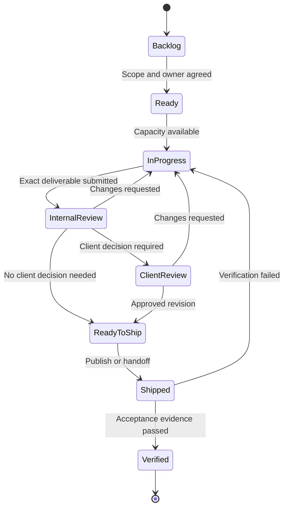
```mermaid
stateDiagram-v2
    [*] --> Backlog
    Backlog --> Ready: Scope and owner agreed
    Ready --> InProgress: Capacity available
    InProgress --> InternalReview: Exact deliverable submitted
    InternalReview --> InProgress: Changes requested
    InternalReview --> ClientReview: Client decision required
    InternalReview --> ReadyToShip: No client decision needed
    ClientReview --> InProgress: Changes requested
    ClientReview --> ReadyToShip: Approved revision
    ReadyToShip --> Shipped: Publish or handoff
    Shipped --> Verified: Acceptance evidence passed
    Shipped --> InProgress: Verification failed
    Verified --> [*]
```

Blocked is an overlay with reason, responsible party, blockedSince, nextAction and resumeState. Cancelled items retain history/scope-removal reason. Changed revision invalidates its approval. The three GrowthAsset statuses cannot represent this lifecycle faithfully.

### 8.3 Proposed report lifecycle — G05

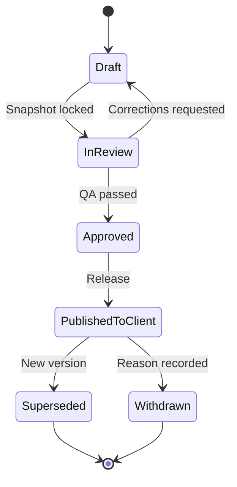
```mermaid
stateDiagram-v2
    [*] --> Draft
    Draft --> InReview: Snapshot locked
    InReview --> Draft: Corrections requested
    InReview --> Approved: QA passed
    Approved --> PublishedToClient: Release
    PublishedToClient --> Superseded: New version
    PublishedToClient --> Withdrawn: Reason recorded
    Superseded --> [*]
    Withdrawn --> [*]
```

Public-link policy is independent of release state. Published private reports are readable by their owning client; public links need expiry/revocation. Migrate historical visibility explicitly rather than silently reinterpreting it.

## 9. Sequence diagrams

“Current” refers to existing backend contracts; the UI/session layer is proposed. “Target” introduces the Appendix A APIs. Paths omit `/api` for readability. The frontend never accesses the database directly.

### SQ01 — Login, routing, refresh and logout (current)

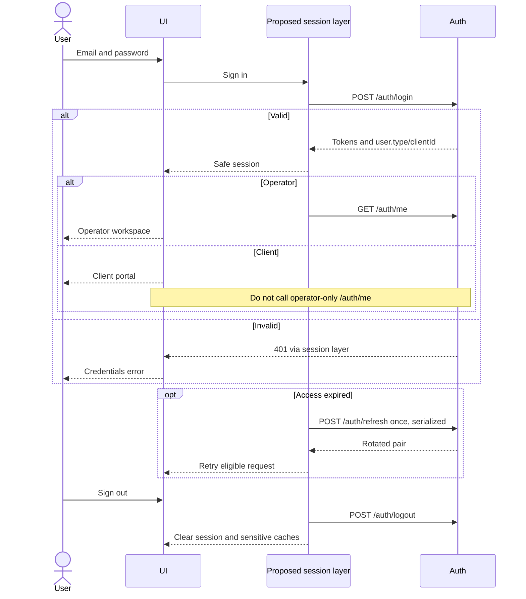
```mermaid
sequenceDiagram
    actor User
    participant UI
    participant Session as Proposed session layer
    participant Auth
    User->>UI: Email and password
    UI->>Session: Sign in
    Session->>Auth: POST /auth/login
    alt Valid
        Auth-->>Session: Tokens and user.type/clientId
        Session-->>UI: Safe session
        alt Operator
            Session->>Auth: GET /auth/me
            UI-->>User: Operator workspace
        else Client
            UI-->>User: Client portal
            Note over UI,Auth: Do not call operator-only /auth/me
        end
    else Invalid
        Auth-->>UI: 401 via session layer
        UI-->>User: Credentials error
    end
    opt Access expired
        Session->>Auth: POST /auth/refresh once, serialized
        Auth-->>Session: Rotated pair
        Session-->>UI: Retry eligible request
    end
    User->>UI: Sign out
    Session->>Auth: POST /auth/logout
    Session-->>UI: Clear session and sensitive caches
```

### SQ02 — Create client, run initial pipeline, issue access (current)

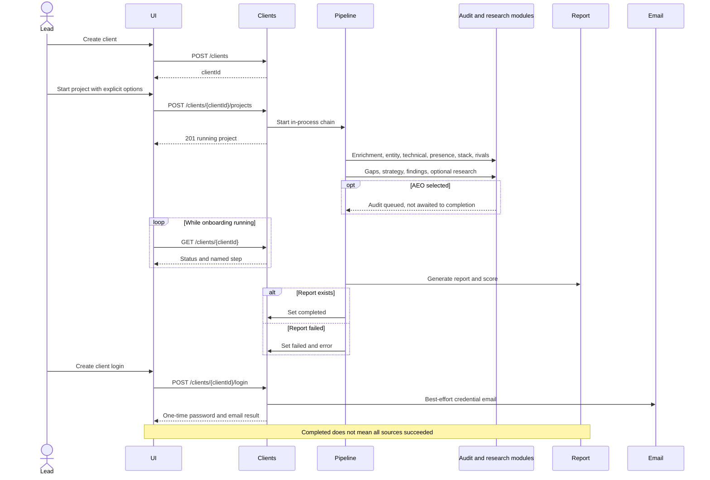
```mermaid
sequenceDiagram
    actor Lead
    participant UI
    participant Clients
    participant Pipeline
    participant Modules as Audit and research modules
    participant Report
    participant Email
    Lead->>UI: Create client
    UI->>Clients: POST /clients
    Clients-->>UI: clientId
    Lead->>UI: Start project with explicit options
    UI->>Clients: POST /clients/{clientId}/projects
    Clients->>Pipeline: Start in-process chain
    Clients-->>UI: 201 running project
    Pipeline->>Modules: Enrichment, entity, technical, presence, stack, rivals
    Pipeline->>Modules: Gaps, strategy, findings, optional research
    opt AEO selected
        Modules-->>Pipeline: Audit queued, not awaited to completion
    end
    loop While onboarding running
        UI->>Clients: GET /clients/{clientId}
        Clients-->>UI: Status and named step
    end
    Pipeline->>Report: Generate report and score
    alt Report exists
        Pipeline->>Clients: Set completed
    else Report failed
        Pipeline->>Clients: Set failed and error
    end
    Lead->>UI: Create client login
    UI->>Clients: POST /clients/{clientId}/login
    Clients->>Email: Best-effort credential email
    Clients-->>UI: One-time password and email result
    Note over UI,Report: Completed does not mean all sources succeeded
```

### SQ03 — Invite and client-owned connection (target G01/G02/G04)

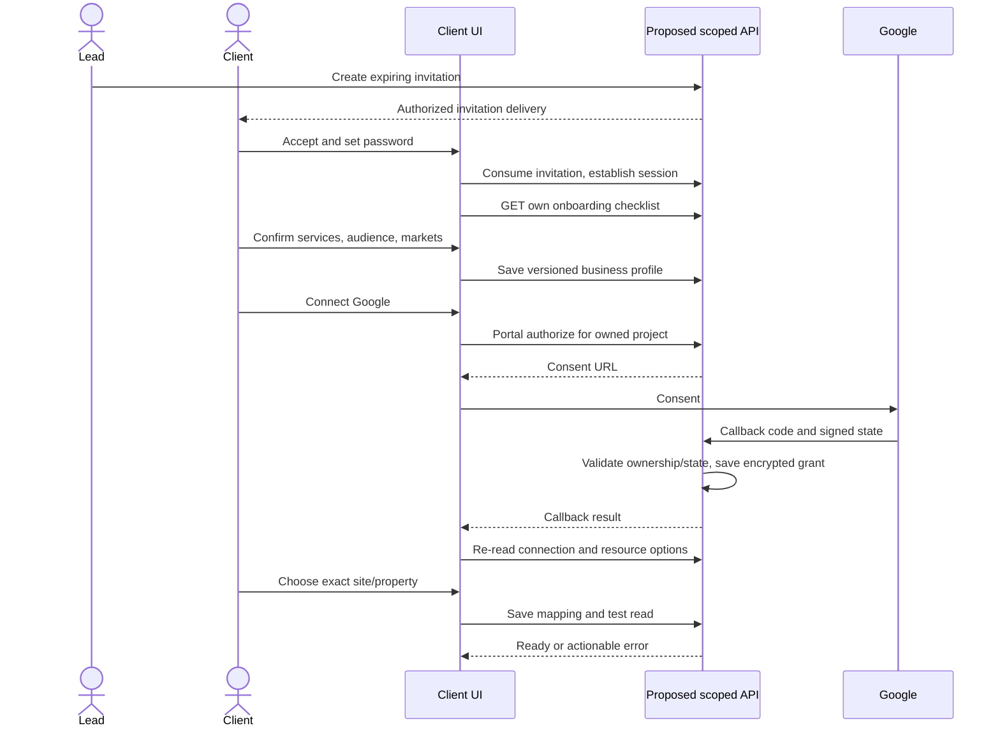
```mermaid
sequenceDiagram
    actor Lead
    actor Client
    participant UI as Client UI
    participant API as Proposed scoped API
    participant Google
    Lead->>API: Create expiring invitation
    API-->>Client: Authorized invitation delivery
    Client->>UI: Accept and set password
    UI->>API: Consume invitation, establish session
    UI->>API: GET own onboarding checklist
    Client->>UI: Confirm services, audience, markets
    UI->>API: Save versioned business profile
    Client->>UI: Connect Google
    UI->>API: Portal authorize for owned project
    API-->>UI: Consent URL
    UI->>Google: Consent
    Google->>API: Callback code and signed state
    API->>API: Validate ownership/state, save encrypted grant
    API-->>UI: Callback result
    UI->>API: Re-read connection and resource options
    Client->>UI: Choose exact site/property
    UI->>API: Save mapping and test read
    API-->>UI: Ready or actionable error
```

### SQ04 — Operator Google OAuth and resource mapping (current)

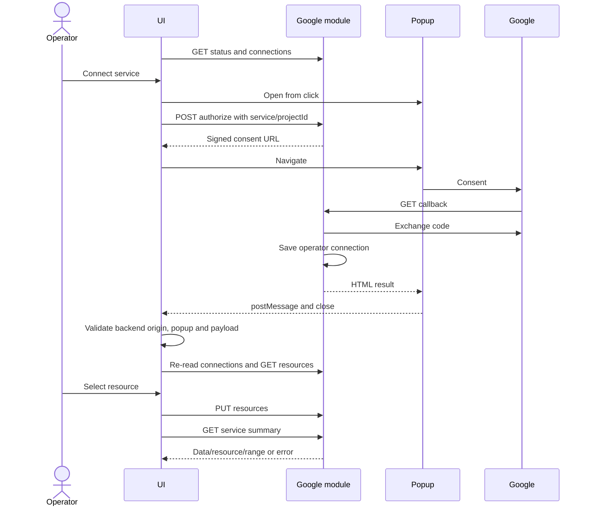
```mermaid
sequenceDiagram
    actor Operator
    participant UI
    participant API as Google module
    participant Popup
    participant Google
    UI->>API: GET status and connections
    Operator->>UI: Connect service
    UI->>Popup: Open from click
    UI->>API: POST authorize with service/projectId
    API-->>UI: Signed consent URL
    UI->>Popup: Navigate
    Popup->>Google: Consent
    Google->>API: GET callback
    API->>Google: Exchange code
    API->>API: Save operator connection
    API-->>Popup: HTML result
    Popup-->>UI: postMessage and close
    UI->>UI: Validate backend origin, popup and payload
    UI->>API: Re-read connections and GET resources
    Operator->>UI: Select resource
    UI->>API: PUT resources
    UI->>API: GET service summary
    API-->>UI: Data/resource/range or error
```

### SQ05 — Technical/SEO queue and recovery (current)

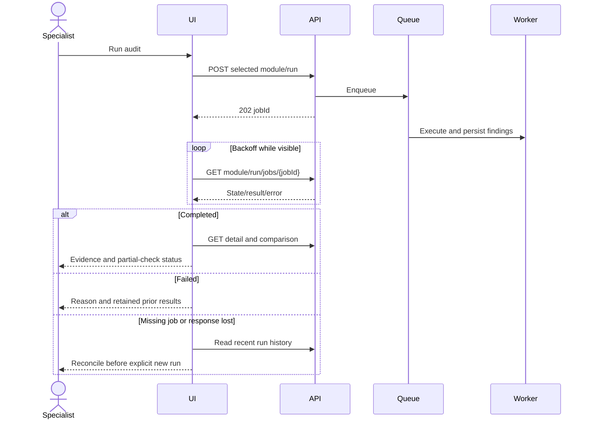
```mermaid
sequenceDiagram
    actor Specialist
    participant UI
    participant API
    participant Queue
    participant Worker
    Specialist->>UI: Run audit
    UI->>API: POST selected module/run
    API->>Queue: Enqueue
    API-->>UI: 202 jobId
    Queue->>Worker: Execute and persist findings
    loop Backoff while visible
        UI->>API: GET module/run/jobs/{jobId}
        API-->>UI: State/result/error
    end
    alt Completed
        UI->>API: GET detail and comparison
        UI-->>Specialist: Evidence and partial-check status
    else Failed
        UI-->>Specialist: Reason and retained prior results
    else Missing job or response lost
        UI->>API: Read recent run history
        UI-->>Specialist: Reconcile before explicit new run
    end
```

### SQ06 — Budgeted AEO with partial engine outcomes (current)

```mermaid
sequenceDiagram
    actor Researcher
    participant UI
    participant AEO
    participant Worker
    participant Engines
    participant Judge
    Researcher->>UI: Engines, markets, tier, repeats
    UI->>AEO: GET /aeo/budget
    AEO-->>UI: required credits, remaining, fits, calls
    alt Insufficient or unknown allowance
        UI-->>Researcher: Scope/budget decision with uncertainty
    else Ready
        Researcher->>UI: Start explicit run
        UI->>AEO: POST /aeo/audits/full
        AEO-->>UI: 201 pending auditId
        AEO->>Worker: Queue pipeline
        Worker->>Worker: Build context and matrix
        loop Each engine and market
            Worker->>Engines: Repeated prompts
            Engines-->>Worker: Answers/citations or failure
            Worker->>Worker: Persist outcomes and provenance
        end
        opt Stance enabled
            Worker->>Judge: Stored answers
            Judge-->>Worker: Stance and quotes
        end
        loop Until terminal
            UI->>AEO: GET /aeo/audits/{auditId}
            AEO-->>UI: Stage, surface results, stored verdict
        end
        UI-->>Researcher: Rates separate from judged stance
    end
    Note over UI,AEO: Resume currently holds its request open; it is not the queued full-run contract
```

### SQ07 — Curated prompts and measurement lab (current)

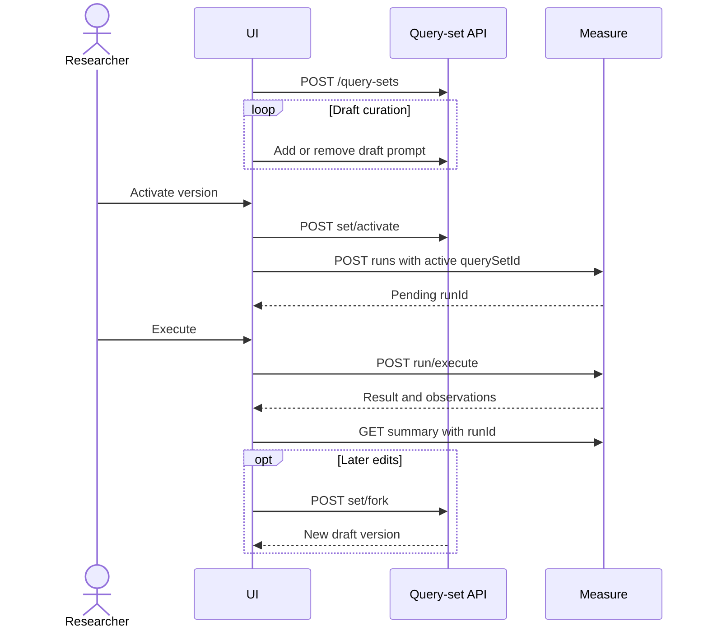
```mermaid
sequenceDiagram
    actor Researcher
    participant UI
    participant Query as Query-set API
    participant Measure
    UI->>Query: POST /query-sets
    loop Draft curation
        UI->>Query: Add or remove draft prompt
    end
    Researcher->>UI: Activate version
    UI->>Query: POST set/activate
    UI->>Measure: POST runs with active querySetId
    Measure-->>UI: Pending runId
    Researcher->>UI: Execute
    UI->>Measure: POST run/execute
    Measure-->>UI: Result and observations
    UI->>Measure: GET summary with runId
    opt Later edits
        UI->>Query: POST set/fork
        Query-->>UI: New draft version
    end
```

### SQ08 — Evidence to committed work (mixed; G06 for work)

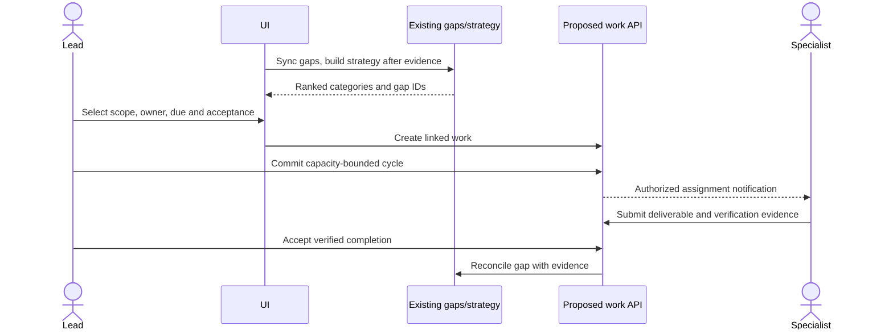
```mermaid
sequenceDiagram
    actor Lead
    participant UI
    participant Analysis as Existing gaps/strategy
    participant Work as Proposed work API
    actor Specialist
    UI->>Analysis: Sync gaps, build strategy after evidence
    Analysis-->>UI: Ranked categories and gap IDs
    Lead->>UI: Select scope, owner, due and acceptance
    UI->>Work: Create linked work
    Lead->>Work: Commit capacity-bounded cycle
    Work-->>Specialist: Authorized assignment notification
    Specialist->>Work: Submit deliverable and verification evidence
    Lead->>Work: Accept verified completion
    Work->>Analysis: Reconcile gap with evidence
```

### SQ09 — Generation, revisions, claim QA, client approval (mixed G09/G10)

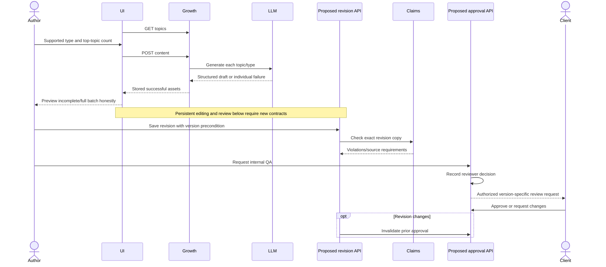
```mermaid
sequenceDiagram
    actor Author
    participant UI
    participant Growth
    participant LLM
    participant Editor as Proposed revision API
    participant Claims
    participant Approval as Proposed approval API
    actor Client
    UI->>Growth: GET topics
    Author->>UI: Supported type and top-topic count
    UI->>Growth: POST content
    Growth->>LLM: Generate each topic/type
    LLM-->>Growth: Structured draft or individual failure
    Growth-->>UI: Stored successful assets
    UI-->>Author: Preview incomplete/full batch honestly
    Note over UI,Editor: Persistent editing and review below require new contracts
    Author->>Editor: Save revision with version precondition
    Editor->>Claims: Check exact revision copy
    Claims-->>Editor: Violations/source requirements
    Author->>Approval: Request internal QA
    Approval->>Approval: Record reviewer decision
    Approval-->>Client: Authorized version-specific review request
    Client->>Approval: Approve or request changes
    opt Revision changes
        Editor->>Approval: Invalidate prior approval
    end
```

### SQ10 — Publication and verification (target G11)

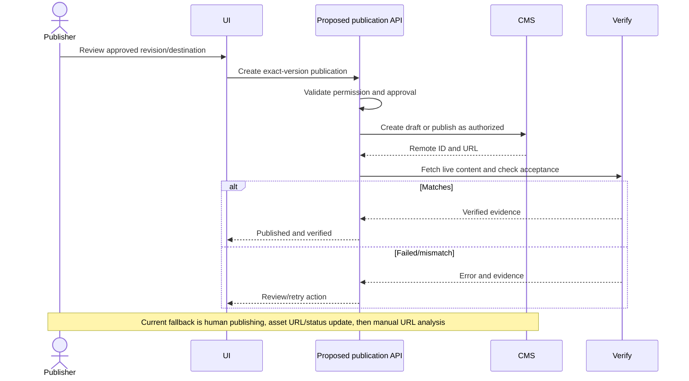
```mermaid
sequenceDiagram
    actor Publisher
    participant UI
    participant Publish as Proposed publication API
    participant CMS
    participant Verify
    Publisher->>UI: Review approved revision/destination
    UI->>Publish: Create exact-version publication
    Publish->>Publish: Validate permission and approval
    Publish->>CMS: Create draft or publish as authorized
    CMS-->>Publish: Remote ID and URL
    Publish->>Verify: Fetch live content and check acceptance
    alt Matches
        Verify-->>Publish: Verified evidence
        Publish-->>UI: Published and verified
    else Failed/mismatch
        Verify-->>Publish: Error and evidence
        Publish-->>UI: Review/retry action
    end
    Note over Publisher,CMS: Current fallback is human publishing, asset URL/status update, then manual URL analysis
```

### SQ11 — Authority discovery to a checked mention (current)

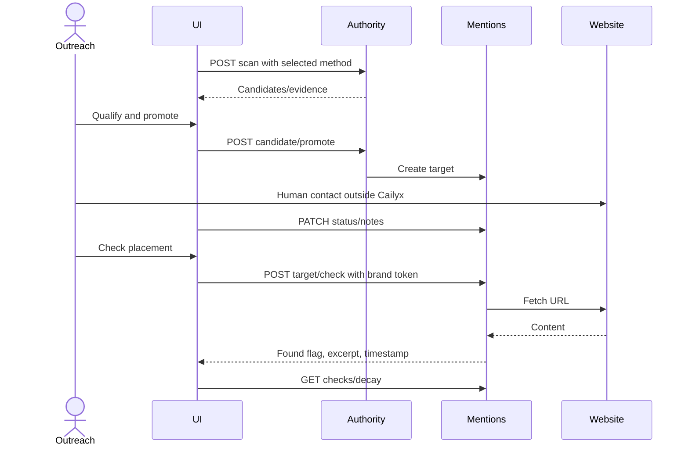
```mermaid
sequenceDiagram
    actor Outreach
    participant UI
    participant Authority
    participant Mentions
    participant Website
    UI->>Authority: POST scan with selected method
    Authority-->>UI: Candidates/evidence
    Outreach->>UI: Qualify and promote
    UI->>Authority: POST candidate/promote
    Authority->>Mentions: Create target
    Outreach->>Website: Human contact outside Cailyx
    UI->>Mentions: PATCH status/notes
    Outreach->>UI: Check placement
    UI->>Mentions: POST target/check with brand token
    Mentions->>Website: Fetch URL
    Website-->>Mentions: Content
    Mentions-->>UI: Found flag, excerpt, timestamp
    UI->>Mentions: GET checks/decay
```

### SQ12 — Report generation and visibility now (current)

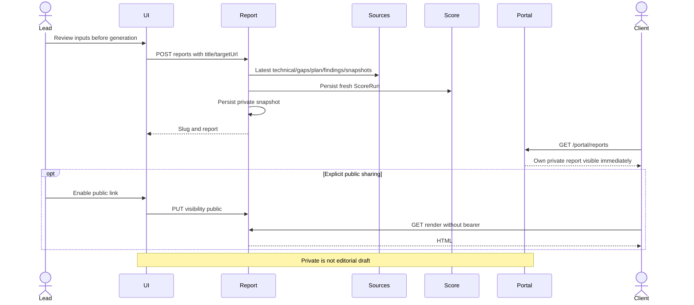
```mermaid
sequenceDiagram
    actor Lead
    participant UI
    participant Report
    participant Sources
    participant Score
    participant Portal
    actor Client
    Lead->>UI: Review inputs before generation
    UI->>Report: POST reports with title/targetUrl
    Report->>Sources: Latest technical/gaps/plan/findings/snapshots
    Report->>Score: Persist fresh ScoreRun
    Report->>Report: Persist private snapshot
    Report-->>UI: Slug and report
    Client->>Portal: GET /portal/reports
    Portal-->>Client: Own private report visible immediately
    opt Explicit public sharing
        Lead->>UI: Enable public link
        UI->>Report: PUT visibility public
        Client->>Report: GET render without bearer
        Report-->>Client: HTML
    end
    Note over UI,Portal: Private is not editorial draft
```

### SQ13 — Report QA, release and delivery (target G05/G10/G13)

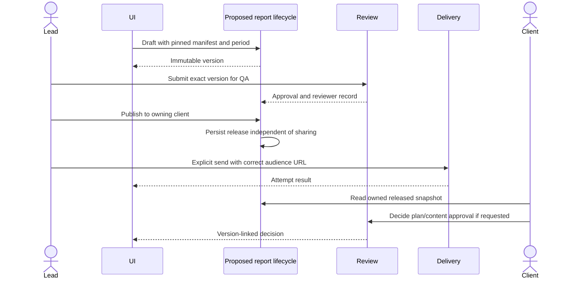
```mermaid
sequenceDiagram
    actor Lead
    participant UI
    participant Report as Proposed report lifecycle
    participant Review
    participant Delivery
    actor Client
    UI->>Report: Draft with pinned manifest and period
    Report-->>UI: Immutable version
    Lead->>Review: Submit exact version for QA
    Review-->>Report: Approval and reviewer record
    Lead->>Report: Publish to owning client
    Report->>Report: Persist release independent of sharing
    Lead->>Delivery: Explicit send with correct audience URL
    Delivery-->>UI: Attempt result
    Client->>Report: Read owned released snapshot
    Client->>Review: Decide plan/content approval if requested
    Review-->>UI: Version-linked decision
```

### SQ14 — Recurrence, alerts, and monthly preparation (target G07/G13)

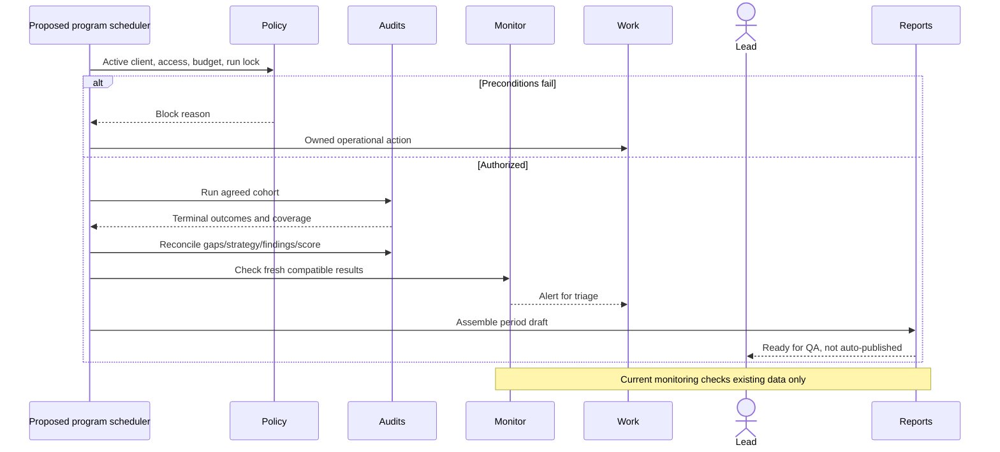
```mermaid
sequenceDiagram
    participant Scheduler as Proposed program scheduler
    participant Policy
    participant Audits
    participant Monitor
    participant Work
    actor Lead
    participant Reports
    Scheduler->>Policy: Active client, access, budget, run lock
    alt Preconditions fail
        Policy-->>Scheduler: Block reason
        Scheduler->>Work: Owned operational action
    else Authorized
        Scheduler->>Audits: Run agreed cohort
        Audits-->>Scheduler: Terminal outcomes and coverage
        Scheduler->>Audits: Reconcile gaps/strategy/findings/score
        Scheduler->>Monitor: Check fresh compatible results
        Monitor-->>Work: Alert for triage
        Scheduler->>Reports: Assemble period draft
        Reports-->>Lead: Ready for QA, not auto-published
    end
    Note over Monitor,Reports: Current monitoring checks existing data only
```

### SQ15 — Sales handoff and authoritative payment (target G04/G16)

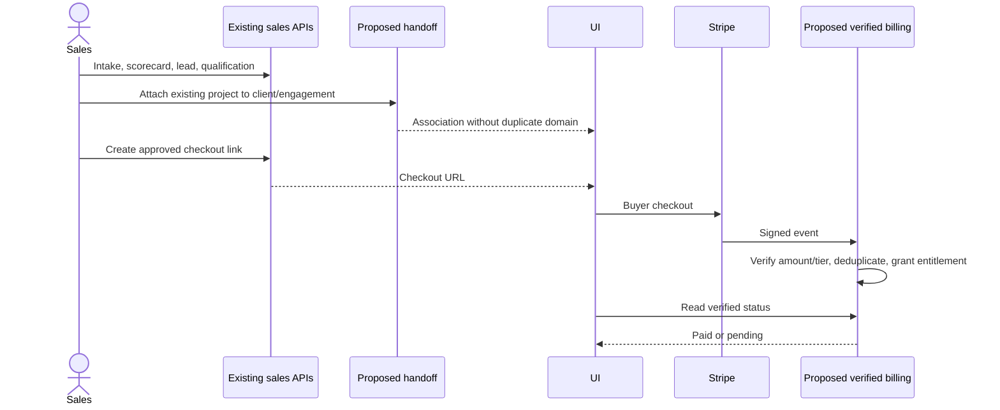
```mermaid
sequenceDiagram
    actor Sales
    participant Existing as Existing sales APIs
    participant Handoff as Proposed handoff
    participant UI
    participant Stripe
    participant Billing as Proposed verified billing
    Sales->>Existing: Intake, scorecard, lead, qualification
    Sales->>Handoff: Attach existing project to client/engagement
    Handoff-->>UI: Association without duplicate domain
    Sales->>Existing: Create approved checkout link
    Existing-->>UI: Checkout URL
    UI->>Stripe: Buyer checkout
    Stripe->>Billing: Signed event
    Billing->>Billing: Verify amount/tier, deduplicate, grant entitlement
    UI->>Billing: Read verified status
    Billing-->>UI: Paid or pending
```

### SQ16 — Client message and reply (current)

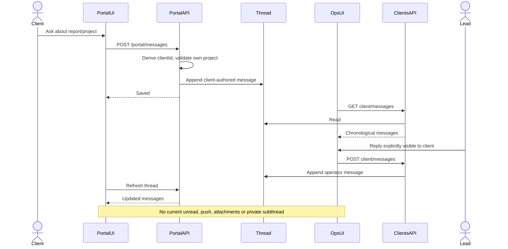
```mermaid
sequenceDiagram
    actor Client
    participant PortalUI
    participant PortalAPI
    participant Thread
    participant OpsUI
    participant ClientsAPI
    actor Lead
    Client->>PortalUI: Ask about report/project
    PortalUI->>PortalAPI: POST /portal/messages
    PortalAPI->>PortalAPI: Derive clientId, validate own project
    PortalAPI->>Thread: Append client-authored message
    PortalAPI-->>PortalUI: Saved
    OpsUI->>ClientsAPI: GET client/messages
    ClientsAPI->>Thread: Read
    ClientsAPI-->>OpsUI: Chronological messages
    Lead->>OpsUI: Reply explicitly visible to client
    OpsUI->>ClientsAPI: POST client/messages
    ClientsAPI->>Thread: Append operator message
    PortalUI->>PortalAPI: Refresh thread
    PortalAPI-->>PortalUI: Updated messages
    Note over PortalUI,OpsUI: No current unread, push, attachments or private subthread
```

### SQ17 — Pause and offboarding (target G06/G07/G15/G17)

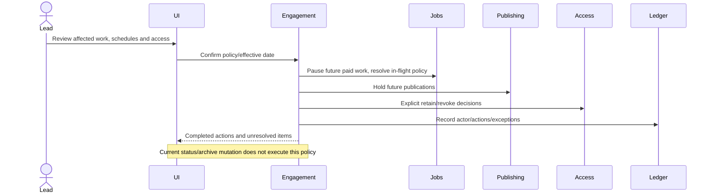
```mermaid
sequenceDiagram
    actor Lead
    participant UI
    participant Engagement
    participant Jobs
    participant Publishing
    participant Access
    participant Ledger
    Lead->>UI: Review affected work, schedules and access
    UI->>Engagement: Confirm policy/effective date
    Engagement->>Jobs: Pause future paid work, resolve in-flight policy
    Engagement->>Publishing: Hold future publications
    Engagement->>Access: Explicit retain/revoke decisions
    Engagement->>Ledger: Record actor/actions/exceptions
    Engagement-->>UI: Completed actions and unresolved items
    Note over UI,Engagement: Current status/archive mutation does not execute this policy
```

## 10. Frontend architecture and API behavior

### 10.1 Implementation boundaries

Use the established Next.js App Router, TypeScript and Tailwind stack. Organize around session, client-management, project-context, connections, research/audits, planning, content, authority, reporting, monitoring, sales and administration. Build one feature module end-to-end at a time; shared session/config/project context may precede them.

One codebase with distinct operator/client route groups is a viable proposal; separate deployments remain an implementation choice. Share neutral design components, not a privileged data container that can accidentally feed operator data into a client view. Client loaders call client-scoped APIs. Route groups alone do not provide authorization.

```text
Page and URL state
  → explicit client or operator view-model
  → typed service adapter for verified backend response
  → same-origin session/API boundary
  → NestJS scoped controller
```

The app can render existing report JSON with this new design without adopting existing UI or backend HTML styling. Public backend rendering remains a delivery option. Vendor keys, Google refresh grants, database access and operational secrets stay server-side.

### 10.2 Contract discipline

OpenAPI has one reusable component schema and many inline/descriptive responses, with source differences in Appendix B. Generated types alone cannot certify runtime behavior. Verify response envelopes, nullable fields, status values, role/type restrictions, errors, side effects and pagination per screen. Normalize `{projects}`, `{findings, thinRun}`, `{assets}` and other wrappers explicitly rather than interpreting unexpected shapes as no data.

No new validation, editor, chart, cache, scheduling, design-system or testing dependency is selected here. Each module analysis must compare tools and obtain approval before installation. Static Mermaid is the document format for diagrams; adding a Mermaid runtime to the application is not required by this plan.

### 10.3 Async behavior

- Technical/SEO starts: 202 and jobId. Presence: discovery ID. Full AEO: 201 and auditId. Client onboarding: running project. Save identifiers before navigating.
- AEO resume, measurement/journey execute, content generation and other research operations may hold requests open. Do not assume all POSTs are queued or all 201s mean finished. Standard jobs are G07/G09.
- Proposed polling: active visible run about every 5 seconds, back off to 15–30 seconds, pause hidden tabs, stop terminal states, reconcile on focus. Coordinate widgets/tabs. The global 100 requests/minute/IP limit can affect a shared office; avoid per-project fan-out polling on portfolios.
- Lost response: preserve last result and reconcile stored history before a new mutation. Never blindly retry email, paid generation, project creation, visibility or publishing actions.
- Project switch cancels obsolete reads; late Project A responses must not populate Project B.
- Queued status must survive reload through server state. Local memory is not a durable job ledger.

### 10.4 Mutation and error rules

| Class | Behavior |
|---|---|
| Local filter/view | URL state, no hidden paid work |
| Field/status edit | Show saving; confirm server result; undo only when an inverse API exists |
| Scan/generation | Prerequisites, scope/cost, explicit start, double-submit protection, timeout reconciliation |
| Email/sitemap/publication | Preview target and effect, explicit action, attempt versus actual delivery/verification |
| Replace competitor list | Explain full replacement, preserve unsaved edits, reload result; concurrency control G19 |
| Delete/cascade | Exact target and downstream effect, destructive confirmation; no fake undo |
| Public sharing | Explicit anyone-with-link disclosure; confirm server visibility |
| Draft edit | Version precondition, conflict UI, never say saved without persistence |

400 → invalid fields/config; 401 → refresh/login; 403 → access policy; 404 → missing/private or missing prerequisite according to endpoint; 409 → duplicate/version/state conflict; 429 → bounded cooldown using Retry-After when available; 503 → provider/config unavailable. Preserve context on other failures. HTTP success can contain a partial/failed vendor snapshot: inspect domain status.

Google summaries allow rolling 1–90 days; SEO audit input permits 7–90. Arbitrary start/end windows need G13. Use returned window and resource, not an assumed browser date. Display timestamps in engagement timezone, with UTC in evidence. Keep credits and currency units distinct.

### 10.5 Performance, safety and telemetry

Load compact summaries first and raw observations/pages only on demand. Server pagination/aggregation is G14. Before it exists, local filters cover only returned records; no fabricated global totals. Cache immutable detail by run/report ID, not only project. Never put private customer responses into a shared public cache.

Escape/sanitize messages, model Markdown, fetched HTML and evidence URLs. Render raw HTML as escaped evidence, or in a restricted preview, never as trusted application markup. Validate outbound link schemes. Same-origin session design requires secure HttpOnly cookies, CSRF handling and refresh coordination; these are implementation requirements, not current NestJS cookie support.

Proposed product events: sign-in type, onboarding status/coverage, connection-ready, run completion/failure, report view, approval decision, work verified. Exclude passwords/tokens, message text, raw AI answers, attribution PII and unpublished copy. Browser page view is not proof of email delivery. Analytics vendor and retention are future approved decisions G15/G17.

## 11. Build sequence and acceptance criteria

### 11.1 Sequential increments

Each increment may touch existing modules, but new feature modules must be analyzed, approved, built, documented and verified sequentially under AGENTS.md. Do not scaffold unsupported target screens with pretend APIs.

| Increment | Outcome | Dependencies | Exit condition |
|---|---|---|---|
| 0. Contract baseline | Correct route/schema/capability/access map | G19, critical G03 | All 264 routes accounted for; representative verified contracts; scope checks |
| 1. Identity | Operator/client sessions, invitations, recovery | G01/G02/G03 | Type routing, refresh races, reset/revoke, cross-client denial |
| 2. Client foundation | Client/project management and prospect attachment | G04, basic G08 | Multi-project, duplicate domain, failed-email, ownership cases |
| 3. Connections | Correct operator/client GSC/GA4 resource grants | G02/G18/G19 | Wrong account, no properties, revoked grants, delegation and disconnect impact |
| 4. Baseline research | Evidence, audits, prompts, competitors, bounded runs | G07/G12/G19 | Partial providers, thin samples, no-data, scope and retry behavior |
| 5. Delivery planning | Assigned, dated, verified work and client plan | G06/G10 | Capacity, dependencies, client blockers and scope changes persist |
| 6. Reports | Reviewed period snapshots and independent sharing | G05/G13 | Draft cannot leak; old report immutable; audience-correct delivery |
| 7. Content | Brief → draft → saved revision → QA → client review → handoff | G09/G10/G12 | Selected version honored, failures reconciled, approval invalidated on edit |
| 8. Authority/maintenance | Outreach, mentions, refreshes, research linked to work | G06/G07/G13 | Placement versus checked evidence; unproven metrics handled |
| 9. Recurring service | Cadence, alerts, team capacity, monthly/quarterly reports | G07/G08/G14 | Pause policy, duplicate-run protection, failure ownership |
| 10. Optional expansion | CMS publishing, paid upgrades, broader channels/settings | G11/G16/G17/G20 | Signed payments, authorized publication, export/retention/offboarding |

Sales-assisted intake/scorecard can accompany foundation work using existing APIs. Public self-service and authoritative billing wait for G16. Release gating must precede any promise that clients see only approved reports.

### 11.2 Acceptance journeys

1. Admin creates a client with two projects; only owning client accounts see its projects/reports/messages. Test guessed foreign IDs and both directions of operator/client denial.
2. Credential email fails; UI retains account-created status and safe handoff response, and does not repeat creation blindly.
3. Client reloads, token expires, simultaneous requests occur; refresh is serialized and `/auth/me` is not called for a client.
4. Google consent succeeds but no resource exists; UI remains unmapped, offers correct-account recovery, and never shows ready prematurely.
5. Technical succeeds while AEO/provider fails; successful evidence remains visible and coverage is partial.
6. Requested five repeats yield fewer successful answers; UI shows thin coverage and makes no significance claim.
7. Query version/engine transport changes; comparison records methodology break.
8. Client decision blocks work; due date, dependency owner and accepted scope remain clear.
9. Generation yields fewer assets than requested; result checklist shows missing output without duplicate paid retry.
10. Approved revision 2 becomes revision 3; approval invalidates, and revision 3 cannot publish under old consent.
11. Target draft is hidden from client/public; released private report is own-client only; public link revocation is independent.
12. Released report remains frozen after new audits; new data creates another snapshot/version.
13. Worker restart/duplicate scheduler event results in one bounded recoverable run and recorded cost/failure.
14. Paused client stops agreed future runs/publications; retained/in-flight work is explicit.
15. Foreign job/run ID in an otherwise valid project URL is denied by backend ownership checks.
16. Checkout-return visit or replayed unsigned event cannot grant an entitlement.
17. Keyboard/mobile users can sign in, read report/evidence, decide approval and send messages; charts expose text/table alternatives.
18. No baseline/measurement or partial score never becomes a false performance decline or confirmed failure.

### 11.3 Completion and decisions

Future module completion requires the repository checklist: module README/spec/requirements/setup status, Swagger/API docs, PRD alignment, applicable type/build checks, real end-to-end verification, changelog, production-readiness updates. This plan marks no new module complete and claims no future test passed.

Resolve before dependent implementation: client seat roles; invitation/recovery; assignment policy; report release and public sharing; service scope/cost caps; review SLA/timezone; publishing destinations; metric windows; billing offers; retention; organization/white-label support. Each dependency choice still requires its own approved options analysis. These open implementation decisions do not block delivery of this design document.

## Appendix A — Backend work required

The following are proposed contracts, not existing endpoints. Paths include `/api`; request fields are minimum design contracts, not final DTOs. **P0** blocks safe release of the dependent workflow, **P1** completes the core service experience, **P2** expands automation/commercial scope. Every resource derives or validates client/project scope on the server and records the acting user. Existing endpoints remain in Appendix C.

### G01 — Identity lifecycle and client profile · P0

Screens AU02–AU05, OP08, CP15. Add `GET /api/portal/me`; `POST /api/auth/password/change` (currentPassword/newPassword); `POST /api/auth/password/forgot` (email); `POST /api/auth/password/reset` (single-use token/newPassword); `GET /api/auth/sessions`; `DELETE /api/auth/sessions/:sessionId`; `POST /api/auth/logout-all`. Proposed shared identity/profile semantics must explicitly permit both user types, unlike current `/auth/me`. Add controlled bootstrap-state discovery if AU06 needs it.

Persist expiring reset/invite token hashes, session metadata/revocation and mustChangePassword. Return safe user/profile only; generic reset response avoids email enumeration. Acceptance: expiry/replay, client rehydration, refresh race, forced first password change, immediate revocation policy, deleted/disabled user access. Interim: assisted credentials/login/logout only; no fake recovery/password screen.

### G02 — Client seats, invitations and delegated connections · P0

Screens OP08/PJ03/PJ04/CP04/CP05/CP14. Add operator client-seat/invite list/create/revoke under `/api/clients/:clientId/members` and `/invites`; authorized client equivalents under `/api/portal/members` and `/invites`; public token acceptance with server-resolved scope.

Add client-scoped Google `status`, `connections`, `authorize`, `resources`, disconnect and test-read under `/api/portal/projects/:projectId/integrations/google/*`. Input: service, allowed resourceId, invitation/role/project scope; never arbitrary owner userId. Add `GET .../connections/:connectionId/impact` and controlled reassignment/delegation.

Persist membership(role/project scope/status), invitation(expiry/acceptance/revocation), connection grant ownership/delegated consumers and resource validation. Acceptance: foreign project denied, client cannot borrow operator credentials, collaborator sees only permitted projects, second operator can use delegated grant, revoke/disconnect effects clear. Current fallback: operator connects their own authorized Google account; client provides access through the agreed human process.

### G03 — Enforced permissions and nested resource scoping · P0

Apply role/action and assigned-project enforcement consistently, including report release, rubric changes, claim approval, generation, and costly operations. Add a safe operator directory for delivery leads (e.g. `GET /api/operators?role=delivery-lead`) rather than granting them admin `/users` access. Persist operator assignments/delegations. Token role changes must take effect under a defined immediate/short-lived revocation policy; current JWT strategy checks existence but returns token-carried roles/types.

Audit nested IDs: technical/SEO job handlers currently receive jobId without checking URL projectId; several AEO handlers use auditId/querySetId without project validation; report view/render resolves slug without checking URL projectId; measurement summary with runId queries observations by runId alone. These are scoped-validation gaps visible in source, not a claim of tested cross-client exploit. Portal report ownership checks already exist and must remain.

Validate operator message projectId belongs to the named client; current operator message service lacks the equivalent check present in portal message writes. Acceptance: direct API foreign-ID tests, role demotion/revocation, all mutations enforce intended permission. Frontend hiding is not the fallback for missing security.

### G04 — Confirmed intake, project attachment and access checklist · P1

Screens OP06/CP04/AE05/SL03/PJ02. Add `PUT /api/clients/:clientId/projects/:projectId/attach` with explicit authorized reassignment semantics; `GET/PUT /api/projects/:projectId/business-profile`; scoped portal equivalent; `GET/POST/PATCH .../onboarding/requests` and checklist reads. Add draft-project/setup launch separation if wizard saves before running. Domain correction requires validated normalization/conflict/ownership policy, not changing a display label.

Business profile: version, brand/legal name, description/services, ICP, markets/languages, facts/claims, competitors, goals, approvers, CMS/publishing constraints and confirmedBy/time. Request: type, requested person, due, status, blocked work. Persist confirmed values separately from extracted candidates. Acceptance: sales handoff does not duplicate unique domain; clientName does not masquerade as clientId; changed facts propagate only on explicit rebuild/version selection. Interim: notes/messages and operator edits, labeled unstructured.

### G05 — Report editorial lifecycle, client release and share policy · P0

Screens RP01–RP05/CP11/CP12. Extend report creation with draft/version support; add `POST /api/projects/:projectId/reports/:slug/review`, `/approve`, `/publish`, `/withdraw`; `POST/DELETE .../share-links` for expiring/revocable tokens; `GET .../delivery-attempts`. Keep public sharing independent from release. Portal returns only released approved versions under the target policy.

Persist report revision/status, frozen evidence manifest, reviewer/decision, publishedAt/by, supersession, share token hashes/expiry and delivery attempts. Acceptance: private draft never appears in portal, public/private is not misused as QA state, historical snapshots remain unchanged, client cannot read another client's report, failed email does not roll back release. Migration: explicitly classify existing reports, which are currently all visible to their owner. Interim: review inputs before report generation and disclose immediate client visibility.

### G06 — Engagements, cycles, tasks, capacity and verification · P1

Screens OP01/OP11–OP13/OP20/PJ07–PJ10/CP06/CP16. Add engagement CRUD under `/api/clients/:clientId/engagements`; cycle CRUD/commit under `/api/projects/:projectId/cycles`; work CRUD under `/api/projects/:projectId/work-items`; `POST .../work-items/:id/submit`, `/verify`, `/block`; team capacity/calendar reads; `GET /api/portal/projects/:projectId/plan` and scoped work read/evidence submit.

Persist Engagement, Cycle, WorkItem, Assignment, Dependency, Milestone, AcceptanceCheck, Verification and CapacityAllocation. Minimum fields are §7.1. Commit freezes scope/denominator; changes carry reasons and history. Verification records source URL/run/exact artifact/date/reviewer. Acceptance: no dependency cycles, assignee rights, real due timezone, scope change history, rejected verification reopens work, pause policy, client visibility excludes internal notes. Interim: existing gap/asset/link/mention statuses and human planning outside the app, with no fake ownership/completion metrics.

### G07 — Durable jobs, whole-program cadence and alert lifecycle · P0 for reliable automation; P1 breadth

Screens OP07/PJ11/MO01–MO03/OP13. Add scoped `GET /api/projects/:projectId/jobs` and `/jobs/:jobId`; `POST .../jobs/:jobId/retry` and `/cancel` where safe; onboarding run create/read/resume; `GET/PUT .../cadences/:taskKind`; alert detail/acknowledge/assign/resolve. Include AEO, SERP, mentions, backlinks, gap/score/report dependencies in supported task kinds.

Persist JobRun/JobStep(IDs, states, attempts, counts, error, heartbeat, costs, artifact IDs), CadenceRule(timezone, schedule, last/next, budget/prerequisites/pause), AlertLifecycle. Add idempotency keys, per-project run locks, worker heartbeats and bounded retries. Cancellation must say whether already-spent/irreversible work remains. Acceptance: restart recovery, duplicate tick safety, source-stage failure ledger, pause semantics and alert deduplication; no full-chain claim from the current monitoring check. Interim: existing per-module starts/statuses and explicitly manual execution.

### G08 — Messages, notifications, attachments and requests · P1

Screens OP09/CP13/OP01. Extend thread reads with cursor pagination and safe author display names; add message-read markers, attachment upload/download, anchored threads, notification inbox/preferences and delivery records. Proposed paths: `GET /api/notifications`, `PATCH /api/notifications/:id/read`, `PUT /api/notification-preferences`, `POST /api/projects/:projectId/attachments`, scoped message attachments and thread references.

Persist read cursors, notification recipient/event, attachment ACL/storage metadata and optional thread context. Keep internal notes a separate server field/channel, not a visual toggle on client messages. Acceptance: file ownership and safe downloads, retries do not duplicate sends, read state is real, client cannot see internal notes. Interim: current append-only text thread and manual refresh; no unread badges based on guesses.

### G09 — Editable briefs, versioned content and reliable generation · P1

Screens CT01–CT06/CP08. Add `POST/GET/PATCH /api/projects/:projectId/content-briefs`; `GET/PATCH .../growth-execution/assets/:assetId` for editable content with version precondition; `/assets/:assetId/revisions`; `POST .../content-jobs` and job status. Generation input: approved briefId/version, selected topic IDs, type, source/claim IDs, voice/context version, language, constraints. Output: requested/succeeded/failed items, actual cost, created artifact IDs, errors and retryable IDs. Add draft-body analysis endpoint if extractability checks are promised before publication.

Persist ContentBrief, ContentRevision, GenerationJob/Item, source references and media metadata. Edits must not be lost or overwrite concurrent revisions. Seven non-article/ad types remain brief-only until separately implemented. Acceptance: exact selected brief used, brand facts/source linkage, revision save/conflict, no duplicate charged batches, missing provider honest, ad character warnings, null content never represented as full draft. Interim: inspect/export original article/ad output and record status/live URL; no persistent editor promise.

### G10 — Version-specific reviews, client approvals and claim gates · P0 for approved-release promises

Screens CT05/CL01/CP09/CP10/RP04. Add `POST /api/projects/:projectId/approvals` with artifactType/id/version, requiredReviewer, due, decision scope; detail/list, decision and cancel; client-scoped `/api/portal/approvals` and `POST .../:id/decision`. Add claim/source review records linked to the exact content/report revision.

Persist ApprovalRequest, Decision, RevisionClaimLink, CheckResult and reviewer identity. Server checks current approved version before publication/release; edits invalidate approval. Acceptance: client cannot approve unseen/foreign/stale version; source independence review; blocked claims cannot bypass via another endpoint; decisions immutable with superseding action. Interim: manual external review plus existing claim checker; do not call it enforced approval.

### G11 — CMS/channel publishing and operational data connectors · P2

Screens PJ03/CT06/AT03/CP05. Add destination connection authorize/test/revoke/resource selection, publication create/status/cancel/retry and remote verification under `/api/projects/:projectId/publications`; protected log-ingest credentials/webhook management if automatic crawler collection is desired. Input: approved revision, destination/resource, planned time, mode(draft/publish), explicit permission. Persist remote ID, attempt/result, verified live version and rollback capability.

Social, email, ads and CMS are distinct integrations; do not bundle unknown permissions into one connect button. Choose vendors/CMSs only through approved analysis. Acceptance: no remote write before explicit approved action, safe retries, schedule timezone, failed remote publish distinct from failed verification. Interim: human publication/outreach, URL record and manual checks.

### G12 — Budgets, spend reservations and cost audit · P0 for bounded paid automation

Screens OP18/AE02/CT03/PJ11. Add `GET/PUT /api/projects/:projectId/budget`, `POST .../cost-estimates`, `GET .../spend`, budget-approval actions. Include provider, unit, estimate range, requested configuration, per-call cap, reservation, actual settlement, remaining and unknown-balance reason. Persist BudgetPolicy, Reservation, SpendEvent and approvals at project/client/service levels.

Existing AEO estimate is a Cloro credit estimate, not all-provider USD spend or a team budget ledger. Acceptance: concurrent requests cannot overspend cap, retry/cache hits handled correctly, unknown balance not “fits,” estimates differ from actual and carry units. Interim: explicit bounded run parameters, available AEO estimate, operator-managed provider allowance.

### G13 — Comparable outcomes, complete report snapshots and client results · P1

Screens RP02/RP03/CP07/PJ01/SE03/SP03. Add `GET /api/projects/:projectId/results?from=&to=&baselineId=&cohortId=`; `GET .../evidence-manifests/:id`; client-scoped results; extend report creation with reportType, window, baseline/cohort and pinned source IDs. Snapshot full AEO/SEO/GA4/presence/competitor/authority/content/work sections, source dates, coverage, scoreRunId/rubricVersion, interpretation and approved next plan.

Persist MeasurementCohort, ReportPeriod, EvidenceManifest and versioned result projections. Validate query-set/provider/transport/market comparability. Add period and consent-aware attribution filters; expand beyond the current AI-source-only DTO only after defining acquisition categories. Validated business revenue requires a deliberate CRM/conversion linkage; current Lead rows represent Cailyx's sales pipeline.

Acceptance: exact historical window reproducible; empty ≠ zero; latest-source timestamps not mislabeled; pending/failed observations disclosed; old reports immutable; personal contact data omitted from public/client aggregates as appropriate; generated content appears only if included in the frozen snapshot. Interim: dated diagnostic report plus separate operator source views, without invented monthly ROI.

### G14 — Portfolio aggregation, pagination, filters and attention views · P1

Screens OP01/OP02/OP10/OP14/SL02, large evidence lists. Add `GET /api/operations/overview`, `/clients/health`, `/work`, `/reports`, `/sales/leads` with server filters, cursor/page limits and scoped totals; add pagination to clients/projects/reports/observations/messages/histories. Saved-view CRUD stores filters, not cached sensitive result sets.

Return each client's worst/current project issues, overdue work, awaiting decisions, stale sources, lead, next commitment and linked evidence. Current client latestScore is the highest latest project score, not an aggregate health score; label it accurately until a different contract exists. Health labels should use transparent reasons, not a hidden composite. Acceptance: large portfolio loads without per-client polling storm, filters/totals consistent, assignment scope enforced. Interim: local filters on complete returned small lists, highest-score label, per-client drill-down.

### G15 — Activity, provenance and audit trail · P1

Screens OP19, work/report/content history. Add `GET /api/activity` and scoped project/client activity/export. Record actor/type, action, resource/version, before/after summary, timestamp, request/job correlation, result and origin. Persist security/role changes, source overrides, approvals, releases, budgets, deletions and external sends/publications.

Acceptance: no secrets/plaintext credentials in logs; immutable events; clients receive only permitted activity; deletion retains a safe audit record under policy. Interim: module timestamps and direct evidence links; no fabricated all-project timeline.

### G16 — Public intake, sales handoff and verified billing · P0 for self-service commerce; P2 expansion

Screens PB03/PB04/SL03/SL06/CP15. Add abuse-protected public diagnostic request with contact consent, challenge/rate limits and background receipt/job ID; keep expensive operator intake protected. Add lifecycle-aware handoff to G04. Add signed `POST /api/billing/webhooks/stripe`, verified checkout-status read, subscription/entitlement/invoice/customer-portal APIs if required.

Persist offer/price mapping, customer/subscription/payment event ledger, idempotency and entitlements. Do not accept user-supplied paid status or amount as authority. Disable/replace the current unsigned upgrade completion stand-in for production commerce. Public scorecard CTA capture needs a token-scoped endpoint; current lead CTA/click actions are authenticated operator routes. Acceptance: replay/forged event denied, server-verified purchase, cancellation/refund rules, webhook delay shown pending. Interim: assisted sales, operator-created checkout links only; no self-service entitlement claim.

### G17 — Export, retention and offboarding policy · P1 for lifecycle completeness

Screens OP05/PJ02/OP21/CP15. Add export request/status/download for an owned project/client, retention policy reads/updates for admins, and explicit offboarding preview/execute/status. Define what archive/pause/delete means for artifacts, credentials, scheduled work, messages and audit history. Data exports need scoped expiring downloads and disclosure of omitted sensitive fields.

Acceptance: offboarding preview lists exact affected resources, no broad accidental cascade, data access revoked according to policy, download access enforced, retained public links explicitly handled. Current hard project delete is not a complete offboarding workflow; existing persona/query-set/lead exports are narrower and remain useful.

### G18 — Usable capability/readiness contract · P1

Screens OP15/PJ03/AE02/CT03. Add `GET /api/capabilities` and project-specific capability readiness with allowed action, supported engine/provider IDs, configured/healthy/last-success/last-error, prerequisites, runtime limits, available output types and scheduler state. Separate server configuration presence from a tested working credential, an authorized user, and a mapped project resource.

Acceptance: no enabled button merely because an env key exists; missing browser session or provider outage gives an actionable state; mock/fixture mode visible; clients do not see secret names/internal infrastructure diagnostics. Interim: use current integrations/Google status and actual operation errors with conservative copy.

### G19 — Contract repair and targeted existing-behavior fixes · P0/P1

Before wiring dependent UI, correct OpenAPI/source differences in Appendix B. In particular:

- Include all three competitor candidate operations; update request flags, auth/client fields, response envelopes, actual status enums and report fields.
- Document public report render and private operator preview correctly; fix report/job/AEO nested ID scope under G03.
- Forward validated technical `pageBudget` into the queued job or remove the ineffective control. Source currently accepts it in DTO but drops it in controller enqueue data.
- Audit GSC sitemap write scopes/permissions: current OAuth uses webmasters.readonly while an endpoint submits sitemaps. Review Analytics' analytics.edit scope and describe actual consent accurately.
- Bind an approved matrix/querySetId to full AEO execution; support metadata-preserving prompt edits/forks and input validation so UI curation governs the intended run.
- Provide conditional/versioned competitor-list updates if simultaneous editing is supported. Keep confirmed rivals and unconfirmed candidates distinct.
- Remove stale report assetsNote and clarify computed/latest-source behavior. AEO verdict GET can recompute/store results; do not treat it as a cheap immutable fetch.
- Improve generation result errors and batch counts; distinguish zero returned assets due to absent topics from per-item LLM failures.

Acceptance: contract fixtures match source and live responses, every displayed control changes the intended backend behavior, units/scopes/statuses accurate. These are repairs to existing capabilities, not a rationale for bypassing tool approval on new integrations.

### G20 — Organization, brand, templates and service configuration · P2

Screens OP20/OP21. Add admin-only settings/branding/templates APIs for logo/colors/display name, support identity, timezone, service defaults, report templates, review SLAs and allowed sharing. Persist versions and snapshot branding/template identity into released reports.

If multi-agency tenancy is required, introduce Organization boundaries and enforce them throughout; the current single-service client model does not implement that. Acceptance: client branding never crosses projects, historical reports retain chosen brand/version, template changes do not mutate committed cycles. Interim: current server branding plus fixed application design; no fake editable settings.

### A.1 Dependency priorities

| Intended promise | Must exist first |
|---|---|
| Clients securely manage accounts and access | G01, G02, G03 |
| Drafts remain internal until approved | G05, G10, G03 |
| Team has owned work and meaningful progress | G06, G14 |
| Recurring service operates reliably within budget | G07, G12, G18 |
| Content can be edited, approved and published | G09, G10, then G11 |
| Reports show comparable business progress | G13 plus G06/G05 |
| Buyers purchase and receive correct service access | G16 plus G04 |

## Appendix B — Documentation and implementation differences

Source behavior takes precedence in this plan where explicitly inspected. The list is an implementation checklist, not a live penetration test or a claim every source path is deployed. Backend UI references/comments were not used to derive this new design.

| ID | Observation and evidence | Design consequence |
|---|---|---|
| D01 | OpenAPI has 261 operations; controller extraction has 264. Extra routes in [competitors controller](backend/src/modules/competitors/competitors.controller.ts): candidate list/confirm/delete. | Include candidate review now; regenerate docs. |
| D02 | [Auth types](backend/src/modules/auth/auth.types.ts) return type/clientId; static safe-user schema omits them. | Route by actual user type; update response contract. |
| D03 | [Roles guard](backend/src/common/guards/roles.guard.ts) default-denies client access to non-portal routes; `/auth/me` lacks client marker. | Client cannot use operator profile rehydration or Google endpoints. |
| D04 | [Clients DTO](backend/src/modules/clients/dto/clients.dto.ts) accepts four optional run flags missing in static create-project schema. | Onboarding configurator can expose source flags after verification. |
| D05 | [Clients service](backend/src/modules/clients/clients.service.ts) adds enrichment, entity, findings and optional research beyond README's seven stages; optional AEO is not awaited. | Completed Day-1 report may precede AEO and omit late evidence. |
| D06 | Same service logs/continues most stage failures and only records report failure as onboarding failed; no durable step history/resume API. | Named current stage, no all-checks-success claim or fabricated retry. |
| D07 | [Client overview types](backend/src/modules/clients/clients.types.ts): latestScore is best/highest current project score. | Label “Highest project score”; it is not average or client health. |
| D08 | [Portal types/service](backend/src/modules/client-portal/client-portal.types.ts) return domain/onboarding/latestScore/latestBand, not static score/band/lifecycle shape. lastAuditAt is latest report createdAt in the service. | Normalize source shape; label latest report date, not audited-at. |
| D09 | [Portal service](backend/src/modules/client-portal/client-portal.service.ts) includes private own-client reports using includePrivate=true. | Visibility is public sharing, not client release. |
| D10 | [Reporting controller](backend/src/modules/reporting/reporting.controller.ts) marks render public with manually checked operator bearer for private preview; static OpenAPI inherits bearer security there. | Public link works only for public reports; private client reads use portal JSON. |
| D11 | [Reporting service](backend/src/modules/reporting/reporting.service.ts) persists presence/competitors/backlinks/growthPlan, creates ScoreRun, and stores latest audit URL. Report DTO lacks persisted rubricVersion/scoreRunId; assetsNote is stale. | Snapshot expansion needed; generating report is a mutation, not preview. |
| D12 | [Project service](backend/src/modules/projects/projects.service.ts) returns `{projects}` for list, while OpenAPI describes array; [findings service](backend/src/modules/findings/findings.service.ts) returns a wrapper rather than simple array. | Explicit typed normalization, no silent empty lists. |
| D13 | [AEO budget type](backend/src/modules/aeo-audit/aeo-audit.types.ts) returns required/remaining/fits/unavailableReason/perSurface/calls/prompts/runCount/markets; static schema suggests estimatedCreditsUsd/reason. | Show credits and tri-state fits; never infer USD. |
| D14 | [AEO controller](backend/src/modules/aeo-audit/aeo-audit.controller.ts): full run queued; resume awaits service inline. Several nested handlers only use resource ID. | Different async contract; scope validation G03; no blanket automatic POST retry. |
| D15 | [Growth DTO/types](backend/src/modules/growth-execution/dto/growth-execution.dto.ts): top-N article/ad generation; PATCH status/URL only. Service skips individual failures. | No exact-topic/brand-voice/editor/revision/approval UI promise without extensions. |
| D16 | [Technical DTO/controller](backend/src/modules/technical-audit/technical-audit.controller.ts): daily accepted, pageBudget validated but not forwarded. | Daily is supported by source; page-depth control currently ineffective. |
| D17 | [Google types](backend/src/modules/google/google.types.ts): GSC readonly and Analytics readonly+edit. [SEO service](backend/src/modules/seo-audit/seo-audit.service.ts) exposes sitemap submission. | Consent copy must match actual scopes; sitemap write needs permission repair. |
| D18 | [Google controller](backend/src/modules/google/google.controller.ts) returns popup HTML/postMessage; old README says callback redirect. | Validate backend event origin and popup; support no-opener redirect fallback. |
| D19 | [Monitoring service](backend/src/modules/monitoring/monitoring.service.ts) compares stored results; current delta exposes score change and observation counts, not a complete period series. | Monitoring is not fresh AEO collection or a full monthly outcome engine. |
| D20 | [Measurement service](backend/src/modules/measurement/measurement.service.ts) summary pools observations by default and returns zero rates for none; runId scope is not validated there. | Empty becomes unmeasured; select comparable cohort; fix ownership. |
| D21 | [JWT strategy](backend/src/modules/auth/strategies/jwt.strategy.ts) verifies user existence then uses token claims for role/type. Most controllers have no specialist role metadata. | Role isolation/deactivation must be enforced server-side before promised. |
| D22 | [Delivery controller](backend/src/modules/delivery/delivery.controller.ts) public upgrade-complete is a webhook stand-in, without Stripe signature verification. | Do not trust browser/ledger completion as payment. |
| D23 | [Intake controller](backend/src/modules/intake/intake.controller.ts) is protected despite public-form terminology; public scorecard read is flag-gated, not public generation. | Public lead-generation flow needs its own bounded API. |
| D24 | [Source schema](backend/prisma/schema.prisma) makes domain globally unique; client attachment isn't in current project edit DTO. | Existing prospect cannot be handed to client by recreating same domain. |
| D25 | [Source schedules](backend/src/modules/scheduling/scheduling.service.ts) and technical/SEO cron paths have limited interval/time and mode semantics. | Verify enabled scheduling mode; no precise calendar or all-module recurrence claim. |
| D26 | Clients operator message write lacks the own-client project validation implemented by portal write. | Add backend check; frontend selector alone is insufficient. |
| D27 | Credential email asks users to change temporary passwords; no self-service password-change/reset route exists. | Target invitation/reset required; do not render an ineffective button. |
| D28 | Current [scoring service](backend/src/modules/scoring/scoring.service.ts) and report types/template have pre-existing local modifications. | This plan reflects inspected working-copy behavior and leaves those edits untouched. |

Configuration/liveness caution: `/health` is uptime/liveness, not proof that all vendors, workers, databases, or delegated resources are healthy. `/integrations` reports configuration summaries, not a complete live readiness test. No `.env` secrets were read for this plan.

Additional side-effect caveat: `GET /api/projects/:projectId/competitors/gap` can call `TechStackService.scanDomain` and fetch schema; AEO verdict GET recomputes/stores a verdict. Inspect these on purpose, avoid speculative prefetch or aggressive polling, and split compute from immutable read if that becomes necessary for caching/scale.

## Appendix C — Every endpoint mapped to the design

This register covers **261 OpenAPI operations plus 3 source-only operations = 264**. Each method/path has a screen destination, purpose, access class and input outline. It is a design traceability register; exact schemas, examples and detailed errors remain in OpenAPI/source. Appendix B corrections override stale descriptions below where noted.

Notation: path parameters are required as shown in `{braces}`; `B` lists JSON body fields (`*` required); `Q` lists query fields; omitted body/query means none documented. `Operator` means any authenticated operator under the current default guard, not the stricter proposed assignment policy. `Lead/admin` and `Admin` reflect existing restrictions. `Public*` includes a condition explained in the row. `Client` is client-type bearer access only. Status codes are documented successful responses, not proof that background work or upstream services succeeded.

### C.1 Auth — 5 operations

| ID | Method and path | Screen(s) | Current access / success | Inputs | Purpose and UI handling |
|---|---|---|---|---|---|
| API-001 | `POST /api/auth/login` | AU01 | Public; 200 | B: `email*`, `password*` | Sign in an operator or client; returned user.type determines workspace (D02). |
| API-002 | `POST /api/auth/logout` | AU01 | Public; 200 | B: `refreshToken*` | Revoke a refresh token so the corresponding session can no longer be used to mint new access tokens. |
| API-003 | `GET /api/auth/me` | AU05 | Operator; 200 | — | Fetch the profile of the operator identified by the current access token, used to hydrate the logged-in session on app load. |
| API-004 | `POST /api/auth/refresh` | AU01 | Public; 200 | B: `refreshToken*` | Rotate a refresh token into a new access/refresh pair; keeps a session alive without re-entering credentials. |
| API-005 | `POST /api/auth/register` | AU06 | Public*; 201 | B: `email*`, `password*`, `name*`, `role` (admin/delivery-lead/content/technical/outreach/sales) | First user bootstraps admin; after that a valid admin bearer is required despite public decorator. Controlled setup/admin flow only. |

### C.2 Clients — 8 operations

| ID | Method and path | Screen(s) | Current access / success | Inputs | Purpose and UI handling |
|---|---|---|---|---|---|
| API-006 | `GET /api/clients` | OP02 | Operator; 200 | — | List all clients with a progress overview (score, band, open gaps, onboarding state) for the admin client-management dashboard. latestScore is highest latest project score, not overall health (D07). |
| API-007 | `POST /api/clients` | OP03 | Lead/admin; 201 | B: `name*`, `contactName`, `contactEmail`, `ownerUserId`, `notes` | Create a new client record so projects and onboarding can be attached to it. |
| API-008 | `GET /api/clients/{clientId}` | OP04 | Operator; 200 | — | Get a single client with its projects (status, score/band, onboarding progress) for the client detail view. |
| API-009 | `PATCH /api/clients/{clientId}` | OP05 | Lead/admin; 200 | B: `name`, `contactName`, `contactEmail`, `status` (active/paused/churned), `ownerUserId`, `notes` | Update a client's name, contact info, status, owner, or notes. |
| API-010 | `POST /api/clients/{clientId}/login` | OP08 | Lead/admin; 201 | B: `email*`, `name` | Create a client-portal login for this client: generates a one-time temporary password, creates a type="client" User row, and best-effort emails the credentials via Plunk. |
| API-011 | `GET /api/clients/{clientId}/messages` | OP09 | Operator; 200 | — | List the message thread with this client, used by both the operator console and the client portal. |
| API-012 | `POST /api/clients/{clientId}/messages` | OP09 | Operator; 201 | B: `projectId`, `body*` | Post a message to this client, visible to them in the client portal — used for operator-to-client communication. |
| API-013 | `POST /api/clients/{clientId}/projects` | OP06, OP07 | Lead/admin; 201 | B: `name*`, `domain*`, `runAeoAudit`, `runKeywordResearch`, `runGrowthExecution`, `runBacklinksRefresh` | Create client-owned project and start Day-1 pipeline immediately; poll client detail. Source includes enrichment/entity/findings and optional research; AEO may outlive report readiness (D04–D06). |

### C.3 health — 1 operations

| ID | Method and path | Screen(s) | Current access / success | Inputs | Purpose and UI handling |
|---|---|---|---|---|---|
| API-014 | `GET /api/health` | OP15 | Public; 200 | — | Public uptime/liveness check for load balancers and monitoring — no credentials required. |

### C.4 Intake — 3 operations

| ID | Method and path | Screen(s) | Current access / success | Inputs | Purpose and UI handling |
|---|---|---|---|---|---|
| API-015 | `POST /api/intake/bulk` | SL01 | Operator; 201 | B: `items*` | Bulk-onboard multiple domains parsed from a CSV upload, enriching each one (heavily rate-limited since every item triggers enrichment). |
| API-016 | `GET /api/intake/enrichments/count` | SL01 | Operator; 200 | — | Get the total count of enrichments performed, for an admin activity dashboard. |
| API-017 | `POST /api/intake/subject` | SL01 | Operator; 201 | B: `domain*`, `company`, `email`, `phone`, `description`, `source` (public-form/operator-console/bulk-csv/api), `notes` | Onboard a new subject by domain — creates/attaches a Project and auto-enriches it (category, description, country, competitors, entities) from its homepage. |

### C.5 Integrations — 1 operations

| ID | Method and path | Screen(s) | Current access / success | Inputs | Purpose and UI handling |
|---|---|---|---|---|---|
| API-018 | `GET /api/integrations` | OP15 | Operator; 200 | — | Shows the operator dashboard which external services (Google, Anthropic, Perplexity, DataForSEO, PageSpeed, Redis, Stripe, Plunk) are connected, so operators can tell at a glance what's configured vs. missing. Configuration presence is not live readiness. |

### C.6 Integrations · Google — 9 operations

| ID | Method and path | Screen(s) | Current access / success | Inputs | Purpose and UI handling |
|---|---|---|---|---|---|
| API-019 | `GET /api/integrations/google/analytics/summary` | SE03 | Operator; 200 | Q: `projectId*`, `days` | Pull GA4 sessions/users/views/engagement plus channel & page breakdown for a rolling window, to power the traffic/behavior view. |
| API-020 | `POST /api/integrations/google/authorize` | PJ03, PJ04 | Operator; 200 | B: `service*` (search-console/analytics), `projectId` | Begin the Google OAuth consent flow for Search Console or Analytics — returns the URL to open in a popup. |
| API-021 | `GET /api/integrations/google/callback` | PJ03, PJ04 | Public; 200 | Q: `code`, `state`, `error` | OAuth redirect target Google calls after consent; exchanges the code for tokens, saves the connection, and closes the popup back to the app. Not called directly by API clients. |
| API-022 | `GET /api/integrations/google/connections` | PJ03, PJ04 | Operator; 200 | — | Get the operator's per-service (Search Console / Analytics) connection state — never returns raw tokens. |
| API-023 | `DELETE /api/integrations/google/connections/{service}` | PJ03, PJ04 | Operator; 200 | — | Revoke and forget a Google connection (search-console or analytics) for the current operator. |
| API-024 | `GET /api/integrations/google/resources` | PJ03, PJ04 | Operator; 200 | Q: `service*`, `projectId*` | List the sites/properties the connected Google account can read, plus which one is currently mapped to the project, for the resource picker. |
| API-025 | `PUT /api/integrations/google/resources` | PJ03, PJ04 | Operator; 200 | B: `service*` (search-console/analytics), `projectId*`, `resourceId*`, `resourceLabel` | Map a project to a specific GSC site or GA4 property so summary endpoints know which resource to query. |
| API-026 | `GET /api/integrations/google/search-console/summary` | SE01 | Operator; 200 | Q: `projectId*`, `days` | Pull Search Console clicks/impressions/CTR/position plus top queries & pages for a rolling window, to power the SEO audit's organic-performance view. |
| API-027 | `GET /api/integrations/google/status` | PJ03, PJ04 | Operator; 200 | — | Check whether the server has a Google OAuth client id/secret configured, before showing the connect button. |

### C.7 Client Portal — 5 operations

| ID | Method and path | Screen(s) | Current access / success | Inputs | Purpose and UI handling |
|---|---|---|---|---|---|
| API-028 | `GET /api/portal/messages` | CP13 | Client; 200 | — | Fetch a client's message thread with the operator, for the client-portal inbox. |
| API-029 | `POST /api/portal/messages` | CP13 | Client; 201 | B: `projectId`, `body*` | Let a client send a message to the operator, optionally scoped to one of their own projects. |
| API-030 | `GET /api/portal/projects` | CP02 | Client; 200 | — | Own project summaries with domain, onboardingStatus/Step, latestScore/latestBand; lastAuditAt actually reflects report generation time (D08). |
| API-031 | `GET /api/portal/reports` | CP11 | Client; 200 | — | Let a logged-in client see every report generated across all of their own projects. |
| API-032 | `GET /api/portal/reports/{slug}` | CP12 | Client; 200 | — | Fetch the full content of one report by slug, scoped so a client can never view a report belonging to a different client. |

### C.8 Projects — 8 operations

| ID | Method and path | Screen(s) | Current access / success | Inputs | Purpose and UI handling |
|---|---|---|---|---|---|
| API-033 | `POST /api/projects` | OP10 | Operator; 201 | B: `name*`, `domain*`, `category`, `clientName`, `status` (scorecard/diagnostic/sprint/retainer/archived), `notes` | Create the backbone project entity (one per unique domain) that every other module attaches audits, personas, and reports to. |
| API-034 | `GET /api/projects` | OP10 | Operator; 200 | Q: `status`, `search` | List all projects, optionally filtered by lifecycle status or a name/domain/client search term, for the operator dashboard. |
| API-035 | `GET /api/projects/{id}` | PJ02 | Operator; 200 | — | Fetch one project's detail plus artifact stats (counts of audits/reports/etc. attached to it). |
| API-036 | `PATCH /api/projects/{id}` | PJ02 | Operator; 200 | B: `name`, `category`, `clientName`, `status` (scorecard/diagnostic/sprint/retainer/archived), `notes` | Edit a project's descriptive fields (name, category, client name, status, notes). |
| API-037 | `DELETE /api/projects/{id}` | PJ02 | Admin; 204 | — | Permanently delete a project and its data — destructive, restricted to admin operators. |
| API-038 | `GET /api/projects/{id}/competitors` | CO01 | Operator; 200 | — | Get the named competitor benchmark list plus domains discovered from stored SERP data, feeding share-of-voice and authority comparisons. |
| API-039 | `PUT /api/projects/{id}/competitors` | CO01 | Operator; 200 | B: `competitors*` | Replace the named competitor list — the exact set that share-of-voice measurement benchmarks against. |
| API-040 | `PUT /api/projects/{id}/transition` | PJ02 | Operator; 200 | B: `status*` (scorecard/diagnostic/sprint/retainer/archived) | Move a project through its engagement lifecycle (scorecard → diagnostic → sprint → retainer, or to archived from anywhere). |

### C.9 AEO Audit — 12 operations

| ID | Method and path | Screen(s) | Current access / success | Inputs | Purpose and UI handling |
|---|---|---|---|---|---|
| API-041 | `POST /api/projects/{projectId}/aeo/audits` | AE02 | Operator; 201 | B: `surface`, `surfaces`, `tier`, `runCount`, `geo`, `markets`, `reuseContext`, `skipStance`, `skipRefine` | Create an audit row in pending state with no spend, so the run can be reviewed/queued explicitly via /resume or /audits/full. |
| API-042 | `GET /api/projects/{projectId}/aeo/audits` | AE01 | Operator; 200 | — | List all AEO audits for a project, newest first, so an operator can see run history and current status. |
| API-043 | `POST /api/projects/{projectId}/aeo/audits/full` | AE02 | Operator; 201 | B: `surface`, `surfaces`, `tier`, `runCount`, `geo`, `markets`, `reuseContext`, `skipStance`, `skipRefine` | Kick off the entire AEO pipeline (context → matrix → measurement → stance → verdict) as one background job so an operator doesn't have to drive each stage manually. |
| API-044 | `GET /api/projects/{projectId}/aeo/audits/{auditId}` | AE03 | Operator; 200 | — | Fetch one audit's status plus its stored verdict (null until the audit completes), for polling a long-running run. |
| API-045 | `POST /api/projects/{projectId}/aeo/audits/{auditId}/resume` | AE03 | Operator; 200 | B: `surface`, `surfaces`, `tier`, `runCount`, `geo`, `markets`, `reuseContext`, `skipStance`, `skipRefine` | Continue a stopped or failed audit from its last completed stage, avoiding a re-scrape or re-generation of already-done work. Holds the request open in current source (D14); explicit action, no blind retry. |
| API-046 | `POST /api/projects/{projectId}/aeo/audits/{auditId}/stance` | AE03 | Operator; 200 | — | Have an LLM judge how the client was positioned in each answer (led/named/caveated/absent, vs which competitors) — separate from counted mention/citation rates. |
| API-047 | `GET /api/projects/{projectId}/aeo/audits/{auditId}/verdict` | AE03 | Operator; 200 | — | Recompute the AEO verdict from stored observations and stances, separating counted rate metrics from judged stance so consumers don't conflate them. Recomputes from stored evidence; prefer the audit's stored verdict for routine display. |
| API-048 | `GET /api/projects/{projectId}/aeo/budget` | AE02 | Operator; 200 | Q: `surfaces`, `tier`, `runCount`, `markets` | Preflight configuration credits/calls: source returns required, remaining, fits (nullable), unavailableReason, perSurface; not USD (D13). |
| API-049 | `POST /api/projects/{projectId}/aeo/context` | AE05 | Operator; 201 | B: `maxPages`, `refine` | Crawl the client's own site and extract services/ICP/pains/outcomes so AEO prompts and audits have real business context to work from. |
| API-050 | `GET /api/projects/{projectId}/aeo/context` | AE05 | Operator; 200 | — | Fetch the most recently built site context so other AEO steps (matrix generation) can reuse it without re-crawling. |
| API-051 | `POST /api/projects/{projectId}/aeo/matrix` | QS02 | Operator; 201 | B: `contextId`, `tier` (trial/trial-wide/scorecard/standard/full), `refine`, `activate` | Build the buyer-style prompt set (10 categories) that will be run against AI answer engines to measure the client's visibility. |
| API-052 | `GET /api/projects/{projectId}/aeo/matrix/{querySetId}` | QS02 | Operator; 200 | Q: `dimension` | Read a generated prompt matrix, optionally filtered to one category, for curation before running an audit. |

### C.10 Agents — 1 operations

| ID | Method and path | Screen(s) | Current access / success | Inputs | Purpose and UI handling |
|---|---|---|---|---|---|
| API-053 | `GET /api/projects/{projectId}/agents` | PJ01, PJ11 | Operator; 200 | — | Return a dashboard status card per capability (SEO, GEO, Articles, Authority, Journey, Persona, Council, Mentions, SERP, Monitoring) so the operator sees at a glance what has run for a project. |

### C.11 Attribution — 3 operations

| ID | Method and path | Screen(s) | Current access / success | Inputs | Purpose and UI handling |
|---|---|---|---|---|---|
| API-054 | `GET /api/projects/{projectId}/attribution` | SE03 | Operator; 200 | Q: `take` | List self-reported acquisition responses for a project, newest first, for operator review. |
| API-055 | `GET /api/projects/{projectId}/attribution/summary` | SE03 | Operator; 200 | — | Roll up self-reported responses into totals and an AI-vs-classic-channel split — the pipeline attribution number analytics tools can't produce on their own. |
| API-252 | `POST /api/public/attribution/{projectId}` | SE03, PJ03 | Public; 204 | B: `source*` (chatgpt/claude/perplexity/gemini/copilot), `prompt`, `note`, `contactEmail`, `page` | Record a self-reported 'how did you find us' answer from a form embedded on the client's own site, to capture AI-assistant-driven acquisition that analytics can't attribute. |

### C.12 Authority — 6 operations

| ID | Method and path | Screen(s) | Current access / success | Inputs | Purpose and UI handling |
|---|---|---|---|---|---|
| API-056 | `GET /api/projects/{projectId}/authority-scans` | AT01 | Operator; 200 | — | List authority-discovery scans run for a project, so an operator can review past mention-opportunity searches. |
| API-057 | `POST /api/projects/{projectId}/authority-scans` | AT01 | Operator; 201 | B: `category`, `method` (serp/llm/citations/combined), `listicleQueries`, `useLlm` | Search for publications, communities, podcasts, and directories where the client could realistically earn a legitimate mention, ranked as candidates for manual outreach. |
| API-058 | `GET /api/projects/{projectId}/authority-scans/{scanId}` | AT01 | Operator; 200 | — | Fetch one authority scan's full detail, including all ranked mention candidates. |
| API-059 | `DELETE /api/projects/{projectId}/authority-scans/{scanId}` | AT01 | Operator; 200 | — | Delete an authority scan and its candidates, e.g. to clean up a bad or duplicate run. |
| API-060 | `PATCH /api/projects/{projectId}/authority-scans/{scanId}/candidates/{candidateId}` | AT01 | Operator; 200 | B: `status*` (new/promoted/dismissed) | Change a mention candidate's status (new/promoted/dismissed) as the operator triages results. |
| API-061 | `POST /api/projects/{projectId}/authority-scans/{scanId}/candidates/{candidateId}/promote` | AT01 | Operator; 201 | — | Promote a mention candidate into the mention-tracking outreach ledger so a human can pursue it (does not send any outreach itself). |

### C.13 Backlinks — 3 operations

| ID | Method and path | Screen(s) | Current access / success | Inputs | Purpose and UI handling |
|---|---|---|---|---|---|
| API-062 | `GET /api/projects/{projectId}/backlinks` | AT05 | Operator; 200 | — | List backlinks summary history for a project, newest first, to track authority growth over time. |
| API-063 | `GET /api/projects/{projectId}/backlinks/latest` | AT05 | Operator; 200 | — | Get the most recent backlinks summary without pulling a new one, for quick dashboard display. |
| API-064 | `POST /api/projects/{projectId}/backlinks/refresh` | AT05 | Operator; 201 | B: `target`, `sampleLimit` | Pull a fresh backlinks profile summary plus a sample of top backlinks from DataForSEO, so the operator has current off-page authority evidence. |

### C.14 Claims — 6 operations

| ID | Method and path | Screen(s) | Current access / success | Inputs | Purpose and UI handling |
|---|---|---|---|---|---|
| API-065 | `POST /api/projects/{projectId}/claims` | CL01, CL02 | Operator; 201 | B: `statement*`, `sourceUrl`, `sourceName`, `grade` (a/b/c/A/B/C), `gradeReason` | Register a new claim for a project; it's auto-discipline-checked and stored blocked if it fails, otherwise held as draft until approved. |
| API-066 | `GET /api/projects/{projectId}/claims` | CL01, CL02 | Operator; 200 | Q: `status` | List claims for a project, optionally filtered by status, so the operator can review what's draft/approved/blocked. |
| API-067 | `POST /api/projects/{projectId}/claims/check` | CL01, CL02 | Operator; 200 | B: `copy*`, `allowRates` | Run arbitrary marketing/report copy through the deterministic claims-discipline filter (banned phrases, ungraded numbers, single-run-rate phrasing) before it's published or reused elsewhere. |
| API-068 | `GET /api/projects/{projectId}/claims/{claimId}` | CL01, CL02 | Operator; 200 | — | Fetch one claim with its full discipline-check report, for auditing why it passed/failed or what raised its grade. |
| API-069 | `POST /api/projects/{projectId}/claims/{claimId}/approve` | CL01, CL02 | Operator; 200 | — | Approve a claim under a hard gate — a claim without a grade, or one hitting a banned phrase or single-run-rate, can never be approved. |
| API-070 | `POST /api/projects/{projectId}/claims/{claimId}/sources` | CL01, CL02 | Operator; 201 | B: `name*`, `url` | Attach an external corroborating source to a claim; two independent sources automatically raise its grade to B. |

### C.15 Competitors — 6 operations

| ID | Method and path | Screen(s) | Current access / success | Inputs | Purpose and UI handling |
|---|---|---|---|---|---|
| API-071 | `POST /api/projects/{projectId}/competitors/discover` | CO01, CO02 | Operator; 201 | B: `competitors` | Promote Project.competitors (JSON) plus any explicit list into first-class Competitor rows and build a light profile for each (tech-stack scan, schema/JSON-LD read, attached SERP/AEO presence). |
| API-072 | `GET /api/projects/{projectId}/competitors/gap` | CO01, CO02 | Operator; 200 | — | Diff the client's tech-stack/schema/SERP/AEO profile against its competitors' — a plain comparison table, not a scored verdict. |
| API-073 | `GET /api/projects/{projectId}/competitors/profiles` | CO01, CO02 | Operator; 200 | — | List first-class Competitor rows for the project, each with its latest tech/schema/AEO/SERP profile (distinct from the named-competitor list on GET /projects/:id/competitors). |
| API-262 (source-only) | `GET /api/projects/{projectId}/competitors/candidates` | CO01, CO02 | Operator; 200 | — | List unconfirmed competitor candidates discovered in AI stance results; review before benchmarking. |
| API-263 (source-only) | `POST /api/projects/{projectId}/competitors/candidates/{competitorId}/confirm` | CO01, CO02 | Operator; 201 | — | Confirm a candidate and append it to the named competitor list. Human review action. |
| API-264 (source-only) | `DELETE /api/projects/{projectId}/competitors/candidates/{competitorId}` | CO01, CO02 | Operator; 200 | — | Reject and delete an unconfirmed candidate; does not mean delete an established tracked competitor. |

### C.16 Council — 4 operations

| ID | Method and path | Screen(s) | Current access / success | Inputs | Purpose and UI handling |
|---|---|---|---|---|---|
| API-074 | `GET /api/projects/{projectId}/council` | CU01 | Operator; 200 | — | List past intervention-debate (council) sessions run for this project. |
| API-075 | `POST /api/projects/{projectId}/council` | CU01 | Operator; 201 | B: `question`, `rounds`, `agentRoles`, `useLlm` | Run an intervention debate: gathers the project's existing artefacts (gap-analysis, link graph, journeys, measurement, technical/entity audits), derives candidate interventions, runs the multi-agent debate engine, and stores the ranked outcome. |
| API-076 | `GET /api/projects/{projectId}/council/{sessionId}` | CU01 | Operator; 200 | — | Get a single council session with its full contributions and rankings. |
| API-077 | `DELETE /api/projects/{projectId}/council/{sessionId}` | CU01 | Operator; 200 | — | Delete a council session, e.g. to discard a debate run with bad or stale inputs. |

### C.17 Crawler Monitor — 3 operations

| ID | Method and path | Screen(s) | Current access / success | Inputs | Purpose and UI handling |
|---|---|---|---|---|---|
| API-078 | `GET /api/projects/{projectId}/crawler-monitor/hits` | TA01, MO01 | Operator; 200 | Q: `limit`, `botType` | List raw AI-crawler hits (newest first), optionally filtered by bot type, for inspecting individual crawl events. |
| API-079 | `POST /api/projects/{projectId}/crawler-monitor/ingest` | TA01, MO01 | Operator; 200 | B: `hits`, `logText` | Ingest AI-crawler access log hits (structured or raw combined-log-format text) so training/search/citation-engine bot activity can be tracked over time. |
| API-080 | `GET /api/projects/{projectId}/crawler-monitor/summary` | TA01, MO01 | Operator; 200 | Q: `daysBack` | Roll up AI-crawler activity for the project: total hits, training/search/citation-engine split, by-vendor breakdown, top crawled URLs. |

### C.18 Data Asset — 4 operations

| ID | Method and path | Screen(s) | Current access / success | Inputs | Purpose and UI handling |
|---|---|---|---|---|---|
| API-081 | `POST /api/projects/{projectId}/data-asset` | CT09 | Operator; 201 | B: `title*`, `brandAlignment` (brand-named/subject-matter), `methodologyNote`, `surveySize`, `assetUrl` | Create a data-asset track (SOP-8): a brand-aligned research/survey/report asset designed to earn citations from AI answer engines. |
| API-082 | `GET /api/projects/{projectId}/data-asset` | CT09 | Operator; 200 | — | List a project's data-asset tracks, newest first. |
| API-083 | `PATCH /api/projects/{projectId}/data-asset/{assetId}` | CT09 | Operator; 200 | B: `title`, `brandAlignment` (brand-named/subject-matter), `methodologyNote`, `surveySize`, `assetUrl`, `status` (planned/fielding/published) | Update a data-asset track's fields or lifecycle state; moving status to "published" stamps publishedAt. |
| API-084 | `DELETE /api/projects/{projectId}/data-asset/{assetId}` | CT09 | Operator; 200 | — | Delete a data-asset track, e.g. one that was abandoned before publishing. |

### C.19 Delivery — 11 operations

| ID | Method and path | Screen(s) | Current access / success | Inputs | Purpose and UI handling |
|---|---|---|---|---|---|
| API-085 | `POST /api/projects/{projectId}/delivery/leads` | SL03 | Operator; 201 | B: `email*`, `name`, `source` (bulk/api/form/scorecard), `scorecardRunId` | Capture a new lead for the project's pipeline (from bulk import, API, a form, or a scorecard run). |
| API-086 | `GET /api/projects/{projectId}/delivery/leads` | SL02 | Operator; 200 | Q: `status` | List a project's leads, newest first, optionally filtered by pipeline status. |
| API-087 | `GET /api/projects/{projectId}/delivery/leads/export` | SL03 | Operator; 200 | — | Export the full lead pipeline as CSV so it can be imported into any external CRM. |
| API-088 | `GET /api/projects/{projectId}/delivery/leads/{leadId}` | SL03 | Operator; 200 | — | Get one lead with its full CTA click event log. |
| API-089 | `PATCH /api/projects/{projectId}/delivery/leads/{leadId}` | SL03 | Operator; 200 | B: `status` (new/reached/booked/won/lost), `name` | Move a lead through the pipeline (new -> reached -> booked -> won \| lost) or edit its name. |
| API-090 | `POST /api/projects/{projectId}/delivery/leads/{leadId}/cta` | SL03 | Operator; 201 | B: `type*` (book-call/review-ask/upgrade-click), `meta` | Append a CTA click event (book-call, review-ask, or upgrade-click) to a lead's permanent event log. |
| API-091 | `POST /api/projects/{projectId}/delivery/send` | RP05 | Operator; 200 | B: `reportUrl*`, `to*`, `subject`, `includeTestimonialAsk` | Email the finished report link plus a booking CTA (and optional testimonial ask) to a recipient via Plunk. |
| API-092 | `POST /api/projects/{projectId}/delivery/upgrades` | SL06 | Operator; 201 | B: `tier*` (full/monitoring), `leadId` | Issue a Stripe Checkout link for an upgrade tier (full or monitoring) so a lead can self-serve purchase. |
| API-093 | `GET /api/projects/{projectId}/delivery/upgrades` | SL06 | Operator; 200 | — | List a project's upgrade ledger rows (Stripe Checkout links issued), newest first. |
| API-094 | `POST /api/projects/{projectId}/delivery/upgrades/{upgradeId}/click` | SL06 | Operator; 201 | — | Log that the checkout link was clicked — flips the upgrade ledger status and appends to the associated lead's event log. |
| API-095 | `POST /api/projects/{projectId}/delivery/upgrades/{upgradeId}/complete` | SL06 | Public*; 201 | B: `status` (created/clicked/completed/abandoned), `stripeSessionId` | Unsigned public webhook stand-in for ledger completion; integration-only, never a browser payment-confirmation action (G16/D22). |

### C.20 Entity Audit — 14 operations

| ID | Method and path | Screen(s) | Current access / success | Inputs | Purpose and UI handling |
|---|---|---|---|---|---|
| API-096 | `GET /api/projects/{projectId}/entity-audit` | EN01, EN02 | Operator; 200 | — | Get the complete entity-audit rollup for a project — all entities, schema checks, platform records, and model diffs — for the project overview. |
| API-097 | `POST /api/projects/{projectId}/entity-audit/entities` | EN01, EN02 | Operator; 201 | B: `name*`, `descriptor`, `type*` (brand/product/founder/metric) | Add a brand/product/founder/metric entity to track for cross-platform identity consistency checks. |
| API-098 | `GET /api/projects/{projectId}/entity-audit/entities` | EN01, EN02 | Operator; 200 | — | List every tracked entity for a project with its schema checks and platform records, to review identity coverage at a glance. |
| API-099 | `GET /api/projects/{projectId}/entity-audit/entities/{entityId}` | EN01, EN02 | Operator; 200 | — | Fetch one entity's full detail (schema checks + platform records) for review or editing. |
| API-100 | `PATCH /api/projects/{projectId}/entity-audit/entities/{entityId}` | EN01, EN02 | Operator; 200 | B: `name`, `descriptor`, `type` (brand/product/founder/metric) | Partially update an entity's name, descriptor, or type after ownership is verified. |
| API-101 | `DELETE /api/projects/{projectId}/entity-audit/entities/{entityId}` | EN01, EN02 | Operator; 200 | — | Remove an entity and cascade-delete its schema checks, platform records, and model diffs. |
| API-102 | `POST /api/projects/{projectId}/entity-audit/entities/{entityId}/model-diff/run` | EN01, EN02 | Operator; 200 | B: `prompt` | Ask every keyed AI surface (Claude, Perplexity) "What is {entity}?" and run a judge pass to detect divergent brand descriptions across models. |
| API-103 | `GET /api/projects/{projectId}/entity-audit/entities/{entityId}/model-diffs` | EN01, EN02 | Operator; 200 | — | List persisted model-diff runs for an entity (empty until an LLM identity check has been run). |
| API-104 | `GET /api/projects/{projectId}/entity-audit/entities/{entityId}/platform-consistency` | EN01, EN02 | Operator; 200 | — | Compare all recorded platform names/descriptors against the canonical entity name to surface identity drift. |
| API-105 | `POST /api/projects/{projectId}/entity-audit/entities/{entityId}/platform-record` | EN01, EN02 | Operator; 201 | B: `platform*` (linkedin/g2/crunchbase/other), `recordedName`, `recordedDescriptor`, `sourceUrl`, `consistencyStatus` (match/mismatch/not-checked), `verifySource` | Record how a third-party platform (LinkedIn, G2, Crunchbase, etc.) describes the entity, optionally auto-verifying via a single-page fetch. |
| API-106 | `PATCH /api/projects/{projectId}/entity-audit/entities/{entityId}/platform-records/{recordId}` | EN01, EN02 | Operator; 200 | B: `platform` (linkedin/g2/crunchbase/other), `recordedName`, `recordedDescriptor`, `sourceUrl`, `consistencyStatus` (match/mismatch/not-checked) | Correct or update a previously recorded platform record's name, descriptor, source, or consistency status. |
| API-107 | `DELETE /api/projects/{projectId}/entity-audit/entities/{entityId}/platform-records/{recordId}` | EN01, EN02 | Operator; 200 | — | Remove a platform record that is no longer relevant or was entered in error. |
| API-108 | `POST /api/projects/{projectId}/entity-audit/entities/{entityId}/schema-check/run` | EN01, EN02 | Operator; 200 | B: `url*` | Fetch JSON-LD schema from a URL, validate required fields, and verify each sameAs link resolves and matches the entity's identity. |
| API-109 | `GET /api/projects/{projectId}/entity-audit/entities/{entityId}/schema-checks` | EN01, EN02 | Operator; 200 | Q: `limit` | Review schema-check history for an entity, newest first, to track structured-data compliance over time. |

### C.21 Findings — 3 operations

| ID | Method and path | Screen(s) | Current access / success | Inputs | Purpose and UI handling |
|---|---|---|---|---|---|
| API-110 | `GET /api/projects/{projectId}/findings` | RP06 | Operator; 200 | — | List all previously generated findings for a project, newest first, for the client-facing narrative report. |
| API-111 | `POST /api/projects/{projectId}/findings/generate` | RP06 | Operator; 200 | B: `limit` | Turn the highest-priority open gaps into client-ready what/why/fix narrative copy (executive + technical registers) via a claims-filtered LLM pass. |
| API-112 | `GET /api/projects/{projectId}/findings/{findingId}` | RP06 | Operator; 200 | — | Fetch a single finding with both executive and technical copy registers, e.g. to render in a report. |

### C.22 Gap Analysis — 7 operations

| ID | Method and path | Screen(s) | Current access / success | Inputs | Purpose and UI handling |
|---|---|---|---|---|---|
| API-113 | `GET /api/projects/{projectId}/gap-analysis` | PJ05 | Operator; 200 | Q: `dimension`, `action`, `category`, `status` | List a project's classified gaps (issue/gap/opportunity/strength/risk), filterable and sorted by priority, to drive the roadmap view. |
| API-114 | `GET /api/projects/{projectId}/gap-analysis/by-category` | PJ05 | Operator; 200 | — | Get gaps grouped SWOT-style by category (issue/risk/gap/opportunity/strength) for an executive-summary view. |
| API-115 | `GET /api/projects/{projectId}/gap-analysis/gaps/{gapId}` | PJ06 | Operator; 200 | — | Fetch full detail for a single classified gap. |
| API-116 | `PATCH /api/projects/{projectId}/gap-analysis/gaps/{gapId}` | PJ06 | Operator; 200 | B: `dimension` (visibility/narrative/topic/format/web-mentions/demand), `action` (fix/build/influence), `category` (issue/gap/opportunity/strength/risk), `status` (open/in-progress/resolved), `impactScore`, `effortScore`, `demandPotential`, `credibilityImpact`, `citationLikelihood`, `title`, `description` | Manually override a gap's dimension/action/category/status or set priority inputs (demand potential, credibility impact, citation likelihood, impact/effort) for outreach prioritization. |
| API-117 | `GET /api/projects/{projectId}/gap-analysis/matrix` | PJ05 | Operator; 200 | — | Get actionable gaps grouped into an impact/effort quadrant (quick-win/major-project/fill-in/thankless-task) to prioritize execution. |
| API-118 | `GET /api/projects/{projectId}/gap-analysis/roadmap` | PJ07 | Operator; 200 | — | Get gaps grouped by action (fix -> build -> influence), each sorted by priority, to plan delivery order. |
| API-119 | `POST /api/projects/{projectId}/gap-analysis/sync` | PJ05 | Operator; 200 | — | Re-run auto-classification by consolidating every audit module's latest findings into scored, upserted gaps — read-only, never triggers a new scan. |

### C.23 Growth Execution — 5 operations

| ID | Method and path | Screen(s) | Current access / success | Inputs | Purpose and UI handling |
|---|---|---|---|---|---|
| API-120 | `POST /api/projects/{projectId}/growth-execution/assets` | CT01 | Operator; 201 | B: `assetTypes`, `perCategoryLimit`, `useLlm` | Generate recommended-asset briefs (title + short angle) from open, actionable gaps, grouped by asset type, to seed the content pipeline. |
| API-121 | `GET /api/projects/{projectId}/growth-execution/assets` | CT02 | Operator; 200 | Q: `assetType`, `status` | List growth assets (recommended/in-progress/published), filterable by type and status, for the content pipeline board. |
| API-122 | `PATCH /api/projects/{projectId}/growth-execution/assets/{assetId}` | CT04 | Operator; 200 | B: `status*` (recommended/in-progress/published), `assetUrl` | Move an asset through its lifecycle (recommended -> in-progress -> published), stamping the live URL once published. |
| API-123 | `POST /api/projects/{projectId}/growth-execution/content` | CT03 | Operator; 201 | B: `assetTypes`, `limit` | Generate full, publish-ready article or ad-copy content (not a brief) for the top priority-keyword topics, using an LLM. Top-N topics only; failures can be skipped and text edits cannot yet be saved (D15). |
| API-124 | `GET /api/projects/{projectId}/growth-execution/topics` | CT01 | Operator; 200 | — | Suggest blog topics and ad angles derived from the project's priority keywords — a preview, never persisted. |

### C.24 Journey — 10 operations

| ID | Method and path | Screen(s) | Current access / success | Inputs | Purpose and UI handling |
|---|---|---|---|---|---|
| API-125 | `GET /api/projects/{projectId}/journey-campaigns` | JO03 | Operator; 200 | — | Lists journey campaigns (multi-persona fan-outs under one budget) for a project. |
| API-126 | `POST /api/projects/{projectId}/journey-campaigns` | JO03 | Operator; 201 | B: `name*`, `surface`, `geo`, `journeyTarget*`, `maxDepth`, `maxBranches`, `personaRoles`, `budgetUsd*`, `useLlm`, `autoRun` | Fans out one journey per matching active persona under a single budget cap, optionally auto-running them — the main lever for launching a bounded swarm research run. |
| API-127 | `GET /api/projects/{projectId}/journey-campaigns/{campaignId}` | JO03 | Operator; 200 | — | Retrieves a journey campaign along with all of its journeys for progress review. |
| API-128 | `POST /api/projects/{projectId}/journey-campaigns/{campaignId}/execute` | JO03 | Operator; 200 | — | Runs the remaining not-yet-completed journeys of a campaign in order, stopping the instant cumulative spend hits the campaign's budget cap. |
| API-129 | `GET /api/projects/{projectId}/journeys` | JO01 | Operator; 200 | Q: `status` | Lists branching search journeys planned/run for a project so an operator can review swarm activity, optionally filtered by status. |
| API-130 | `POST /api/projects/{projectId}/journeys/plan` | JO01 | Operator; 201 | B: `personaId*`, `surface`, `geo`, `maxDepth`, `maxBranches`, `useLlm` | Plans a branching search journey tree for a given persona (deterministic by default, or LLM-planned), without executing anything — used to preview what a synthetic buyer would search. |
| API-131 | `GET /api/projects/{projectId}/journeys/suggestions` | JO01 | Operator; 200 | — | Produces a deterministic buyer-query suggestion wheel (grouped by awareness stage) from planner templates + personas, to feed the Flywheel UI card without any LLM cost. |
| API-132 | `GET /api/projects/{projectId}/journeys/{journeyId}` | JO02 | Operator; 200 | — | Retrieves a single journey with its full ordered step tree for detailed review. |
| API-133 | `DELETE /api/projects/{projectId}/journeys/{journeyId}` | JO02 | Operator; 200 | — | Removes a journey run that's no longer needed. |
| API-134 | `POST /api/projects/{projectId}/journeys/{journeyId}/execute` | JO02 | Operator; 200 | Q: `maxCostUsd` | Runs the pending steps of a planned journey against its surface adapter (scoring subject/competitor presence in answers), stopping at a cost cap — this is the actual spend-incurring step. |

### C.25 Keyword Research — 3 operations

| ID | Method and path | Screen(s) | Current access / success | Inputs | Purpose and UI handling |
|---|---|---|---|---|---|
| API-135 | `POST /api/projects/{projectId}/keyword-research` | KW01 | Operator; 201 | B: `keywords*`, `locationName`, `languageCode`, `includeRelated` | Pulls live search volume, competition and CPC data (plus related/long-tail expansion) for a set of seed keywords via DataForSEO, giving the team real demand data to plan content and SEO targets around. |
| API-136 | `GET /api/projects/{projectId}/keyword-research` | KW01 | Operator; 200 | Q: `setId`, `minVolume` | Lists a project's keyword research sets (or one set's keywords via ?setId=), optionally filtered by minimum volume, so the team can browse previously researched keywords without another vendor call. |
| API-137 | `GET /api/projects/{projectId}/keyword-research/priority` | KW01 | Operator; 200 | Q: `setId`, `limit` | Ranks a keyword set's keywords into a priority-to-target order using a disclosed weighted formula (volume/competition/CPC) — a free, deterministic way to decide which keywords to attack first. |

### C.26 Internal Link — 6 operations

| ID | Method and path | Screen(s) | Current access / success | Inputs | Purpose and UI handling |
|---|---|---|---|---|---|
| API-138 | `GET /api/projects/{projectId}/link-graph` | LI01, LI02 | Operator; 200 | — | Lets an operator see the history of internal-link analysis runs for a project, to check when the site's link structure was last crawled. |
| API-139 | `POST /api/projects/{projectId}/link-graph` | LI01, LI02 | Operator; 201 | B: `rootUrl`, `maxPages`, `maxDepth`, `useLlm` | Crawls the client's site to build its internal link graph and surface orphan/under-linked pages with concrete 'add link A → B' recommendations, so an SEO can fix topical architecture. |
| API-140 | `GET /api/projects/{projectId}/link-graph/{graphId}` | LI01, LI02 | Operator; 200 | — | Retrieves the full detail (nodes, edges, recommendations) of one past link-graph run for review. |
| API-141 | `DELETE /api/projects/{projectId}/link-graph/{graphId}` | LI01, LI02 | Operator; 200 | — | Removes a stale or unwanted link-graph run to keep a project's history clean. |
| API-142 | `GET /api/projects/{projectId}/link-graph/{graphId}/recommendations` | LI01, LI02 | Operator; 200 | Q: `status` | Lists the actionable internal-linking recommendations from a run, filterable by status, so an operator can track which have been applied. |
| API-143 | `PATCH /api/projects/{projectId}/link-graph/{graphId}/recommendations/{recId}` | LI01, LI02 | Operator; 200 | B: `status*` (open/applied/dismissed) | Marks a link recommendation as applied or dismissed so the team can track remediation progress. |

### C.27 Measurement — 5 operations

| ID | Method and path | Screen(s) | Current access / success | Inputs | Purpose and UI handling |
|---|---|---|---|---|---|
| API-144 | `POST /api/projects/{projectId}/measurement/runs` | MS01, AE04 | Operator; 201 | B: `querySetId*`, `surface*` (claude/perplexity/mock), `geo`, `runCount` | Creates an AI-surface observation run against an active query set — the core of Cailyx's moat: measuring mention/citation rates (n≥5 repeats), not search positions. |
| API-145 | `GET /api/projects/{projectId}/measurement/runs` | MS01, AE04 | Operator; 200 | Q: `surface` | Lists past measurement runs (newest first, optionally filtered by surface) for review of AI-visibility testing history. |
| API-146 | `GET /api/projects/{projectId}/measurement/runs/{runId}` | MS01, AE04 | Operator; 200 | — | Retrieves one measurement run with all of its raw observations (mentions, citations, raw AI answers) for detailed inspection. |
| API-147 | `POST /api/projects/{projectId}/measurement/runs/{runId}/execute` | MS01, AE04 | Operator; 200 | — | Executes a measurement run — fires every prompt × runCount observations against the surface adapter, recording mention/citation/competitor presence per observation, cost-capped. |
| API-148 | `GET /api/projects/{projectId}/measurement/summary` | MS01, AE04 | Operator; 200 | Q: `runId` | Aggregates mention/citation rates overall, by surface, and by funnel stage, plus share of voice vs named competitors — the headline visibility metrics for a client, always expressed as rates rather than positions. |

### C.28 Mention Tracking — 9 operations

| ID | Method and path | Screen(s) | Current access / success | Inputs | Purpose and UI handling |
|---|---|---|---|---|---|
| API-149 | `POST /api/projects/{projectId}/mentions/campaigns` | AT02 | Operator; 201 | B: `name*`, `listicleQuery` | Creates an outreach campaign to group mention targets, optionally anchored to a 'best X' listicle-hunt query, organizing SOP-7 link-building outreach work. |
| API-150 | `GET /api/projects/{projectId}/mentions/campaigns` | AT02 | Operator; 200 | — | Lists outreach campaigns for a project with their target counts, for tracking overall outreach volume. |
| API-151 | `GET /api/projects/{projectId}/mentions/decay` | AT04 | Operator; 200 | Q: `brandToken*` | Shows how stale each target's brand mention is (days since last mention, flagged stale at ≥90 days), so the team knows which placements need re-checking or outreach. |
| API-152 | `POST /api/projects/{projectId}/mentions/targets` | AT03 | Operator; 201 | B: `url*`, `type` (listicle/community/review/other), `label`, `campaignId`, `notes` | Manually records a candidate mention target (a listicle omitting the client, a community thread, a review platform) so it can be tracked and checked for brand mentions over time. |
| API-153 | `GET /api/projects/{projectId}/mentions/targets` | AT03 | Operator; 200 | Q: `status` | Lists mention targets with their latest check result, filterable by outreach status, giving an outreach pipeline view. |
| API-154 | `PATCH /api/projects/{projectId}/mentions/targets/{targetId}` | AT03 | Operator; 200 | B: `label`, `status` (new/contacted/replied/placed/rejected), `notes` | Updates a target's label, outreach status, or notes as an outreach effort progresses. |
| API-155 | `DELETE /api/projects/{projectId}/mentions/targets/{targetId}` | AT03 | Operator; 200 | — | Deletes a mention target (and cascades its check history) once it's no longer relevant. |
| API-156 | `POST /api/projects/{projectId}/mentions/targets/{targetId}/check` | AT03 | Operator; 200 | B: `brandToken*` | Fetches the target page once to check whether the brand token appears (with a short evidence excerpt), appending to the decay-tracking check ledger — a low-cost, low-ToS-risk semi-auto check. |
| API-157 | `GET /api/projects/{projectId}/mentions/targets/{targetId}/checks` | AT03 | Operator; 200 | — | Returns the full check history for a target (newest first) to see how mention status has changed over time. |

### C.29 Monitoring — 7 operations

| ID | Method and path | Screen(s) | Current access / success | Inputs | Purpose and UI handling |
|---|---|---|---|---|---|
| API-158 | `GET /api/projects/{projectId}/monitoring/alerts` | MO02 | Operator; 200 | Q: `kind`, `severity`, `limit` | Lists raised alerts newest-first, filterable by kind/severity, so operators can triage regressions across a project. |
| API-159 | `POST /api/projects/{projectId}/monitoring/check` | MO01 | Operator; 200 | — | Manually triggers an alert check comparing the two latest score/measurement runs against regression thresholds, persisting Alert rows — used to force a check outside the scheduled cadence. |
| API-160 | `GET /api/projects/{projectId}/monitoring/delta` | MO01 | Operator; 200 | — | Computes the before/after/change across the two latest score runs plus measurement trend, to show whether a project is improving or regressing. |
| API-161 | `PUT /api/projects/{projectId}/monitoring/schedule` | MO03 | Operator; 200 | B: `cadence` (weekly/monthly/manual-only) | Sets the recurring monitoring cadence (weekly/monthly/manual-only), registering a BullMQ repeatable job that re-runs the alert check automatically. |
| API-162 | `GET /api/projects/{projectId}/monitoring/schedule` | MO03 | Operator; 200 | — | Reads the current monitoring cadence config for a project. |
| API-163 | `DELETE /api/projects/{projectId}/monitoring/schedule` | MO03 | Operator; 200 | — | Cancels the recurring monitoring job and reverts the project to manual-only checks. |
| API-164 | `GET /api/projects/{projectId}/monitoring/snapshot` | MO01 | Operator; 200 | — | Gives a single point-in-time health read (latest score run, latest mention/citation rates, crawler-hit count) so an operator can check a project's current standing without piecing together multiple endpoints. |

### C.30 Page Analysis — 3 operations

| ID | Method and path | Screen(s) | Current access / success | Inputs | Purpose and UI handling |
|---|---|---|---|---|---|
| API-165 | `GET /api/projects/{projectId}/page-analysis` | CT07 | Operator; 200 | — | List a project's page-analysis history (newest first) to track extractability improvements over time. |
| API-166 | `POST /api/projects/{projectId}/page-analysis/analyze` | CT07 | Operator; 200 | B: `url*`, `useLlm` | Score a page's answer-engine extractability (BLUF/question-H2/standalone/claims/format, weighted 30/25/25/20) so content can be prioritized for AI-answer visibility. |
| API-167 | `GET /api/projects/{projectId}/page-analysis/{analysisId}` | CT07 | Operator; 200 | — | Fetch one page analysis in full detail (decoded headings/claims/format) to review why a page scored the way it did. |

### C.31 Persona — 9 operations

| ID | Method and path | Screen(s) | Current access / success | Inputs | Purpose and UI handling |
|---|---|---|---|---|---|
| API-168 | `GET /api/projects/{projectId}/personas` | PE01 | Operator; 200 | Q: `status` | List synthetic buyer personas for a project, optionally filtered by status, to see who the AI-visibility research is being run as. |
| API-169 | `POST /api/projects/{projectId}/personas` | PE01 | Operator; 201 | B: `label*`, `role*` (founder/cmo/head-of-growth/seo-lead/content-lead/demand-gen/saas-operator/product-marketer/agency-owner/rev-ops), `seniority` (ic/lead/director/vp/c-level/founder), `companyStage` (idea/seed/series-a/growth/enterprise), `awareness` (problem-aware/solution-aware/product-aware/most-aware), `primaryGoal*`, `researchObjective*`, `painPoints`, `buyingTriggers`, `objections`, `vocabulary` | Hand-author a single buyer persona as a draft, for cases where the deterministic generator's catalogue doesn't fit. |
| API-170 | `GET /api/projects/{projectId}/personas/export` | PE01 | Operator; 200 | — | Export every persona for a project as a single payload, for handoff or offline review. |
| API-171 | `POST /api/projects/{projectId}/personas/generate` | PE01 | Operator; 201 | B: `count*`, `roles`, `useLlm` | Bulk-generate buyer personas deterministically (optionally LLM-refined) so a project has research identities ready to seed query sets and journeys. |
| API-172 | `GET /api/projects/{projectId}/personas/{personaId}` | PE02 | Operator; 200 | — | Fetch one persona with its parsed pain-points/triggers/objections/vocabulary lists. |
| API-173 | `PATCH /api/projects/{projectId}/personas/{personaId}` | PE02 | Operator; 200 | B: `label`, `seniority`, `companyStage`, `awareness`, `primaryGoal`, `researchObjective`, `painPoints`, `buyingTriggers`, `objections`, `vocabulary` | Edit a draft persona's fields before it's activated for research (drafts only). |
| API-174 | `DELETE /api/projects/{projectId}/personas/{personaId}` | PE02 | Operator; 200 | — | Hard-delete a persona and free its slot against the project's persona cap. |
| API-175 | `POST /api/projects/{projectId}/personas/{personaId}/activate` | PE02 | Operator; 200 | — | Promote a draft persona to active so it can be used in live measurement/journey runs. |
| API-176 | `POST /api/projects/{projectId}/personas/{personaId}/archive` | PE02 | Operator; 200 | — | Retire a persona (any status) from active research use without deleting its history. |

### C.32 Pipeline Math — 3 operations

| ID | Method and path | Screen(s) | Current access / success | Inputs | Purpose and UI handling |
|---|---|---|---|---|---|
| API-177 | `PUT /api/projects/{projectId}/pipeline-math` | SL04 | Operator; 200 | B: `revenueTarget*`, `acv*`, `winRate*`, `meetingToSql*`, `leadToMeeting*`, `visitorToLead*`, `marketSize` | Compute (create or replace) the GTM qualification chain — revenue target down to visitors needed — live during a discovery/sales call. |
| API-178 | `GET /api/projects/{projectId}/pipeline-math` | SL04 | Operator; 200 | — | Fetch the project's current pipeline-math model to review the sales-qualification arithmetic already on file. |
| API-179 | `PATCH /api/projects/{projectId}/pipeline-math` | SL04 | Operator; 200 | B: `revenueTarget`, `acv`, `winRate`, `meetingToSql`, `leadToMeeting`, `visitorToLead`, `marketSize` | Recompute the pipeline model from a partial input patch, for quick what-if scenarios during a live call. |

### C.33 Digital Presence — 13 operations

| ID | Method and path | Screen(s) | Current access / success | Inputs | Purpose and UI handling |
|---|---|---|---|---|---|
| API-180 | `GET /api/projects/{projectId}/presence` | DP01, DP02 | Operator; 200 | — | Return the client's full digital-footprint inventory: every account found/supplied, expected platforms with no account, and what other modules have discovered about identity and presence. |
| API-181 | `POST /api/projects/{projectId}/presence/accounts` | DP01, DP02 | Operator; 201 | B: `url*` | Manually add an account by URL for the case discovery can't cover — an account that exists but isn't linked from the site. |
| API-182 | `PATCH /api/projects/{projectId}/presence/accounts/{accountId}` | DP01, DP02 | Operator; 200 | B: `url*` | Correct an account's URL when the crawler stored the wrong one. |
| API-183 | `DELETE /api/projects/{projectId}/presence/accounts/{accountId}` | DP01, DP02 | Operator; 200 | — | Remove an account from the inventory, e.g. a false positive from a discovery run. |
| API-184 | `POST /api/projects/{projectId}/presence/accounts/{accountId}/confirm` | DP01, DP02 | Operator; 201 | — | Accept a search-suggested candidate account as real — the human yes/no that promotes an unreliable SERP guess into a confirmed, operator-supplied account. |
| API-185 | `POST /api/projects/{projectId}/presence/brand-voice` | DP01, DP02 | Operator; 201 | — | Synthesize the brand's tone, themes, vocabulary and CTA patterns from previously-pulled Apify captions using an LLM — grounded entirely in stored captions, never invented. |
| API-186 | `GET /api/projects/{projectId}/presence/brand-voice` | DP01, DP02 | Operator; 200 | — | Fetch the most recently built brand-voice read for the project. |
| API-187 | `POST /api/projects/{projectId}/presence/business-profile` | DP01, DP02 | Operator; 201 | B: `businessName`, `locationName` | Pull the Google Business Profile plus Google/Trustpilot/Yelp review counts and ratings via DataForSEO — each pull is a new time-stamped snapshot, never an upsert. |
| API-188 | `POST /api/projects/{projectId}/presence/directory-ratings` | DP01, DP02 | Operator; 201 | — | Read the self-published AggregateRating schema from every already-discovered review/directory listing (G2, Capterra, Trustpilot, Glassdoor, Yelp, Clutch, Crunchbase, Product Hunt) — free, no vendor call. |
| API-189 | `POST /api/projects/{projectId}/presence/discover` | DP01, DP02 | Operator; 201 | B: `searchWeb` | Crawl the client's homepage and about/contact pages for social/profile links (JSON-LD sameAs + on-page links); optionally sweep Google for unlinked accounts as paid candidates. |
| API-190 | `GET /api/projects/{projectId}/presence/discoveries` | DP01, DP02 | Operator; 200 | Q: `limit` | List digital-presence discovery run history, newest first. |
| API-191 | `GET /api/projects/{projectId}/presence/discoveries/{runId}` | DP01, DP02 | Operator; 200 | — | Get one discovery run by id — poll this to check status while a discovery run is in progress. |
| API-192 | `POST /api/projects/{projectId}/presence/social-activity` | DP01, DP02 | Operator; 201 | B: `confirmSpend*`, `platforms`, `postsPerPlatform` | Pull posting cadence, followers, and engagement for the client's linked accounts via Apify. Spends real Apify account credit, so confirmSpend:true is mandatory — never runs by default. |

### C.34 Query Set — 8 operations

| ID | Method and path | Screen(s) | Current access / success | Inputs | Purpose and UI handling |
|---|---|---|---|---|---|
| API-193 | `GET /api/projects/{projectId}/query-sets` | QS01 | Operator; 200 | Q: `status` | List every version of every persona's prompt set for a project (SOP-1), newest first, to see what buyer questions are being measured. |
| API-194 | `POST /api/projects/{projectId}/query-sets` | QS01 | Operator; 201 | B: `persona*` (problem-aware/solution-aware/product-aware/most-aware), `label`, `source` (manual/sales-questions/support-tickets), `prompt`, `funnelStage` (problem-aware/solution-aware/product-aware/most-aware) | Create the version-1 draft prompt set for one buyer persona, optionally seeded with a first prompt, to start building the measured query list. |
| API-195 | `GET /api/projects/{projectId}/query-sets/export` | QS01 | Operator; 200 | — | Export every persona/version query set with all prompt rows, since the client owns the query set data. |
| API-196 | `GET /api/projects/{projectId}/query-sets/{setId}` | QS02 | Operator; 200 | — | Fetch one query set with its prompt items. |
| API-197 | `POST /api/projects/{projectId}/query-sets/{setId}/activate` | QS02 | Operator; 200 | — | Freeze a draft query set for measurement — activation makes it immutable so measurement runs are comparable. |
| API-198 | `POST /api/projects/{projectId}/query-sets/{setId}/fork` | QS02 | Operator; 201 | — | Fork an active/archived query set into a new draft version — the only way to edit an already-active set. |
| API-199 | `POST /api/projects/{projectId}/query-sets/{setId}/prompts` | QS02 | Operator; 201 | B: `prompt*`, `funnelStage*` (problem-aware/solution-aware/product-aware/most-aware) | Add a prompt to a draft query set before it's frozen for measurement. |
| API-200 | `DELETE /api/projects/{projectId}/query-sets/{setId}/prompts/{itemId}` | QS02 | Operator; 200 | — | Remove a prompt from a draft query set. |

### C.35 Reporting — 5 operations

| ID | Method and path | Screen(s) | Current access / success | Inputs | Purpose and UI handling |
|---|---|---|---|---|---|
| API-201 | `POST /api/projects/{projectId}/reports` | RP02 | Operator; 201 | B: `targetUrl*`, `title*` | Generate a branded, scored diagnostic report by aggregating the latest technical-audit, entity-audit, and gap-analysis findings for a project. |
| API-202 | `GET /api/projects/{projectId}/reports` | RP01 | Operator; 200 | — | List all diagnostic reports generated for a project. |
| API-203 | `GET /api/projects/{projectId}/reports/{slug}/render` | PB01 | Public*; 200 | Q: `view` | Render public report HTML without auth; private preview needs manually verified operator bearer. view=detailed selects detailed HTML (D10). |
| API-204 | `GET /api/projects/{projectId}/reports/{slug}/view` | RP03 | Operator; 200 | — | Fetch a report's full underlying JSON data by its slug (operator-only; also serves private reports). |
| API-205 | `PUT /api/projects/{projectId}/reports/{slug}/visibility` | RP04 | Operator; 200 | B: `visibility*` (private/public) | Flip a report between private and public, controlling whether the rendered HTML link can be shared externally. |

### C.36 Scorecard — 4 operations

| ID | Method and path | Screen(s) | Current access / success | Inputs | Purpose and UI handling |
|---|---|---|---|---|---|
| API-206 | `POST /api/projects/{projectId}/scorecard` | SL05 | Operator; 201 | Q: `depth` | Run the Rung-0 free diagnostic — a fresh low-depth technical audit plus versioned scoring — producing a 0-100 score, band, and exactly 3 named problems with evidence. |
| API-207 | `GET /api/projects/{projectId}/scorecard` | SL05 | Operator; 200 | — | List all scorecard runs for a project, newest first, to track diagnostic score history. |
| API-208 | `GET /api/projects/{projectId}/scorecard/public/{publicToken}` | PB02 | Public*; 200 | — | Fetch a scorecard result via its shareable public token — the lead-gen self-serve view, disabled unless SCORECARD_PUBLIC=1. |
| API-209 | `GET /api/projects/{projectId}/scorecard/{runId}` | SL05 | Operator; 200 | — | Fetch one scorecard run's full detail (ownership-checked against the project). |

### C.37 Scoring — 6 operations

| ID | Method and path | Screen(s) | Current access / success | Inputs | Purpose and UI handling |
|---|---|---|---|---|---|
| API-210 | `GET /api/projects/{projectId}/scoring` | PJ01 | Operator; 200 | — | List a project's score-run history (newest first) so trends and past evidence can be reviewed. |
| API-211 | `GET /api/projects/{projectId}/scoring/latest` | PJ01 | Operator; 200 | — | Fetch the most recent score run for a project, e.g. to render the current score on a dashboard. |
| API-212 | `POST /api/projects/{projectId}/scoring/run` | PJ01 | Operator; 201 | — | Score a project now against the active rubric so operators get a fresh, evidence-backed roll-up score. |
| API-213 | `GET /api/projects/{projectId}/scoring/{runId}` | PJ01 | Operator; 200 | — | Get one score run in full detail, including per-dimension evidence, for audit or drill-down. |
| API-253 | `GET /api/rubrics` | OP17 | Operator; 200 | — | List all scoring rubric versions so an operator can see rubric history and which one is active. |
| API-254 | `POST /api/rubrics` | OP17 | Operator; 201 | B: `version`, `weights`, `bands`, `activate`, `note` | Create a new scoring rubric version (weights must sum to 100), used when scoring criteria need to change. |

### C.38 SEO Audit — 9 operations

| ID | Method and path | Screen(s) | Current access / success | Inputs | Purpose and UI handling |
|---|---|---|---|---|---|
| API-214 | `GET /api/projects/{projectId}/seo-audit` | SE01 | Operator; 200 | — | List summary rows of past SEO audit runs for a project, for a history/trend view. |
| API-215 | `POST /api/projects/{projectId}/seo-audit/run` | SE01 | Operator; 202 | B: `windowDays` | Queue a fresh SEO audit built from the operator's connected Search Console data, returning a jobId to poll. |
| API-216 | `GET /api/projects/{projectId}/seo-audit/run/jobs/{jobId}` | PJ11 | Operator; 200 | — | Poll the status/result of a queued SEO audit job. |
| API-217 | `GET /api/projects/{projectId}/seo-audit/schedule` | MO03 | Operator; 200 | — | Get the current recurring-SEO-audit cadence for a project. |
| API-218 | `PUT /api/projects/{projectId}/seo-audit/schedule` | MO03 | Operator; 200 | B: `cadence*` (daily/weekly/monthly/manual-only) | Set how often SEO audits should re-run automatically (daily/weekly/monthly/manual-only). |
| API-219 | `POST /api/projects/{projectId}/seo-audit/submit-sitemaps` | SE02 | Operator; 200 | — | Re-submit the project's sitemap(s) to Google Search Console — the one corrective action this module can take directly. |
| API-220 | `GET /api/projects/{projectId}/seo-audit/trend/history` | SE01 | Operator; 200 | Q: `limit` | Get score/clicks/impressions history (oldest first) to draw a trend chart. |
| API-221 | `GET /api/projects/{projectId}/seo-audit/{auditId}` | SE02 | Operator; 200 | — | Get one SEO audit run in full, with its queries, pages and findings, for a detail view. |
| API-222 | `GET /api/projects/{projectId}/seo-audit/{auditId}/comparison` | SE02 | Operator; 200 | — | Compare one SEO audit run against the prior one so an operator can see what changed. |

### C.39 SERP Intelligence — 10 operations

| ID | Method and path | Screen(s) | Current access / success | Inputs | Purpose and UI handling |
|---|---|---|---|---|---|
| API-223 | `GET /api/projects/{projectId}/serp-trackers` | SP01 | Operator; 200 | — | List SERP trackers for a project, to see which keyword sets are being watched. |
| API-224 | `POST /api/projects/{projectId}/serp-trackers` | SP01 | Operator; 201 | B: `name*`, `keywords*`, `locationName`, `languageCode`, `device` (desktop/mobile), `provider` (dataforseo/fixture) | Create a named tracker for a set of keywords + locale to start monitoring rankings and AI Overview presence. |
| API-225 | `GET /api/projects/{projectId}/serp-trackers/market-visibility` | SP03 | Operator; 200 | — | Roll up the latest captured SERP data by market/locationName — avg rank, AI Overview and local-pack presence, and top competitors — to compare visibility across regions. |
| API-226 | `GET /api/projects/{projectId}/serp-trackers/{trackerId}` | SP02 | Operator; 200 | — | Get one tracker with its queries and recent snapshots for a detail view. |
| API-227 | `DELETE /api/projects/{projectId}/serp-trackers/{trackerId}` | SP02 | Operator; 200 | — | Delete a SERP tracker and stop tracking its keywords. |
| API-228 | `POST /api/projects/{projectId}/serp-trackers/{trackerId}/capture` | SP02 | Operator; 200 | B: `provider` (dataforseo/fixture) | Fetch live SERP results for every tracked query, analyze rank/AI-Overview/competitor presence, and persist a snapshot; costs money so it's capped and rate-limited. |
| API-229 | `POST /api/projects/{projectId}/serp-trackers/{trackerId}/queries` | SP02 | Operator; 200 | B: `keywords*` | Add more keywords to an existing tracker so they get captured on the next run. |
| API-230 | `DELETE /api/projects/{projectId}/serp-trackers/{trackerId}/queries/{queryId}` | SP02 | Operator; 200 | — | Remove one tracked keyword from a tracker so it stops being captured. |
| API-231 | `GET /api/projects/{projectId}/serp-trackers/{trackerId}/snapshots` | SP02 | Operator; 200 | — | List all captured snapshots for a tracker to review capture history. |
| API-232 | `GET /api/projects/{projectId}/serp-trackers/{trackerId}/snapshots/{snapshotId}` | SP02 | Operator; 200 | — | Get one snapshot with its per-query results for a detailed rank/AI-Overview breakdown. |

### C.40 Sleeper Refresh — 7 operations

| ID | Method and path | Screen(s) | Current access / success | Inputs | Purpose and UI handling |
|---|---|---|---|---|---|
| API-233 | `POST /api/projects/{projectId}/sleeper-refresh/import` | CT08 | Operator; 200 | B: `text`, `pages` | Bulk-import sleeper-page candidates from a pasted GSC CSV/TSV export or structured rows, upserting by URL (up to 500 rows/call). |
| API-234 | `POST /api/projects/{projectId}/sleeper-refresh/pages` | CT08 | Operator; 201 | B: `url*`, `label`, `trafficDeclinePct`, `referringDomains`, `notes` | Manually record a page as a sleeper-page candidate (declining traffic) to start tracking it for a content refresh (SOP-10). |
| API-235 | `GET /api/projects/{projectId}/sleeper-refresh/pages` | CT08 | Operator; 200 | Q: `minDeclinePct`, `minReferringDomains`, `status` | List sleeper-page candidates, each flagged sleeper/not-sleeper/unproven against the decline and referring-domain thresholds, sorted by decline. |
| API-236 | `PATCH /api/projects/{projectId}/sleeper-refresh/pages/{pageId}` | CT08 | Operator; 200 | B: `status` (flagged/brief-sent/in-progress/refreshed/abandoned), `label`, `trafficDeclinePct`, `referringDomains`, `notes`, `dateModifiedBefore` | Update a sleeper page's status, label, decline metrics or notes as it moves through the refresh workflow. |
| API-237 | `DELETE /api/projects/{projectId}/sleeper-refresh/pages/{pageId}` | CT08 | Operator; 200 | — | Delete a sleeper-page candidate from tracking. |
| API-238 | `POST /api/projects/{projectId}/sleeper-refresh/pages/{pageId}/refreshed` | CT08 | Operator; 200 | B: `dateModifiedAfter*`, `notes` | Mark a refresh as shipped, recording the new dateModified so the SLA claim ("the refresh actually moved the page") is auditable. |
| API-239 | `GET /api/projects/{projectId}/sleeper-refresh/summary` | CT08 | Operator; 200 | — | Get a roll-up of sleeper-page counts by status and how many refreshes verifiably moved dateModified — a refresh SLA scorecard. |

### C.41 Strategy — 2 operations

| ID | Method and path | Screen(s) | Current access / success | Inputs | Purpose and UI handling |
|---|---|---|---|---|---|
| API-240 | `GET /api/projects/{projectId}/strategy` | PJ07 | Operator; 200 | — | Get the latest stored action plan for a project, to display recommendations without rebuilding. |
| API-241 | `POST /api/projects/{projectId}/strategy/build` | PJ07 | Operator; 200 | — | Re-run gap analysis and rebuild the project's action plan, grouping every actionable gap into ranked, quick-wins-first recommendation categories. |

### C.42 Tech Stack — 2 operations

| ID | Method and path | Screen(s) | Current access / success | Inputs | Purpose and UI handling |
|---|---|---|---|---|---|
| API-242 | `GET /api/projects/{projectId}/tech-stack` | TS01 | Operator; 200 | Q: `domain` | Get the latest stored tech-stack scan for a domain (client's own by default) without re-scanning. |
| API-243 | `POST /api/projects/{projectId}/tech-stack/scan` | TS01 | Operator; 201 | B: `domain` | Fetch a domain's homepage and match headers/HTML/scripts against a signature table to fingerprint its technology stack (client's own domain by default, or a competitor's). |

### C.43 Technical Audit — 8 operations

| ID | Method and path | Screen(s) | Current access / success | Inputs | Purpose and UI handling |
|---|---|---|---|---|---|
| API-244 | `GET /api/projects/{projectId}/technical-audit` | TA01 | Operator; 200 | — | List all technical audit runs for a project, most recent first, for a history view. |
| API-245 | `POST /api/projects/{projectId}/technical-audit/run` | TA01 | Operator; 202 | B: `targetUrl`, `pageBudget` | Queue a technical audit (robots.txt, CDN probe, JS render, Core Web Vitals, schema) on the background pipeline; poll the returned jobId for the result. pageBudget is currently dropped before enqueue (D16). |
| API-246 | `GET /api/projects/{projectId}/technical-audit/run/jobs/{jobId}` | PJ11 | Operator; 200 | — | Poll the status of a queued technical audit job (waiting/active/completed/failed). |
| API-247 | `PUT /api/projects/{projectId}/technical-audit/schedule` | MO03 | Operator; 200 | B: `cadence*` (daily/weekly/monthly/manual-only) | Set the recurring cadence (weekly/monthly/manual-only) for automatic technical audits of a project. |
| API-248 | `GET /api/projects/{projectId}/technical-audit/schedule` | MO03 | Operator; 200 | — | Get the current recurring-audit schedule configuration for a project. |
| API-249 | `GET /api/projects/{projectId}/technical-audit/trend/history` | TA01 | Operator; 200 | Q: `limit` | Get the chronological score history behind the technical-audit trend line. |
| API-250 | `GET /api/projects/{projectId}/technical-audit/{auditId}` | TA02 | Operator; 200 | — | Get one audit run in full detail — findings, reproduction commands, and per-page metadata — for a deep-dive view. |
| API-251 | `GET /api/projects/{projectId}/technical-audit/{auditId}/comparison` | TA03 | Operator; 200 | — | Compare an audit run against the one before it — every metric that moved, plus pages added/removed/improved/regressed. |

### C.44 Users — 7 operations

| ID | Method and path | Screen(s) | Current access / success | Inputs | Purpose and UI handling |
|---|---|---|---|---|---|
| API-255 | `GET /api/users` | OP16 | Admin; 200 | — | List all operator accounts, for the admin console's user-management screen. |
| API-256 | `POST /api/users` | OP16 | Admin; 201 | B: `email*`, `password*`, `name*`, `role*` | Create a new operator account with an assigned role. |
| API-257 | `GET /api/users/roles` | OP16 | Admin; 200 | — | Get the role catalogue so the admin UI can populate a role picker. |
| API-258 | `GET /api/users/{id}` | OP16 | Admin; 200 | — | Get one operator's profile by ID. |
| API-259 | `PATCH /api/users/{id}` | OP16 | Admin; 200 | B: `name`, `role` | Update an operator's name and/or role. |
| API-260 | `DELETE /api/users/{id}` | OP16 | Admin; 200 | — | Delete an operator account. |
| API-261 | `POST /api/users/{id}/password` | OP16 | Admin; 200 | B: `password*` | Reset an operator's password, revoking all of their active sessions. |

### C.45 Non-UI and internal capabilities

Callback endpoints, health checks, attribution capture, webhook stand-ins and public renders are mapped for system completeness, not automatically promoted to operator action buttons. Database, fetcher, shared LLM/configuration, jobs and scheduling infrastructure have no additional dedicated business controllers beyond the operations above. Their readiness affects run/error UX and proposed G07/G18 administration.

### C.46 Coverage and handoff verification

All 264 controller operations are mapped exactly once in this register (261 from OpenAPI; 3 source-only). Every screen reference resolves to the screen inventory. Existing response/example schemas remain in backend/openapi.json and its HTML viewer; this file adds product intent, actual-source corrections, and the complete target experience. No backend operation was run against a live customer, and no frontend implementation was inspected or changed.

Document verification: **123 unique screens**, **20 prioritized backend gap groups**, **17 sequence diagrams**, and **3 additional flow/state diagrams**. Checked method/path coverage, duplicate endpoint/screen IDs, screen/gap references, local source links, table column consistency and fenced blocks. Diagrams were structurally reviewed in Markdown, not browser-rendered. Application builds/live API tests were not run because this delivery changes documentation only.
