# Cailyx — Platform Improvement & Implementation Plan

**Status:** proposed implementation specification; no application changes made by this document.  
**Prepared:** 16 September 2026.  
**Applications in scope:** `web/` and `backend/`.  
**Basis:** the two discussions in the supplied transcript, deduplicated across their repeated transcriptions, and inspection of the current implementation.  
**Relationship to the earlier plan:** extends [design_plan.md](design_plan.md). This document supersedes its affected navigation, dashboard, research, content, and score proposals—not its security, approval, evidence, or release requirements.

## How to use this plan

Read sections 1–4 for the product decisions, sections 5–16 for the screen and feature specifications, sections 17–21 for implementation, and the appendices for contracts, gaps, and acceptance tests. Follow the sequential build order in section 20. Do not interpret the entire document as permission to build all modules simultaneously.

The guiding experience is:

> “Show me how my business is doing, what needs my attention, what we are doing next, and the content we are preparing.”

Clients should not need to understand crawlers, prompt matrices, entities, API providers, generation jobs, or data pipelines to use Cailyx. Staff still need those tools, but in purposeful, permission-controlled details—not in the client's navigation.

This is a **change plan**, not a replacement implementation of everything that already works. Authentication, invitations, account ownership, exact-version approvals, publishing safeguards, frozen reports, budgets, and measurement history must be preserved.

### Contents

1. [Scope, evidence, and current implementation findings](#1-scope-evidence-and-current-implementation-findings)
2. [Requirement register: all agreed changes](#2-requirement-register-all-agreed-changes)
3. [Product structure, permissions, and navigation](#3-product-structure-permissions-and-navigation)
4. [UX system and plain-English content standards](#4-ux-system-and-plain-english-content-standards)
5. [Overview, Cailyx score, and action-needed list](#5-overview-cailyx-score-and-action-needed-list)
6. [Thirty-day plan and one content calendar](#6-thirty-day-plan-and-one-content-calendar)
7. [Website: health, Google visibility, and visitors together](#7-website-health-google-visibility-and-visitors-together)
8. [AI visibility and customer questions](#8-ai-visibility-and-customer-questions)
9. [Business information, website understanding, and brand details](#9-business-information-website-understanding-and-brand-details)
10. [Target markets and measurement location](#10-target-markets-and-measurement-location)
11. [Online presence, account discovery, and social activity](#11-online-presence-account-discovery-and-social-activity)
12. [Competitors and content opportunities](#12-competitors-and-content-opportunities)
13. [Content workspace, writing style, generation, and publishing](#13-content-workspace-writing-style-generation-and-publishing)
14. [Client journeys, account connections, and reports](#14-client-journeys-account-connections-and-reports)
15. [Staff, admin, team workflow, and cadence](#15-staff-admin-team-workflow-and-cadence)
16. [Complete affected-screen inventory and route migration](#16-complete-affected-screen-inventory-and-route-migration)
17. [Backend architecture, data, and API contracts](#17-backend-architecture-data-and-api-contracts)
18. [Frontend implementation architecture](#18-frontend-implementation-architecture)
19. [State models and sequence diagrams](#19-state-models-and-sequence-diagrams)
20. [Sequential implementation and rollout](#20-sequential-implementation-and-rollout)
21. [Verification and completion checklist](#21-verification-and-completion-checklist)
22. [Decisions requiring confirmation](#22-decisions-requiring-confirmation)

- [Appendix A. Backend additions and extensions](#appendix-a--backend-additions-and-extensions)
- [Appendix B. Request and response examples](#appendix-b--request-and-response-examples)
- [Appendix C. Requirement-by-requirement acceptance tests](#appendix-c--requirement-by-requirement-acceptance-tests)
- [Appendix D. Source map and implementation touchpoints](#appendix-d--source-map-and-implementation-touchpoints)

## 1. Scope, evidence, and current implementation findings

### 1.1 What changes—and what does not

The agreed changes simplify navigation, improve business understanding and discovery, connect existing data into meaningful insights, consolidate content production, and make the client experience readable without technical knowledge. They include both presentation changes and genuine backend work.

They do **not** authorize deleting working research capabilities, replacing authentication, choosing new paid vendors, enabling advertising spend, automatically posting content, rewriting old reports, or treating missing measurements as bad performance.

The existing `web/` application is the frontend in scope. Do not perform this work in a similarly named legacy frontend directory. Existing routes, screen components, services, and UI primitives are useful building blocks; existing duplicated flows are not constraints on the new information architecture.

### 1.2 Evidence and confidence

This plan is based on static inspection of:

- `web/src/lib/navigation.ts`, layouts, project/operator/client pages, and service adapters.
- Backend controllers, services, DTOs, module documentation, `backend/prisma/schema.prisma`, and the checked-in OpenAPI document.
- The previous design plan and current changelog, with source code taking precedence over stale comments.
- The contract cross-check in [platform-change-contract-research.md](docs/analysis/platform-change-contract-research.md).

The checked-in OpenAPI currently contains **535 GET/POST/PUT/PATCH/DELETE operations**. That is an inventory observation, not a claim that all operations are implemented, production-ready, or represented accurately by every frontend screen. This change plan inventories affected contracts; it does not repeat the earlier full-platform endpoint catalogue.

No paid audit, publication, database migration, login, or live end-to-end test was performed to prepare this plan. Runtime behavior and deployed provider availability must be verified during implementation. Existing module READMEs describe historical tests; they are not new verification by this plan.

### 1.3 Findings that change the implementation approach

| Finding in the current source | Consequence for this plan |
|---|---|
| The project sidebar has separate Website health, Search performance, Traffic, AI visibility, Prompt library, Site context, Presence, Presence insights, Keywords, and several research destinations. | Consolidate by user question, not by backend module. |
| Project Calendar, Content Calendar, and portfolio Calendar are separate implementations/navigation concepts. | Build one content-calendar feature with project/portfolio scopes; remove task/report/run events from that feature. |
| The operator overview uses artifact counts and technical-score history; it does not provide the requested complete Cailyx score. | Add a real overview projection and a separately versioned composite score. Never rename artifact counts into performance metrics. |
| The existing scoring rubric has five AI-oriented dimensions; missing sources contribute zero to a disclosed partial floor score. | Preserve historical scores; introduce new methodology and incomplete-data behavior explicitly. |
| Versioned, editable, confirmable `BusinessProfile` APIs already exist for staff and clients. The old Site Context page still says corrections are unavailable. | Reuse the profile system; remove obsolete UI claims. Do not build a second competing business profile. |
| Site-context extraction already uses homepage/sitemap/high-signal paths, with a default page ceiling of 12 and one synthesis pass. | The transcript's “random 30 pages” is not a literal description of today's code. Improve selection, field evidence, and staged extraction rather than documenting that as a verified bug. |
| Website-first presence discovery and multi-name search variants already exist. | Preserve and extend them: better matching evidence, rejection memory, applicability, and a simpler display. |
| Presence already infers expected platforms by business category. | Make applicability explicit, editable, and consistent across collection, scoring, and UI; do not recreate a flat universal checklist. |
| Competitor discovery promotes stored/explicit competitor lists; competitor profiles already reuse stored AEO/SERP evidence. | Add service/market-based discovery; improve validation and shared comparison snapshots. Reuse is partly implemented, not wholly missing. |
| Keyword research has manual volume/CPC research and a priority calculation, but that calculation is not a competitor-ranking gap engine. | Add evidence-backed gap opportunities, not another cosmetic sorting tab. |
| Google summary services return separate top queries/pages/channels; those summaries do not provide the complete joined dataset needed for Website insights. | Add normalized, stored, paginated source data and an insight layer. Three cards in one page are insufficient. |
| AEO already accepts market lists; Cloro payloads send country, and SERP trackers carry location/language/device. | Fix target-market selection and city/provider capability disclosure rather than claim all location support is absent. |
| Briefs, revisions, generation records, review, approvals, publications, and scheduling already exist. | Extend these contracts; do not rebuild the previous plan's G09/G10/G11 wholesale. |
| `voiceContextVersion` is currently a label, not proof that a saved style/profile version was loaded into generation. | Resolve actual versioned writing instructions server-side and pin their IDs/content fingerprints. |
| Current generation performs work inline before the request returns; a job record alone does not make it durable background processing. | Make generation resumable and asynchronous through the established jobs infrastructure. |
| The publishing implementation registers custom-webhook; other declared CMS/social adapters are not implemented, and email/ads are not declared providers. | Support planning without pretending automated delivery exists. Additional channel integrations require approval and implementation. |
| The client Content screen is still unavailable; operator content APIs are not a safe substitute. | Add explicit client-safe content and calendar projections before exposing them. |
| Some client-plan data strips internal notes but still exposes operational actor/source fields. | Replace subtractive filtering with allowlisted client DTOs as part of the client UX work. |
| Released reports use frozen snapshots, but some overview summaries can still read mutable report score fields. | Make summary cards point to the same released revision they describe; separate live results from last-report results. |

### 1.4 Capability labels used below

| Label | Meaning |
|---|---|
| Reuse | Existing code/contract can provide the capability; verify it during implementation. |
| Extend | Existing owner remains, but its data/behavior/contract needs changes. |
| New | No suitable current contract found; implement behind approved module analysis. |
| UI | Navigation, copy, composition, or interaction work without a new business capability. |
| Decision | Discussion did not settle the product behavior; preserve existing functionality until confirmed. |

“New endpoint” below always means **proposed**, not callable today. API paths in this plan use the backend `/api` prefix. Web service adapters already add their same-origin `/api` boundary and must not double-prefix paths.

## 2. Requirement register: all agreed changes

These IDs are the acceptance and implementation traceability keys. Repeated transcript passages do not create additional requirements.

| ID | Agreed change | Main owner | Specification |
|---|---|---|---|
| R01 | Put one overall Cailyx score at the top of the project overview. | scoring + web | §5 |
| R02 | Show scores for meaningful major buckets beneath it; not necessarily four. | scoring | §5 |
| R03 | Keep overview focused on scores, actions, and upcoming content. | web + overview read model | §5 |
| R04 | Show only items that require the current user's action in priorities. | delivery-plan/approvals | §5 |
| R05 | Make roadmap a high-level thirty-day plan grouped by workstream. | delivery-plan | §6 |
| R06 | Show goals and commitments, not every execution task, in the roadmap. | delivery-plan | §6 |
| R07 | Maintain one content calendar, removing duplicate calendar destinations. | content/publishing + web | §6 |
| R08 | Calendar entries open the relevant content directly. | web | §6 |
| R09 | Combine health, search performance, and traffic into Website. | google/audits + web | §7 |
| R10 | Connect those data sources to produce useful combined insights. | website insight service | §7 |
| R11 | Combine AI results and prompt-level views into one experience. | aeo/query-set + web | §8 |
| R12 | Put detailed competitor comparison in Competitors. | competitors + web | §8, §12 |
| R13 | Move Site Context out of Research and Audits. | business-profile + web | §9 |
| R14 | Select useful website pages using structure and metadata. | aeo-context | §9 |
| R15 | Build accurate business understanding through staged extraction. | aeo-context | §9 |
| R16 | Let clients correct business context and preserve those corrections. | business-profile | §9 |
| R17 | Keep brand/entity details separate, with an easy single-brand experience. | entity-audit + web | §9 |
| R18 | Combine Digital Footprint and Presence Insights. | digital-presence + web | §11 |
| R19 | Remove redundant discovery tabs; retain useful missing/needs-confirmation states. | digital-presence + web | §11 |
| R20 | Discover accounts from the website first, then search name variations. | digital-presence | §11 |
| R21 | Validate discovered account identity before counting it as the business. | digital-presence | §11 |
| R22 | Show relevant platforms for each business, not universal irrelevant gaps. | digital-presence | §11 |
| R23 | Separate social performance from writing-style analysis. | digital-presence/content | §11, §13 |
| R24 | Move editable Brand Voice into Content and use it in generation. | content | §13 |
| R25 | Find real competitors through services, markets, and search evidence. | competitors | §12 |
| R26 | Reuse the same stored AI/search results for competitor comparisons. | competitors/measurement | §12 |
| R27 | Automatically surface keywords where competitors outperform the client. | keyword-research | §12 |
| R28 | Turn an opportunity directly into a brief/draft. | content | §12–13 |
| R29 | Give keyword opportunities one home, with optional manual keyword lookup. | content + web | §12 |
| R30 | Identify target customer countries/cities and use them in measurement. | business-profile/measurement | §10 |
| R31 | Consolidate recommendations, briefs, drafts, and assets into one content workspace. | content/growth-execution | §13 |
| R32 | Generate through a contextual action, not a standalone navigation section. | content + web | §13 |
| R33 | Remove duplicate content Page Analysis; keep the capability in Website. | page-analysis + web | §7 |
| R34 | Retain content refreshes. | sleeper-refresh/content | §13 |
| R35 | Clarify Search Trackers, Buyer Research, and Research Campaigns before redesign. | product decision | §22 |
| R36 | Clarify Data Assets and Claims before redesign/removal. | product decision | §22 |

Additional UX work in this plan supports these requirements: audience-specific language, accessible layouts, safe client projections, predictable state handling, server-side scope validation, consistent action labels, and preservation of historical evidence. These are supporting implementation requirements, not extra features inferred from ambiguous transcription.

## 3. Product structure, permissions, and navigation

### 3.1 Different audiences, shared underlying records

| Audience | Main question | Default experience |
|---|---|---|
| Client owner | “Are we improving, and what do you need from me?” | Overview, plan, results, content, approvals, reports. |
| Client collaborator | “What can I review or update?” | Assigned reviews and permitted business/account information. |
| Delivery lead | “What have we promised, and what is at risk?” | Portfolio attention, client/project plan, ownership, review, capacity. |
| Specialist/editor | “What do I need to complete, and what evidence supports it?” | Assigned work, Website/AI/Presence/Competitors, content workbench. |
| Administrator | “Are access, connections, spending, and operations healthy?” | Existing admin controls, with clearer labels and safe defaults. |

Use existing role/capability checks. New client edit rights—writing style, candidate confirmation, market changes—must be explicit capabilities, not assumed from “logged in.” A read-only client must not gain write access just because a new button appears.

### 3.2 Recommended staff project navigation

```text
Project name ▼

Overview
Plan
Content calendar

Performance
  Website
  AI visibility
  Online presence
  Competitors

Content
  All content
  Writing style

Reports
Business information
Connected accounts

Team tools ▸
  My work / team work
  Delivery cycles
  Review queue
  Monitoring and schedules
  Authority and outreach
  Research tools [staff only; definitions pending]
  Evidence tools [staff only; definitions pending]

Project settings
```

This is the full expanded structure, not a requirement to show every item at once. Keep Team tools collapsed, remember its state per user, and apply role-based visibility. Put “Needs your action” in Overview and the global work inbox rather than introducing another overlapping primary navigation label.

The Content destination contains Ideas, In progress, Needs review, Scheduled, and Published views. These are views of one workspace, not new sidebars with competing object lists. Writing style is a secondary content destination; it can appear in the Content page header as well as the expanded Content navigation group.

### 3.3 Recommended client navigation

Keep client-wide Home, Approvals, Reports, Messages, and Account. Within a project:

```text
Overview | Plan | Results | Content | Calendar

Secondary links: Business information · Connected accounts
```

Results has Website, AI visibility, Online presence, and Competitors tabs using the same domain read models with **client-safe** projections. Clients do not get the staff Research tools or Evidence tools navigation. For one-project clients, retain direct project landing; for multiple projects, retain the permitted project picker. Never expose an all-client selector.

Reports remain reachable from the client-wide Reports item and the latest-report card. Project filtering is preserved; there is no duplicate report publishing workflow.

### 3.4 Portfolio and administration

Keep existing staff destinations Today, Clients, My Work, Reports, Sales, and Admin. Rename the global calendar entry to **Content calendar** and treat it as the portfolio scope of the same calendar. Move task due-date and audit-run scheduling access into Team work / Monitoring; removing them from the content calendar does not delete their schedules.

Client list columns: business name, delivery lead, current plan progress, overdue commitments, waiting on client, last report, last update. A project performance score can be a secondary detail, but never confuse it with account health or delivery completion.

Admin names: “People and access,” “Service connections,” “Score settings,” “Spending limits,” “Activity history,” “Templates,” and “Organization.” Provider credentials, models, raw errors, configuration names, and retries belong here or in staff-only detail panels—not in client-facing copy.

### 3.5 Permission and publication boundaries

| Operation | Client | Staff specialist | Delivery lead/admin |
|---|---|---|---|
| Read project overview/results | Own permitted project; safe projection | Assigned/allowed project | Allowed project |
| Edit business details | If profile-edit permission | Existing policy or propose changes | Allowed |
| Confirm business details/markets | Designated client editor/owner | Propose, unless role explicitly permits | Allowed with attribution |
| Edit writing style | If content-settings permission | Propose or edit per project | Allowed |
| Confirm/reject an online account | Designated client editor; proposed capability | If granted | Allowed |
| Create/generate content | Client only if expressly enabled; default request to team | Existing content-write capability | Allowed |
| Approve a content version | Assigned approver only | Internal review, not impersonated client consent | Respect required approver rules |
| Schedule or publish externally | Default no | Only explicit publishing capability | Explicit approval + connected destination required |
| Run paid research or discovery | No default permission | Budget/capability-gated | Budget/capability-gated |
| View raw model/provider data or vendor costs | No | Only if authorized | Authorized staff |

Client approval is not a publishing grant. Publicly discovering an Instagram account is not connecting it. A staff member's Google login is not automatically delegated to every client project. Preserve these distinctions everywhere.

## 4. UX system and plain-English content standards

### 4.1 Design principles

1. Lead with the business result or decision, then offer explanation.
2. Give each concept one home; link to it from other screens instead of recreating it.
3. Default to the next useful action, not a table of backend artifacts.
4. Show a small, curated summary first. Detailed evidence is available without becoming the default page.
5. Use the actual project/business name in breadcrumbs, notifications, and actions; avoid “This project” where cached context is available.
6. Distinguish no data, zero results, outdated data, access problems, and work in progress.
7. Never hide important uncertainty to make the interface feel simpler.
8. Keep client copy simple; retain precise backend vocabularies in code and staff diagnostics.

### 4.2 Page anatomy

Default project page structure:

- Header: clear title, one-sentence explanation, one primary action where appropriate.
- Context: business, selected period, target market, and last update; avoid a wall of technical badges.
- Summary: three to five important figures or facts, not twenty miniature charts.
- Main content: the user's working list, comparison, plan, or editor.
- Secondary detail: expandable “How we checked this,” “See details,” or staff-only troubleshooting.

Use existing Tailwind tokens, Radix-based primitives, cards, tables, dialogs, and charts. This plan does not choose a new design framework or install a new component library. Refine the current visual language: strong title hierarchy, generous spacing, one accent color for primary actions, muted metadata, text plus color for status.

Overview gets a prominent score with bucket cards beneath; it does not need a speedometer animation or a radar chart. Plan uses grouped commitments. Calendar defaults to a practical agenda on mobile and a month/week view on larger screens. Website uses a short insight list and a page table. Content uses a table/list with status filters and a focused editor.

### 4.3 Language dictionary

These are visible labels, not automatic database/API renames.

| Current/technical wording | Client-facing wording | Explanation where needed |
|---|---|---|
| Site context | Business information | “What you do, who you help, and where your customers are.” |
| Brand entities | Brand details | “The business name and details people should find online.” |
| Digital footprint / Presence insights | Online presence | “Where your business appears online and how active those profiles are.” |
| Brand voice | Writing style | “How your business should sound in its content.” |
| Research & Audits | Performance | Do not show backend-module groupings to clients. |
| Technical audit | Website check | “Problems that may make your website harder to use or find.” |
| Search performance | Google search | “How often people see and visit your website from Google.” |
| Traffic & acquisition | Website visitors | “How people reach your website.” |
| Prompt library / Query set | Customer questions | “Questions we check to see whether AI recommends your business.” |
| AI visibility | AI visibility | “How often your business appears in the AI answers we check.” |
| Shortlist presence | Appears in recommendations | Explain the measured sample; do not imply all AI answers. |
| Stance / verdict | How your business is described | Use only when supported by the stored analysis. |
| SERP rank | Position in Google | “Your position in the search results we checked.” |
| Share of voice | Share of mentions | Add the comparison set and denominator in details. |
| ICP | Your ideal customers | “The people or businesses you want to reach.” |
| Geo / markets | Target locations | “Where you want to reach customers—not just where your office is.” |
| Candidate | Needs confirmation | “Is this your account?” or “Is this a competitor?” |
| Expected but not found | Recommended profile not found | Show why it is relevant and when it was checked. |
| Unverified | Found; not fully checked | Not the same as “not yours” or “missing.” |
| Extractability | Easy for search tools to understand | Usually explanatory copy inside Website, not a primary nav term. |
| Canonical mismatch | Search engines may be using a different page address | Staff details may show canonical URLs. |
| Roadmap | 30-day plan | Use actual start/end dates beside the title. |
| Gap / intervention | Opportunity / improvement | Use “problem” only for a demonstrated defect. |
| Workstream / discipline | Area of work | Website, Content, Email, Ads, Online presence. |
| Brief | Content plan | The title/instructions behind a piece; “brief” can remain staff shorthand. |
| Asset | Content | Name the type where useful: article, email, social post. |
| Generation job | Draft being prepared | Staff can inspect the underlying job. |
| Claims discipline | Fact check | Do not remove the underlying approval gate. |
| Data asset | Research and data | Provisional label, pending R36 clarification. |
| Refresh / sleeper | Update existing content | “Improve an existing page instead of creating another.” |
| Integration | Connected account | “Allow Cailyx to read the data or publish the content you choose.” |
| Capability unavailable | Not available for this account yet | Prefer relevant alternatives over disabled technical menus. |
| Evidence manifest | Sources and dates | Client sees a safe summary, not internal record IDs. |
| Methodology break | Results are not directly comparable | “We changed what we checked, so a percentage change would be misleading.” |
| Cohort | What we checked | Questions, AI tools, locations, and dates in plain language. |
| Re-run pipeline | Update results | Only if it truly initiates collection; refreshing the page is “Reload.” |
| Rubric | How the score is calculated | Version number belongs in details, not the headline. |
| Provenance | Where this came from | Website, your confirmation, connected account, or measured result. |

Avoid `AEO`, `SERP`, `GSC`, `GA4`, `LLM`, `ICP`, `DTO`, provider names, credential variable names, raw statuses, JSON, and internal IDs in normal client screens. “Google Search Console” and “Google Analytics” are appropriate product names in account-connection steps, accompanied by an explanation.

### 4.4 Copy templates

| Situation | Copy | Action |
|---|---|---|
| New project | “We’re getting to know your business. Confirm these details to help us make a useful plan.” | Review business information |
| Score incomplete | “Your score is being prepared. We still need results for two areas.” | See what is needed |
| Score source old | “These results were last updated on 8 September.” | View latest update |
| No actions | “You’re all caught up. We’ll let you know when we need something.” | No forced CTA |
| No content planned | “There’s no content scheduled yet. Your team can add it from the content workspace.” | View content |
| Missing Google access | “Connect Google Search Console to see how people find your website.” | Connect account |
| Permission expired | “We need you to reconnect Google Analytics to update visitor results.” | Reconnect |
| Candidate account | “We found a LinkedIn page that may belong to your business.” | Yes, this is ours / Not ours |
| Candidate competitor | “This business offers similar services in your target locations.” | Add competitor / Not a competitor |
| Profile change conflict | “Someone updated these details while you were editing. Review their changes before saving.” | Review changes |
| Draft in progress | “Your draft is being prepared. You can leave this page and return later.” | View content |
| Draft failure | “We couldn’t finish this draft. Your content plan is saved.” | Try again or contact team |
| Review version changed | “This content has changed since you opened it. Please review the latest version.” | Open latest version |
| Planned, not publishable | “Planned for Tuesday. It still needs approval before it can be published.” | Review content |
| Provider accepted push | “Sent to your publishing account. We’re checking that it is live.” | View status |
| Manual publication | “Your team will publish this outside Cailyx.” | View instructions |
| Comparison unavailable | “We checked different questions or locations this time, so we’re not showing a change percentage.” | See what changed |
| Staff configuration failure | Client: “This update needs your team’s help.” Staff: safe diagnostic details. | Message team |

Never display provider exception text directly to clients. Convert errors to stable reason codes and safe messages at the backend projection boundary; frontend mapping supplies action-oriented copy.

### 4.5 Interaction, accessibility, and responsiveness

- Aim for WCAG 2.2 AA behavior; verify keyboard order, visible focus, contrast, labels, error association, and screen-reader announcements.
- Use text/icon plus color for every status. Charts need a table or readable summary.
- A table row link must not contain conflicting nested buttons; make the title the primary link and expose actions separately.
- Keep filters and selected tabs in URL state. Back returns to the same filtered list and scroll position where practical.
- Modal generation forms restore focus to the initiating button; important content editing uses a full page, not stacked dialogs.
- No drag-only calendar scheduling. Provide a date/time form and keyboard-accessible list view.
- On mobile: score first, actions second, agenda third; bucket cards wrap rather than forcing horizontal scrolling.
- Use skeletons shaped like the final content; individual panel failures must not blank a whole overview.
- Preserve unsaved edits, warn before leaving a dirty form, and recover safely from session expiry.
- Use explicit dates and a named timezone for scheduled actions. Relative labels such as “tomorrow” need an accessible exact date.
- Only render actions a user may perform; server permission checks remain authoritative.

### 4.6 Progressive disclosure without concealment

Client-visible details can include source names, dates, counts checked, what was missing, and why a comparison is unavailable. Staff-only detail can include run IDs, model versions, raw samples, source joins, charge estimates, and retry diagnostics. The same business fact must not change between the two views.

Do not hide an important limitation behind a tooltip-only icon. “Based on 24 questions checked in the US” belongs beside an AI score; provider transport configuration does not.

## 5. Overview, Cailyx score, and action-needed list

### 5.1 Overview layout and content

```text
Acme · Overview                              Updated 16 Sep
Your online performance, current plan, and next steps.

Cailyx score  [74 / 100]       [View results]
An example only; production values always come from stored runs.

Website   Google search   AI visibility   Online profiles   Social   Content
 [82]         [68]             [61]            [79]          [70]     [85]

Needs your action                         Upcoming content
Approve the product article               Tue 22 · 10:00 · Product article
Confirm your target locations             Thu 24 · 09:00 · Launch email
[View all 2]                              [Open calendar]

30-day plan: 3 of 5 commitments completed  Latest report: September update
```

The sample score and bucket numbers above are illustrative, not customer data. With the proposed weights below they round to 74; production fixtures must follow the finally approved rubric.

Limits: one overall score, the applicable bucket cards, at most three action cards, at most five upcoming items, and compact plan/report links. Do not fill the page with audit counts, run histories, social discovery tables, all tasks, or disconnected widgets. For staff, a small “Team attention” shortcut can sit below the main client-equivalent information.

### 5.2 Define a new score instead of renaming the old one

The existing score answers a narrower AI/search-readiness question. The requested Cailyx score covers broader digital performance. These are not interchangeable.

Introduce an explicit **score family** and **methodology version**, for example `digital-performance / 1`, while preserving existing `ScoreRun` history and rubric versions. Reuse the scoring module, not the original fixed five-field contract unmodified. Old reports retain their old score name/methodology; no historical record is rewritten.

Recommended first bucket proposal, subject to approval and data feasibility:

| Bucket | Proposed weight | What it assesses | Inputs; exclusions |
|---|---:|---|---|
| Website health | 25 | Whether important pages can be reached, indexed, and used reliably. | Technical/SEO checks, canonical/indexability signals; not Google visitor volume. |
| Google visibility | 20 | Search presence for an agreed, measured set of relevant queries/pages. | GSC and/or scoped rank observations with separately defined submetrics; not generic global domain popularity. |
| AI visibility | 20 | Appearance and recommendation in the agreed customer-question sample. | Stored observations, mention/recommendation definitions; not a promise of ranking in every AI system. |
| Online profiles | 15 | Relevant business accounts/listings exist and have consistent identity details. | Confirmed relevant accounts and evidence; not number of platforms indiscriminately. |
| Social activity | 10 | Appropriate, sustained activity on agreed channels. | Observed posting cadence and supported engagement measures; not raw follower count as a success score. |
| Content quality | 10 | Quality/coverage of agreed important content. | Page/content quality checks and evidence-backed coverage; not merely number of drafts generated. |

These weights are a **decision proposal**, not a scientifically validated universal score. Do not activate them until metric definitions, feasible inputs, normalization curves, and sample thresholds are approved. If an area cannot be measured defensibly, show its standalone facts and keep the overall score incomplete rather than fabricate a sub-score. A first version may use fewer buckets if approved; R02 explicitly does not require four or six.

### 5.3 Calculation and missing-data contract

For the proposed first implementation:

1. Determine applicability from the confirmed business profile and approved project scoring configuration. “Not relevant” is a recorded decision with a reason, not inferred from missing data.
2. Determine whether each applicable bucket has the required sources, fresh enough evidence, minimum sample, and a valid metric version.
3. Calculate each valid bucket using its approved deterministic submetric formula. LLM prose never sets scores.
4. If **any applicable bucket is unmeasured or invalid**, return overall `incomplete` with no numeric total; still show valid bucket values. This conservative first-version rule prevents silent score inflation from missing sources.
5. If all applicable buckets are valid, calculate `sum(weight × bucketScore) / sum(applicableWeights)` and round only the final displayed result. Explicitly excluded N/A buckets are the only reason to redistribute weight.
6. Return weighted evidence coverage independently; it indicates coverage, not statistical confidence or business performance.
7. An old complete snapshot may remain visible as “Last complete score — [date]” while a new update is incomplete. Never combine its total with newly measured buckets as if from the same run.

For each bucket store: key, label, weight, applicability, value or absent-value state, measurement window, methodology version, metric inputs, thresholds, source references, source ages, missing reasons, and effective contribution. Examples of distinct states: `measured`, `not-measured`, `not-applicable`, `outdated`, `failed`.

Thresholds are configurable per metric version. Social cadence must reflect an agreed cadence per channel; a B2B business must not be penalized for not posting daily on TikTok. Google visibility must not mix advertiser competition with organic ranking difficulty. Page-quality scores cannot substitute for real traffic metrics.

### 5.4 Metric design gate

Before implementing the new rubric, the scoring analysis document must specify for every submetric:

- Business question and exact formula, numerator, denominator, units, rounding.
- Source owner and availability, including disconnected-account behavior.
- Scope: website/property, markets, question set, content sample, and observation window.
- Scoring curve and why the selected curve is fair across company types and sizes.
- Minimum sample and maximum age; “unknown” vs observed zero behavior.
- Whether it duplicates a metric in another bucket and how double counting is avoided.
- Versioned test fixtures at minimum, maximum, partial, N/A, and boundary cases.

No “confidence 92%” badge without a defined statistical method. No percentile benchmark unless a defensible comparison dataset exists. This document deliberately does not invent those datasets.

### 5.5 Trends and drilldown

Display score change only between runs with compatible score family/version, applicability, market set, source definitions, and measurement windows. If anything changes, show “Scoring changed” and start a new comparison segment. Extend the existing results/cohort comparison discipline to the new score; do not average old and new scores.

Bucket card click opens the corresponding Results tab/client-safe detail or staff performance page with period preserved. A “How this score works” sheet explains the buckets and missing data in plain English. Staff can inspect the full calculation and evidence IDs separately.

### 5.6 Needs your action

Create a server-side action-needed projection, not a frontend filter over the first page of all project tasks.

Eligible sources: assigned approval requests, assigned onboarding/profile confirmation requests, requested account reconnection, content changes requested from the current actor, and explicit client-owned blockers. Staff additionally see assigned review/verification tasks and delivery blockers within their permissions.

Each item needs a stable source identity, audience, assignee/eligible actor set, title, reason, deadline if present, severity, project scope, destination, current version, and completion condition. Derive source state; do not create a duplicate task merely to show a card. Deduplicate repeated alerts from the same unresolved request.

Order by overdue/time-sensitive, blocking others, then ordinary requests. An audit finding such as “17 pages have missing descriptions” is not a client action unless someone explicitly asks the client to supply/approve something. Findings remain in staff work/evidence.

An action disappears only when the authoritative source is resolved, cancelled, no longer assigned, or no longer actionable. Opening it or reading a notification does not complete it. Show true total counts beyond the three displayed cards, with pagination in “View all.”

### 5.7 Backend and frontend work

- Extend `scoring` for the new family, bucket states, reproducibility, and applicability snapshots.
- Add overview composition to an existing project/results read-model owner; keep scoring logic out of controllers and React.
- Reuse approvals, onboarding requests, delivery-plan, publications, and report lifecycle as the sources of truth.
- Add staff and client overview/action-needed endpoints with audience-specific DTOs.
- Replace artifact-count tiles in the operator overview; bring client overview onto the same safe summary semantics.
- Distinguish live score from last released report score and keep date/revision labels on both.
- Loading this page must never start an audit, refresh a paid provider, build a score, or create a job.

## 6. Thirty-day plan and one content calendar

### 6.1 Three concepts that must remain distinct

| Concept | Answers | Example |
|---|---|---|
| Plan commitment | What the team intends to accomplish in the period. | “Publish ten useful articles for the new product.” |
| Work item | Who will perform a concrete step, by when, and how completion is verified. | “Review the first product article.” |
| Content schedule | When a specific piece should be published/sent. | “Product article — 22 September, 10:00.” |

One commitment can have many work items and content pieces. A content piece can have multiple channel publications. Counting those publications as multiple articles would be incorrect unless the commitment explicitly counts placements instead of unique pieces.

### 6.2 Plan screen

Title: **Your 30-day plan** for clients, **30-day plan** for staff. Subtitle: “What we’re working on and what we aim to finish by [date].”

Header shows actual start/end date, agreement status, delivery lead, and a period selector. Sections appear only when included: Website, Content, Email, Ads, Online presence, and other explicitly agreed work. Avoid empty workstream tabs for services the client has not purchased or approved.

Each commitment card includes:

- Plain-English outcome and a short reason.
- Measurable target if appropriate, unit, and end date.
- Status: Proposed, Planned, In progress, Needs attention, Completed, or Cancelled.
- Progress derived from linked verified deliverables, with “3 of 10 articles published” rather than an unexplained percentage.
- Accountable lead; client view says “Your Cailyx team” unless a staff name is intentionally shared.
- Next client action, if any, linking to the action source.
- Link to relevant content/results; staff-only expansion to execution tasks.

“Fix important website problems” can be a legitimate high-level commitment. Its internal task checklist stays behind staff details. Avoid pretending every commitment is countable: an outcome goal such as “Increase qualified visits” needs an outcome metric and cannot become completed solely because tasks are closed.

### 6.3 Plan lifecycle and change control

Reuse Engagement/Cycle/WorkItem ownership. Extend with a stable commitment resource or a clearly typed commitment collection under a cycle; do not create a second independent plan engine.

Suggested transitions: draft → proposed → agreed → active → completed/closed; cancelled/superseded are explicit alternatives. “Agreed” requires recorded approval/confirmation under existing policy; an operator writing a plan does not mean the client approved it.

A scope change records previous target/date, new target/date, reason, actor, and whether reconfirmation is required. Client-safe plan history shows what changed and why, not internal actor IDs. Completed work is not silently removed to make progress look better. Extend current cycle scope-change mechanisms rather than bypass them.

### 6.4 One content calendar: product rule

There is one **content calendar feature**, one entry contract, one shared React implementation, and one source of scheduling truth. It can be viewed for a project or the permitted portfolio. The overview contains a small preview of that same calendar; it is not another scheduler.

Include: planned blog/article publication, social content publication, email content send, ad creative launch if there is a real corresponding content record, and other explicitly supported content types.

Exclude: audit runs, crawler checks, report releases, employee leave, generic work deadlines, approvals without a publication plan, and monitoring jobs. They retain their own operational schedules outside this calendar.

### 6.5 Calendar screen behavior

- Default to this month on desktop; provide Week and Agenda. Mobile defaults to Agenda.
- Filters: permitted project, content type, channel, owner for staff, state, and timezone. Date range is server-filtered.
- Event title: content title, type/channel, publication time, and a clear status. Do not use run IDs or internal source types.
- Click goes directly to the corresponding content detail and selected scheduled placement. Do not open a redundant calendar-specific content editor modal.
- A secondary “View live content” link appears only for a known safe published URL; clicking the main event still opens Cailyx content.
- Show unscheduled items in a separate list, not at midnight or on arbitrary dates.
- Rescheduling uses a form with date, time, timezone, and impact explanation. Dragging, if added, invokes the same validated mutation and must have a keyboard alternative.
- Past-due planned items read “Not published yet”; distinguish failure, approval hold, disconnected account, and manual publishing. Do not infer “published” from the date passing.
- Client users see only content explicitly shared with them and publication information they may access; internal draft titles must not leak through calendar events or counts.

### 6.6 Separate intention from execution

Current `Publication` creation requires an approved revision. The calendar also needs to show a planned date **before** approval. Therefore introduce a schedule intention attached to the content piece/brief, not a fake publication row that bypasses approval.

Recommended data relationship:

```text
Plan commitment
  → content piece / brief family
    → planned placement (date, timezone, channel, mode)
      → publication attempt(s) for an approved revision
```

The canonical calendar read merges each planned placement with its linked publication state into **one event**. Stable `scheduleId` is the event identity; a publication ID is a child execution record. Multiple intended channel placements are distinct events, not duplicate rows caused by joining the same placement twice.

Schedule state: planned, awaiting-approval, ready, scheduled, held, publishing, published, failed, cancelled. Some are derived; persist only source facts needed for reproducibility. Keep delivery/verification state separate: “Published; live check pending” is possible.

For unsupported email/ads/CMS channels, allow only supported **planning/manual delivery** modes, clearly labelled. Do not show an automated Send/Launch action. An ad creative calendar entry does not authorize budget changes or a campaign launch.

### 6.7 API and reliability requirements

- Add bounded `from`, `to`, `timezone`, `projectId`/portfolio scope, `type`, `state`, and cursor pagination to calendar reads.
- Return pagination/truncation explicitly; a UI cannot claim a month is empty because it loaded only the latest 200 records.
- Create/update/cancel schedule intentions with optimistic concurrency and idempotency.
- Link a schedule to an approved revision only through publishing's existing gates; recheck approval, destination, project pause, and permissions at dispatch time.
- Store UTC instant plus intended local date/time and IANA timezone; reject nonexistent times and ask users to disambiguate repeated DST times.
- Updating a plan date does not silently reschedule content. Updating a content schedule does not silently change a commitment's target.
- Cancellation preserves history; it does not delete the content or retract an already published item.

## 7. Website: health, Google visibility, and visitors together

### 7.1 The unified screen

Title: **Website**. Description: “See how your website is performing, what brings people to it, and what to improve next.”

Sections/tabs: Overview, Pages, Google search, Visitors. Staff can open Check history and Technical details; those are not first-level client navigation items.

Overview contains:

1. Website health summary and number of important unresolved issues.
2. Google impressions/clicks and visitor sessions for their explicitly stated matching or differing windows.
3. Three to five useful cross-source insights.
4. Important pages: page title/address, health state, Google clicks, organic landing sessions, and next action.
5. Source availability strip in plain English: Website check updated; Google Search connected; Google Analytics needs reconnection.

Never present a traffic change as proof that a technical fix caused it. The page should connect evidence, not invent attribution.

### 7.2 Page detail

Open an existing/new canonical page detail from the Website page table. Tabs/sections:

- Summary: title, canonical address, current health, most important issue.
- Search: queries observed for that page, clicks, impressions, average position, date/location/device scope.
- Visitors: landing sessions by source/channel and relevant engagement outcomes.
- Content: current page-analysis results, refresh recommendation, and linked Cailyx content.
- Changes: observed fixes and content revisions with dates; no causal improvement claim without stronger evidence.

Page Analysis moves here. Preserve its existing capability, run history, and source URLs; remove only the duplicate Content navigation destination. “Update this page” starts/opens a refresh workflow and returns to the same page context afterward.

### 7.3 Data work required

Current GSC summary queries totals, top ten queries, and top ten pages independently. Current GA summary queries channels and top page paths. Those do not establish page-query-landing-session relationships.

Add read/ingestion contracts for:

- GSC page/query/date/country/device facts at approved aggregation levels, with pagination and source completeness metadata.
- GA landing-page/session-source/channel facts in compatible report requests, scoped to the selected property and period.
- Technical/SEO page facts with canonical/address aliases and observed time.
- Shared normalized page identity per project, without discarding original source URLs.
- Stored Website insight snapshots that reference exact source extracts and rule versions.

Google documents that Search Analytics returns grouped aggregate rows, uses Pacific dates, and does not guarantee every row. Pagination does not remove that limitation. Preserve these properties in extraction and disclosure. [Google Search Analytics API](https://developers.google.com/webmaster-tools/v1/searchanalytics/query)

Google Analytics exposes landing-page and session-source dimensions separately from ordinary page-view dimensions. Validate compatible dimensions/metrics before implementing each report; the current `pagePath` summary is not a substitute for a landing-session report. [Google Analytics Data API schema](https://developers.google.com/analytics/devguides/reporting/data/v1/api-schema)

### 7.4 Join rules and limits

Normalize host aliases, verified redirects, and known canonical relationships into a page identity. Preserve case-sensitive paths where the site uses them; do not lowercase whole URLs indiscriminately. Strip known tracking parameters only under a configured normalization rule; functional query parameters may identify different pages. Keep language paths and market-specific pages distinct.

Join only within the same project, authorized Google property, compatible host/path scope, matching country/device/channel filters where supported, and documented period. Search Console daily data and Analytics property-timezone data may not have identical day boundaries. When exact alignment is impossible, disclose the difference and use an appropriate coarser comparison; do not relabel dates as equal.

Do **not** join a specific organic query to an individual GA session or claim exact conversions for that query from these aggregate APIs. UTM parameters do not solve that missing organic-query linkage. Show “Queries leading to this page” and “Visitors landing on this page” as related aggregate evidence, with an explanation of the limitation.

Avoid fanout: joining ten query rows to one page-level session row must not multiply sessions by ten. Aggregate facts at their own grain; relate them through page identity. Never sum repeated page totals in a query table. Clicks, sessions, users, and page views are different units, not interchangeable counts.

### 7.5 Deterministic insight rules first

| Insight | Required evidence | Honest wording | Next action |
|---|---|---|---|
| Important page inaccessible | Failed current page check + prior/current search demand | “This page receives search interest but could not be opened in our latest check.” | Inspect issue; assign fix |
| Seen often, clicked infrequently | Minimum impressions + defined CTR comparison for comparable scope | “People see this page in Google, but relatively few click it.” | Review title/description |
| Visitors reach an outdated page | Current landing sessions + dated content/refresh evidence | “People are landing on a page due for an update.” | Open refresh |
| New content has no measurement yet | Publication date + no eligible search observation window | “This page is new. We need more data before assessing its performance.” | Monitor, not declare failure |
| Search clicks and organic sessions differ | Both valid extracts, known scope/clock differences | “Google clicks and website visits use different counting methods.” | Explain; do not flag every mismatch as a bug |
| Query opportunity points to weak page | Observed query/page relation + relevant page-quality issue | “This page appears for a useful search, but its content could answer the question more clearly.” | Open content plan |
| Technical fix followed by improvement | Verified fix date + comparable later observations | “Results improved after this change; other factors may also have contributed.” | Review supporting history |

Thresholds and templates are versioned rules. Each insight has fact inputs, explanation, limitations, severity, action target, source IDs, and validity period. Missing inputs disable that rule only; they do not turn missing figures into zero.

An optional LLM can rewrite a set of validated facts into simple language or group related insights. It must return referenced fact IDs, must not fabricate metrics or causal claims, and must fall back to deterministic templates on failure. Treat crawled text as untrusted data, not instructions.

### 7.6 Connection and failure experience

If no Google accounts are connected, Website still shows public website checks and explains what connecting adds. If only Search Console is available, show Search Console facts and no invented visitor figures. If access expires, retain the last authorized snapshot under the existing retention policy, label its date, and show Reconnect to the permitted user.

Collection jobs run in the background under existing ownership/delegation and spending rules. Read requests never secretly perform paid refreshes. Client-safe connection errors tell users what to do; staff diagnostics identify the actual provider/configuration problem.

## 8. AI visibility and customer questions

### 8.1 One experience

Merge the AI visibility hub and prompt library into **AI visibility** with three useful views:

- Summary: score/mention rate where valid, how many questions were checked, locations, dates, and plain-English status.
- Customer questions: questions grouped by business topic, with observed appearance/recommendation results.
- History: comparable measurements and meaningful changes; raw run administration remains staff detail.

Question detail shows the question, topic, selected market/AI tool, number of attempts, observed result, checked date, and safe explanation/source references. Staff can access stored raw observations subject to existing policy. Clients should not receive raw answers merely because a prompt detail page was merged.

### 8.2 Key content and interactions

Client headline example: “Your business appeared in 18 of the 40 answers we checked.” Include the period and locations. “Appeared” and “recommended” are separate measures. Do not say “You rank #1 in AI” unless the measurement actually defines and supports an ordered position.

A question has a stable identity and belongs to a versioned set. Changes to wording/topic/market create an appropriate new version and comparability break. Do not modify an existing historical query set to keep a chart continuous.

Staff can add/edit questions, review generated suggestions, set measurement scope, approve cost, and run checks. Keep model/provider/repeats/budget settings in an advanced staff panel. The main Run button should be “Update AI results,” with a confirmation showing what will be checked and its allowed cost.

### 8.3 Competitor boundary

AI visibility focuses on the client's own results and topic coverage. A contextual link such as “Compare with competitors” may carry the selected topic/market/period. Detailed rival tables, comparative topic gaps, and competitive strengths belong in Competitors. Do not duplicate their full analysis here.

### 8.4 Backend changes

Reuse AEO audit/verdict, query-set/matrix, measurement, and results/cohort APIs. Add a read composition that returns question-level aggregates with stable pagination and current/selected-set versions. If a question has no observations, show “Not checked” rather than zero appearances.

Keep surface/market failures in the denominator disclosure, not silently dropped into a flattering average. AI tool, country, mode of access, question version, sampling configuration, and methodology must remain recorded even when client UI uses simpler words.

## 9. Business information, website understanding, and brand details

### 9.1 Business information is the shared foundation

Move Site Context to **Business information** outside Research/Performance. Present four simple sections:

1. About your business: name, website, what you do, products/services.
2. Your customers: customer types, buyer roles, problems, desired outcomes.
3. Target locations and languages: where customers should be reached.
4. Brand details: recognized business/brand names, alternate names, important identifiers, and distinct products/locations when relevant.

Writing style lives in Content, with a link here if helpful. Online account listings live in Online presence. Do not combine entities and account inventory into one ambiguous screen.

### 9.2 Reuse confirmed business profiles

Use current `BusinessProfile` drafts, confirmed versions, and explicit rebuild behavior. Extracted `SiteContext` remains a source of suggestions, not the authoritative business record.

UI groups fields as Confirmed by you, Suggested from your website, and Needs information. A client can edit a draft and confirm it; the confirmation creates the existing immutable version. Store field-level provenance and a distinction between intentional blank values and unknown values so a recrawl cannot refill a field the client deliberately removed.

On recrawl, show proposed changes side by side: current confirmed value, new suggestion, source page, and Accept/Keep current. Never overwrite client corrections in the background. Record rejected suggestions or override locks so they are not repeatedly reintroduced unchanged.

A confirmed change shows an impact preview: future questions, competitor discovery, platform applicability, and future drafts may need updating. Reuse the explicit rebuild endpoint/targets, extending it only where needed. Existing approved content, historical observations, and frozen reports remain untouched.

### 9.3 Staged website-understanding pipeline

| Stage | Work | Persistent output | Failure behavior |
|---|---|---|---|
| 1. Discover | Homepage, sitemap, navigation, selected declared URLs; same-site checks. | Candidate page inventory and discovery source. | Keep reachable pages; disclose incomplete discovery. |
| 2. Inspect metadata | URL, title, description, headings/preview, language, page type hints, duplication. | Page candidate facts and selection version. | Metadata unknown is not automatic exclusion. |
| 3. Select | Deterministic relevance ranking plus optional bounded LLM classification. | Include/exclude reason, intended business fields, coverage plan. | Deterministic fallback with an honest quality flag. |
| 4. Extract | Read selected pages; extract structured facts per page or small coherent batch. | Facts with page URL, text support, content hash, observed time. | Retain successful extracts; retry failed pages only. |
| 5. Reconcile | Merge duplicates, resolve conflicts, separate services from plans/steps/people. | Candidate business profile and unresolved questions. | Leave uncertain fields empty/proposed. |
| 6. Validate | Check every assertion against its cited extraction; validate schema and market values. | Validation results, unsupported assertions removed. | No unsupported fact enters the candidate profile. |
| 7. Human review | Compare with confirmed information and accept selected changes. | New confirmed `BusinessProfile` version. | Existing confirmed version remains active. |
| 8. Refresh dependants | Explicitly rebuild selected downstream suggestions. | Version references and change summary. | No automatic paid cascade or historical rewrite. |

Metadata often requires an initial page fetch; do not pretend arbitrary page descriptions can be obtained for free without reading the page. Reuse fetched HTML and cached extracts to avoid a second unnecessary fetch. Separate lightweight metadata discovery from expensive rendering/full-text processing.

### 9.4 Selection rules

Prioritize homepage, service/product summaries, representative service detail pages, about, pricing where it clarifies offerings, industries/use cases, target-location pages, and relevant case studies. Avoid login/account/cart/search-result pages, policy-only pages, generic duplicated footers, and large unrelated blog archives as primary business facts.

Select for **coverage**, not just highest score: one homepage and eleven similar blog posts do not represent a complex service business. Reserve capacity by purpose and let staff add/remove source pages. A large site can require staged runs rather than unbounded scraping.

Record page budget, request budget, character/token budget, estimated/actual spend, and elapsed-time limits separately. A failed page should not allow an unlimited number of retries because the successful-page count is still below the ceiling.

Respect fetcher protections, robots/crawl policy where applicable, rate limits, URL allowlists, and redirection checks. Validate parsed hostname/origin rather than string-prefix matching. Reject private-network targets and dangerous redirects. Fetched text must not be permitted to override system instructions or trigger tool calls.

### 9.5 Single-brand versus multi-brand UX

For one organization/brand, open its detail immediately within Brand details; remove the unnecessary list → Open entity step. Display “These details help us recognize your business correctly across websites and AI answers.”

For multiple real brands/products/locations, provide a clear switcher and relationships, not an unexplained entity table. Do not auto-merge legally distinct businesses because names are similar. Staff can inspect schema/platform-consistency/model-diff checks; client presentation focuses on business-name/address/description mismatches and required corrections.

Do not equate a personal founder profile with the company. Preserve entity roles in both identity matching and account discovery while keeping the two feature areas separate.

## 10. Target markets and measurement location

### 10.1 Product meaning

Target locations answer “Where do you want customers?” A company headquartered in India and selling to the US must be measured for the US when that is its confirmed target. Headquarters and legal address are separate fields and never silently set the measurement market.

Use structured targets: country, optional region/city, language, priority, active/inactive, confirmation state, and optional product/service applicability. A country-wide target is not interchangeable with a city target. “Global” requires a defined measurement sample; it is not a provider location code.

### 10.2 Configuration flow

1. Suggest locations from explicit service-area evidence; label them suggestions.
2. Client/authorized staff confirms countries/cities and language.
3. Preview which Google/AI checks support each requested location.
4. Persist a versioned market configuration and provider mappings.
5. Future measurement creates a scope snapshot from that version; estimates reflect markets × questions × tools × repeats.
6. If a target is unsupported, require an explicit fallback or leave it unmeasured; do not silently run US-wide and label it a city.

No market confirmed: request confirmation. A staff-approved provisional run can still use an explicit location, but results say “Provisional location” and do not imply the business has confirmed it. Remove the silent ccTLD → default-US path for the normal client workflow; preserve historical run metadata as recorded.

### 10.3 Provider adapter contract

Return requested and effective location, language, location granularity, provider mapping, and mode: `provider-targeted`, `prompt-localized`, or `unsupported`. Current Cloro country payloads demonstrate country targeting requests; they do not establish city-level support for every AI tool. SERP locationName support likewise needs validated provider location mappings, not arbitrary text accepted by a form.

A prompt mentioning “New York” is not proof the response was observed as a New York user. If only prompt localization is supported, label it accurately and exclude it from comparisons requiring actual geographic targeting.

Persist stable market IDs/versions alongside legacy labels. Map alpha-2 codes, provider-specific location identifiers, and Google-specific country formats at adapter boundaries; do not use a single unvalidated string everywhere. Validate city-country consistency and localized names.

### 10.4 UX location

Editing belongs in Business information → Target locations. Performance screens have a location filter and read-only “What we checked” details. The old Markets screen becomes a focused results link/tab or redirect, not a separate competing source of business truth.

Changing target locations does not edit old observations or retroactively recompute a report. Offer explicit future question/competitor/keyword refresh actions with cost and comparability impact.

## 11. Online presence, account discovery, and social activity

### 11.1 Unified Online presence screen

Description: “Your business profiles, customer reviews, and social activity in one place.”

Show a compact summary followed by contextual groups: Social accounts, Business listings/reviews, and Other relevant profiles. The groups and platform cards come from applicability plus actual discovered/confirmed accounts; do not render irrelevant empty tabs.

Each account card shows platform/name, account address, ownership confirmation status, discovery/check date, and available activity facts. Labels:

- Confirmed account.
- Found; not fully checked.
- Needs confirmation.
- Recommended profile not found.
- Not checked yet.
- Not relevant, only in settings/details or when explaining a previous recommendation.

“Found,” “discovered,” “search candidate,” and “pipeline discovery” must not become four tabs for overlapping records. Keep discovery history in staff details. Add account is a simple URL entry; derive platform from the validated URL.

### 11.2 Applicability rules

Extend existing category-based expected-platform logic into an explicit applicability policy. Inputs: confirmed business type, delivery model, local customer presence, products/services, markets, relevant confirmed accounts, and explicit overrides.

Examples are recommendations, not universal truths:

- Online-only SaaS: software directories may matter; a physical-location Google profile should not be presumed required.
- Local service business: local listings/reviews can be important.
- Consultancy: professional profiles and relevant directories may matter more than consumer social channels.
- Mobile app: app-store listings may be relevant.

Return `relevant`, `optional`, `not-relevant`, or `needs-confirmation` plus reason and rule version. Uncertain classification asks a question; it does not penalize the score. Staff/client authorized edits are versioned and survive rediscovery.

Apply the same policy to the collector, missing-profile recommendations, UI groups, reports, and score. Hiding a Google Business Profile tab but still subtracting points for its absence is a bug. A relevant but missing platform stays visible; absence must not itself make a platform irrelevant.

### 11.3 Website-first discovery, then bounded search

Keep current precedence: user-entered/confirmed account → identity-supported website declaration/link → search candidate. Use homepage and high-signal linked pages; prefer organization-owned `sameAs` links and avoid share buttons, post/reel URLs, personal profiles, and unrelated partner logos.

For relevant unresolved platforms, generate a bounded set of meaningful name variants from confirmed brand/legal/alternate names and domain tokens. Do not blindly use every short word permutation. Examples: full business name, short recognized brand, brand + service, brand + domain, and known local qualifier. Reuse cached queries and stop based on both request and spend ceilings.

Current name-variation search is already present. Improvements should preserve its cache/spending behavior and add structured evidence, source snippets, stable query fingerprints, and platform-specific identity matching.

### 11.4 Candidate validation

Use multiple signals: website backlink/domain, platform profile website field if available, compatible brand/alias, description/service match, expected country/location, organization versus person, and conflicting identity evidence.

Name/handle similarity alone is a hint, not ownership proof. A 200 HTTP response means reachable, not “this is the client's account.” Login walls mean unverifiable, not absent. Title/description absence must not produce a false rejection.

Store per-signal evidence and a match recommendation; do not expose an unexplained precise percentage to clients. Suggested UI explanations: “Links to your website,” “Matches your business name,” “Different location—please check.” Human confirmation remains required for ambiguous matches.

Provide Confirm, Not ours, and Correct link. Rejection stores a tombstone with normalized URL/platform/business scope and reason; otherwise the next search can keep recommending the same unrelated business. Allow authorized undo/reconsideration; no permanent destructive deletion required.

### 11.5 Social performance, separate from style

Show observed posting frequency, last observed post, available follower counts, available reactions/comments, and trends only when comparable historical snapshots exist. “No recent posts in the sample” is different from “inactive everywhere.” Include the observed period and sample size in details.

Do not calculate response rate/customer engagement from captions alone. If comments/replies are not collected, say “Reply activity is not available” or omit that metric. Follower growth requires timestamped profile snapshots, not two fetches of the same historical value. Platform-normalized engagement comparisons require defined denominators; do not compare raw likes across dissimilar networks as one score.

Social captions may feed writing-style suggestions, but the resulting editable profile appears in Content → Writing style. Performance collection does not overwrite the active writing style.

### 11.6 Publishing connection boundary

The Online presence page can show “Connected for publishing” only when the publishing system verifies a corresponding authorized destination. Public account discovery alone should show “Public profile found.” The CTA can be “Connect for publishing” only if that platform actually has an implemented integration; otherwise offer manual delivery instructions or contact team.

## 12. Competitors and content opportunities

### 12.1 Competitor screen

Title: **Competitors**. Description: “Compare your business with others your customers may choose.”

Main views: Tracked competitors, Suggested competitors, Comparison. A single competitor detail holds its business description, matched services/locations, source evidence, AI/search performance, and linked content opportunities. Remove overlapping Benchmark list / Profiles / Candidates / SERP discoveries distinctions from primary navigation.

Show why each competitor is relevant and when it was confirmed. A directory that lists providers, a partner, a customer, a software dependency, and a direct rival are different roles. Website mentions alone do not establish a competitor.

### 12.2 Discovery workflow

Use confirmed services, customer segments, category, and target markets to compose bounded Google searches. Combine those results with rival names/domains observed in existing unbranded AI answers and SERP snapshots. The LLM may suggest classifications/aliases grounded in these sources; it must not invent domains or promote unsupported names into confirmed competitors.

Normalize registrable business identity cautiously: preserve multi-brand distinctions and country-specific services; exclude the client's own domain, publishing platforms, generic directories, and obvious non-provider result types. Deduplicate candidates by canonical domain plus verified identity aliases. Distinguish “direct competitor,” “adjacent alternative,” and “not relevant.”

Candidates require validation and human confirmation before joining the tracked comparison set. Rejection memory prevents rediscovery loops. Explicit manual addition remains available. Retain known competitors while searching for new ones; discovery is not replacement of the entire list.

### 12.3 Reuse observations, not paid checks

Current competitor profiles already read stored AEO/SERP information. Preserve this principle and strengthen it:

- One observation has client and competitor mentions/ranks derived from the same captured answer/result.
- Build comparison snapshots from a selected cohort/period/market/question or keyword set.
- Store exactly which source IDs, extraction version, and competitor-set version were used.
- Adding a competitor may reprocess existing retained evidence without a new paid run where evidence is sufficient; record a new derived comparison version.
- Never retroactively mutate a frozen report/comparison. Retain the prior competitor set and calculated results.
- If historical SERP rows retain only top-domain summaries and not a rival's exact page, do not fabricate a page URL or full historical rank. Mark the missing field and collect richer data prospectively.

The Competitors page is read-only on load. “Update comparison” from existing data is distinct from “Collect new results,” which is explicit and budgeted.

### 12.4 Comparison content

Show AI appearances/recommendations by topic and market, Google positions for the same tracked keywords/location/device, and evidence-backed profile/content gaps. Keep AI and Google columns separate with their own denominators; no misleading combined “competitor score” from unrelated metrics.

If a rival has no observation for the selected scope, show Not checked / Not found within checked results as appropriate, not automatic zero. Include number of questions/keywords checked and date. “Competitor leads on this topic” must be based on enough aligned observations, with threshold defined in the analysis.

### 12.5 Content opportunities: one canonical home

The canonical list lives in **Content → Ideas**. Website, AI visibility, Competitors, and reports link to a filtered view or a specific idea. They can preview a few relevant opportunities; they do not maintain separate independently editable copies.

An opportunity contains topic/search term, reason, supporting competitor/client evidence, market/language, measured date, observed client/rival position where available, relevance, demand data if available, suggested content type, existing-content match, and status. Origin can be search gap, AI-question gap, refresh, client request, or editorial idea; source types remain distinct.

### 12.6 Keyword gap rules

Seed candidate keywords from stored tracked SERPs, known relevant queries, approved business services, and existing keyword research. Discovering a rival's complete ranking universe would require an additional data capability; do not claim the current top-domain snapshots provide it.

For the first version, define gaps within the **observed keyword corpus**:

- Client not found within checked depth; confirmed rival observed.
- Client observed below a rival by a meaningful configured margin.
- Relevant topic observed in rival content/AI answers but not yet measured as a Google keyword—label as a topic suggestion, not a verified ranking gap.

Preserve checked depth and query/location/device/time. Null rank from a failed capture is unknown, not “not ranking.” Missing volume/CPC stays unavailable. Advertiser competition is not organic difficulty, and CPC is an advertising estimate with currency/date, not a guarantee of business value.

Deduplicate opportunity identity by project + normalized topic/keyword + target market + language + intent + evidence source family. Allow multiple evidence records to reinforce one idea. Re-running the analysis updates evidence/current recommendation without creating repeated content pieces or reopening a deliberately dismissed idea without new reason.

### 12.7 Opportunity to content

“Create content” opens the contextual creation panel prefilled with topic, audience, location/language, intent, source references, recommended type, and related existing page. The user chooses **Create a new piece** or **Update an existing page** when both are valid.

Create a stable content plan/brief and link it to the opportunity transactionally with an idempotency key. If a matching draft already exists, show “Open existing draft,” not another Generate button that creates duplicates. Generation is a separate explicit step unless the user chose “Create and prepare draft.” Preserve the source opportunity after conversion as `in-progress`/linked; it is not deleted.

Manual keyword lookup is a secondary “Research a search term” action inside Ideas. It reuses existing keyword research and cost gates. Do not show the same keyword table under Performance and Content.

## 13. Content workspace, writing style, generation, and publishing

### 13.1 One workspace, distinct stages

Title: **Content**. Description: “Plan, prepare, review, and publish content for your business.”

The workspace has saved views or tabs: All content, Ideas, In progress, Needs review, Scheduled, Published. “Update existing content” is a filter/view within this workspace and an entry point from Website. Writing style is a secondary destination. Calendar is a link to the canonical calendar, not another independently implemented tab.

An idea, a content plan, a draft, and a published piece are different stages of work. Consolidation means showing their relationship clearly, not pretending the objects are interchangeable or concatenating all backend lists into duplicate rows.

### 13.2 Stable content identity

Use existing `GrowthAsset` as the stable identity for a content piece where suitable. Add explicit links from opportunities and stable brief families. Preserve `ContentRevision` as immutable editorial versions; preserve existing approval/publication references.

The current brief lineage groups by mutable title. Fix that before relying on unified timelines: introduce a stable `briefFamilyId` or equivalent, unique family/version constraints, and an explicit relationship to the content piece. Renaming “Product launch article” must not sever its history or merge it with another similarly named brief.

Existing ambiguous title-based history cannot be safely auto-merged. Migrate using actual parent/source references where available; create isolated legacy families for ambiguous records and give staff a review tool. Preserve original IDs and links.

Recommended relationship:

```text
Opportunity [optional]
  → Content piece (stable identity)
    → Content plan / brief family
      → brief version(s)
    → generated/manual revision(s)
      → fact checks and internal review
      → approval request(s) for exact revision
    → planned placement(s)
      → publication(s) for exact approved revision
```

### 13.3 Workspace rows and filters

Each content piece appears once in the main list, with title, content type, audience/location where relevant, current editorial state, owner, next date, and next useful action. Publication placements can expand under the piece; they should not silently duplicate it in the All content count.

Ideas are separate records until promoted. They show reason, evidence, recommendation, and Start content / Update existing content. Once promoted, the idea links to its piece and its status changes; it does not remain an unexplained duplicate recommendation beside the active draft.

Search/filter fields: title/topic, type, stage, source, market/language, assigned owner, and client visibility. All filtering/counts/pagination must be server-side and use the same predicate. Saved views may reuse the current saved-view infrastructure where its schema supports the filter set.

### 13.4 Editorial state versus placement state

Do not flatten all dimensions into one misleading database status. A piece can have an approved current version, an in-progress new draft, and one live publication at the same time.

Return separate state axes:

- `editorialState`: planned, drafting, draft, internal-review, changes-requested, ready-for-client, approved.
- `clientReviewState`: not-shared, awaiting-review, changes-requested, approved, expired/superseded.
- `publicationSummary`: unscheduled/planned/scheduled/publishing/published/failed, with counts per placement.
- `updateState`: no-update or revision-in-progress while a previous version remains live.

The UI can derive a primary badge using a documented precedence, but secondary facts remain visible. Example: “Published · Update in progress” is clearer than replacing Published with Draft and implying the live article vanished.

### 13.5 Content detail page

Reuse the existing staff content detail route. Add a corresponding safe client route. Layout:

- Header: title, type, current state, primary next action.
- Preview/editor: actual content, selected version, save state; no raw prompt or provider metadata for clients.
- Content plan: audience, purpose, search/topic target, outline, CTA, references, and writing style applied.
- Review: comments/requests, checks, and exact version awaiting approval.
- Schedule: planned placements, timezone, actual publishing capability, blockers.
- History: meaningful revisions and publication changes; client sees only shared versions/history.

Staff editing uses existing optimistic version controls. Switching versions never replaces the active editing draft silently. Client view defaults to the explicitly shared revision, not the latest internal draft. “Approve” and “Request changes” remain attached to that exact revision.

### 13.6 Contextual generation

Remove Generate from primary navigation. Entry points: New content, Start from an idea, Prepare draft from a content plan, Create another version, or Update this page.

The dialog has a small number of understandable fields:

1. What are we creating? Supported content type and purpose.
2. Who is it for? Prefilled audience, language, target location.
3. What should it cover? Topic, instructions/outline, source references.
4. Writing style: selected confirmed profile, with a short summary and Change link.
5. Review before starting: estimated usage/cost for authorized staff, output count, approval prerequisites, and whether this creates a new piece or revision.

Do not ask a client for model names, tokens, temperature, prompt matrix IDs, or provider routes. Advanced staff settings remain available only where useful and approved.

If no approved content plan exists, the dialog first creates/updates a plan, then routes through its approval requirement. Moving generation into a modal must not bypass the current approved-brief gate. “Create and prepare draft” can be a combined user action only when the actor is authorized for both transitions and required approval is satisfied; otherwise show the next review step honestly.

### 13.7 Durable generation

Extend the current content-job contract so POST returns accepted job identity promptly, with content/brief identity and a canonical destination. Dispatch through the existing jobs infrastructure with persisted work state, leases/ownership, bounded retries, and cancellation semantics.

Persist before execution: idempotency key, actor/project, approved brief version, writing-style version, effective business-profile snapshot, source evidence IDs, requested output type, generation settings, cost reservation, and content target. The worker resolves only pinned inputs; editing writing style after enqueue does not alter an in-flight job.

On completion, create the content revision and update job/item state transactionally where possible. If a worker crashes after creating the revision but before acknowledging success, a retry finds the existing output instead of creating another. Retry failed items only; partial successes remain visible. Do not auto-retry an ambiguous external publication from a content-generation retry.

The dialog can close after acceptance. A persistent inline status in Content and a safe notification lead to the result. Browser reload/session expiry must not lose progress or restart the job. Keep billing reservations/settlement attached to the same operation.

### 13.8 Writing style profile

Title: **Writing style**. Description: “Help every piece of content sound like your business.”

Editable fields: short style summary, tone, preferred words, words to avoid, example sentences, CTA preferences, formality, audience, and optional channel-specific differences. Avoid a compulsory matrix of abstract adjectives. A client should be able to say “Clear and friendly, with short sentences; avoid hype.”

Show suggestions from observed content separately from the confirmed active profile. Include source examples and sample size when available. With insufficient source posts, offer manual setup; do not fabricate an analyzed style.

Reuse `PresenceBrandVoice` outputs as **extracted suggestions**. Introduce versioned editable/confirmed style records owned by Content. A new social scrape does not overwrite the active profile. Support draft → confirmed version, restore a prior version by creating a new one, and explicit review of suggested changes.

Generation must read the actual confirmed style content and confirmed business-profile fields, validate project ownership, and store their immutable IDs/versions/fingerprints. A free-text version label is not enough. Historical revisions preserve exactly what was used, including an “unknown legacy style input” disclosure for older generation records.

### 13.9 Type capability matrix

| Type/capability | Current evidence | Planned UX rule |
|---|---|---|
| Article generation | Implemented writer path. | Offer generation after brief/permission/budget gates. |
| Ad-copy generation | Implemented writer path. | Can prepare copy; does not imply ad campaign launch. |
| Email/social/FAQ/other tracked formats | Records may be supported, but generation is not implemented for all types. | Permit manual planning/editing only where current contracts support it; show generation only after a tested writer is added. |
| Custom-webhook publication | Registered working adapter path. | Show only for configured, authorized destination and exact approved revision. |
| Other CMS/social catalog entries | Declarations without registered implementations. | Do not simulate connection or auto-publishing. |
| Email sending / ad delivery | No approved implemented provider contract found. | Manual/external plan with honest status; separate future integration work. |

Use capability responses, not hardcoded frontend assumptions. The plan's future calendar supports these content concepts, but automated production/delivery must be individually implemented and verified before advertised.

The current tracked-type list also includes `seo-fix`, `structured-data`, and `review-campaign`. Do not automatically treat all `GrowthAsset` rows as publishable content. Website fixes belong in team work; structured-data implementation belongs with the relevant page/work item; a review campaign needs its own clarified execution meaning. Preserve these records and cross-links, but exclude non-content execution items from the content calendar and article-delivery counts.

### 13.10 Reviews, claims, and data

Keep internal review and client approval as separate actions. Draft generation never grants approval; a new revision invalidates or supersedes prior revision-specific approvals according to existing rules. The publication scheduler rechecks readiness at dispatch.

R36 is a clarification, not permission to remove safety checks. Claims continue supporting source/factual validation. Present relevant results as “Facts to check” inside review; staff can open the detailed Claims tools. Data Assets remain in staff Evidence tools pending a decision on their intended workflow. Do not delete stored datasets or bypass claim gates to simplify the sidebar.

### 13.11 Refresh existing content

Retain refresh discovery, linked page evidence, current content snapshot, suggested changes, and review/publishing steps. In the client UI say **Update existing content**. Keep original published URL, source revision, reason for updating, and comparison of proposed changes.

A refresh creates a new revision or linked content piece under a clear identity policy; it does not overwrite the previous live revision or its approvals. If an existing page was not created in Cailyx, record it as an external original and preserve its source snapshot before editing. A refresh is not automatically a new article for plan-count purposes.

## 14. Client journeys, account connections, and reports

### 14.1 Login and first visit

Keep existing authentication/session/invitation flows. After login, route by actual actor type and permitted projects. Do not add a role-choice switch that can grant staff access.

First visit for a client with one project:

1. Open the project Overview or a brief welcome checklist if essential setup is incomplete.
2. Explain “Here you can follow your plan, review content, and see results.”
3. Ask for business details and target locations that genuinely need confirmation.
4. Offer relevant account connections with the reason for each.
5. Show current team activity and next update date if one is actually scheduled.

Do not block reading an already released report because Google Analytics is not connected. Required setup gates apply to the capability that needs the missing input, not the entire portal.

### 14.2 Connecting accounts

Use the current client-owned Google connection/delegation system, not the staff-only Google routes. A client selects Search Console and Analytics properties explicitly; do not assume the first resource returned is the right website. Show the selected website/property in readable form and test access before saying Connected.

Connection flow copy:

- Search Console: “See how people find your website in Google.”
- Analytics: “See how people visit and use your website.”
- Publishing: “Allow approved content to be sent to this account,” only when supported.

Return from OAuth to the intended project/connection step with validated state and allowlisted return paths. Keep cancellation/retry understandable. Warn before disconnecting if scheduled updates or publications rely on the grant; revocation must stop future use according to the existing policy.

Publicly found social profiles need no OAuth simply to be listed. Do not bundle read analytics permission and write publishing permission without explaining each. Clients never see raw tokens, credential references, webhook secrets, or other-client resources.

### 14.3 Returning-client flow

Overview → Needs your action → content review or business/account request → complete decision → return to Overview with updated count. The client can then inspect Plan for upcoming work, Calendar for dates, Results for performance, and Reports for released summaries.

The main daily task should take one or two meaningful clicks. If a client has no required action, do not manufacture urgency from every audit warning.

### 14.4 Client content sharing policy

Add explicit sharing state for content/revisions and intended schedule entries. Default private for internal drafts. An approval request may expose the specific review revision through the existing portal approval flow; the general Content list should link to it only when the same access policy allows it.

Suggested client visibility:

| Record | Default visibility |
|---|---|
| Internal idea/source research | Private unless deliberately shared. |
| Proposed content plan | Shared only when marked client-visible. |
| Working draft iterations | Private. |
| Revision requested for client review | That exact revision is visible. |
| Approved/published content | Visible under project policy, with selected published/shared version. |
| Internal comments, costs, prompts, staff IDs | Never in client projection. |
| Calendar entry for an unshared internal piece | Hidden, including counts/title. |

Client endpoints must enforce these rules on list, detail, attachments, revision history, calendar, search, counts, and notifications. Hiding a button is not access control.

### 14.5 Report redesign

Keep the implemented lifecycle: draft → review → approval → release; client reads frozen released revisions. New report layout mirrors the simplified platform:

1. **Summary:** what improved, what needs attention, and what happens next; concise plain English.
2. **Cailyx score:** selected complete/incomplete score snapshot and buckets, source dates, scoring explanation, compatible comparison only.
3. **Website:** key health changes, Google results, visitors, and evidence-linked combined insights.
4. **AI visibility:** appearances/recommendations across the agreed questions/tools/locations; sampling disclosure.
5. **Online presence:** relevant profiles, activity, and confirmed gaps; no irrelevant penalties.
6. **Competitors:** a few meaningful comparable observations and linked opportunities.
7. **Content delivered:** unique pieces and placements separately, approved/published/verified status, links where appropriate.
8. **Plan progress:** promised versus verified deliverables, scope changes, and reasons for carryover.
9. **Next 30 days:** proposed commitments, not hundreds of execution tasks.
10. **Your actions:** approvals/information/account access genuinely needed from the client.
11. **Sources and dates:** readable coverage and limitations; staff gets detailed evidence separately.

Avoid reporting internal jobs completed as business outcomes. “Ten drafts generated” is not “ten articles published.” A Google session is not a qualified lead; client revenue stays unmeasured unless a valid client-owned attribution integration provides it. Existing Cailyx sales leads must never appear as client ROI.

### 14.6 Report consistency and historical safety

Freeze new score family/version, source snapshots, applicability rules, market configuration, competitor set, and content/plan counts into each report revision. Extend existing evidence manifests and report snapshots. “Latest report” cards must derive from the released snapshot, not mutable draft score columns.

A live Results page can change as new measurements arrive. A released report cannot. Label them separately and preserve their respective dates. Withdrawal removes client access to the withdrawn report but does not fabricate an alternate release. Public sharing remains independently revocable; new UI does not weaken share-token policy.

## 15. Staff, admin, team workflow, and cadence

### 15.1 Portfolio attention

Today shows assigned urgent work, content waiting for internal review, failed/held scheduled publications, clients waiting on access/decisions, and commitments at risk. Counts must use server-side scope and pagination, not the first page of loaded work.

Clients list answers who needs help, why, and who owns the next step. Keep business-performance score, delivery progress, and commercial account health separate columns/sections. A high Cailyx score does not mean the team is on time; completed tasks do not prove improved marketing outcomes.

### 15.2 Responsibility model

| Responsibility | Accountable owner | Supporting role | Evidence of completion |
|---|---|---|---|
| Business information/markets | Client-designated editor + delivery lead | Analyst | Confirmed version and resolved questions. |
| Source selection/extraction quality | Research/technical lead | Analyst | Reviewed source coverage and field evidence. |
| Account/competitor identity | Delivery lead or authorized client editor | Analyst | Confirmed identity and source evidence. |
| 30-day commitments | Delivery lead | Specialists | Agreed target/date and linked work. |
| Draft quality | Editor/content lead | Writer | Reviewed revision, resolved fact checks. |
| Client approval | Assigned approver | Delivery lead follows up | Exact-revision decision. |
| Publication | Authorized publishing operator | Editor | Dispatch result and independent live verification. |
| Report release | Delivery lead/reviewer | Analyst | Approved immutable report revision. |
| Spending/security | Administrator | Delivery lead | Configured caps, audit trail, tested access. |

Do not let the same UI button blur authoring, internal quality review, client approval, and publishing. Existing permission policy can allow one person to hold multiple roles, but every transition remains separately recorded.

### 15.3 Proposed operating cadence

These are configurable defaults for approval, not universal automatic paid schedules.

| When | Activity | Result | Client-visible part |
|---|---|---|---|
| Onboarding | Confirm profile/locations, connect accounts, review identity matches. | Trustworthy foundation and baseline scope. | Short setup checklist. |
| After confirmation | Run approved baseline collections within budget. | Dated score/source snapshots and opportunities. | Results being prepared; no fake zero. |
| Daily staff check | Review required actions, scheduled publication holds, failed jobs. | Assigned recovery or next action. | Only requests requiring the client's help. |
| Before publication | Recheck exact revision, approvals, destination, schedule, and pause state. | Safe authorized dispatch. | Clear schedule/status. |
| Weekly | Review delivery commitments, content queue, emerging issues, budget use. | Updated team assignments and explicit scope changes. | Short progress update if promised. |
| Weekly or agreed interval | Refresh relevant social/keyword/visibility evidence. | New stored observations where budget allows. | Updated dates and meaningful changes. |
| Monthly/30-day boundary | Close verified delivery, collect comparable outcomes, draft/review/release report. | Frozen report and next plan proposal. | Readable results and next 30 days. |
| On major business change | Reconfirm services/markets/style; preview downstream impact. | New version and targeted rebuild. | Review changes, no silent overwrite. |
| On pause/revocation | Stop new paid work/external dispatch per policy; preserve history. | Auditable hold/cancellation. | What is paused and how to resume. |

Re-use current cadence/job systems. Each recurring operation needs an owner, scope, maximum spend, idempotency window, freshness target, retry policy, and escalation rule. Calendar simplification must not remove the mechanism scheduling audits.

### 15.4 Progress definitions

Plan completion counts verified delivery against the committed target. Show separately: planned, in progress, awaiting client, delivered, and verified live where relevant. A blocked publication is not delivered. A client clicking “done” on an assigned request may submit evidence for staff verification; it does not always verify the work automatically.

Report score changes are outcome measurements, not staff performance ratings. Small samples, seasonality, source changes, and scope changes require caveats. Staff can explain these in client-friendly text backed by evidence.

### 15.5 Admin extensions

Extend current admin capabilities only as necessary:

- Score settings: separate legacy and digital-performance families, preview new rubric on fixtures, activate by version, no editing used versions.
- Service connections: read collection versus publishing access, provider capability state, safe per-project impact.
- Spending limits: staged context extraction, discovery, generation, and recurring collection share existing budget enforcement.
- Activity history: profile/style/market confirmation, candidate rejection/confirmation, opportunity conversion, schedule changes, and release decisions.
- Templates: approved plain-English insight and report copy, with version references.
- Access: client permissions for profile/style/account confirmation, publishing staff, and technical diagnostics.

## 16. Complete affected-screen inventory and route migration

### 16.1 Route conventions

In the following tables, `P` means `/projects/:projectId` for staff; `C` means `/client/projects/:projectId`. These are **web routes**, not API paths. Actual staff project routes are `/projects/...`, while portfolio routes are `/ops/...`.

Recommended canonical URLs shorten newly consolidated staff destinations. Keep existing detail IDs and legacy routes through redirect/compatibility handlers. Visible wording can change independently of route names; if route churn is deferred, the new composition may initially use the old canonical path with the same design.

### 16.2 Staff/project screens

| ID | Screen / proposed route | Purpose and main content | Main actions / source |
|---|---|---|---|
| S01 | Overview · `P` | Composite score, buckets, actor actions, upcoming content, plan/report link. | Open action/results/calendar; new overview projection. |
| S02 | Needs your action · `P/actions` | Full scoped queue behind Overview's three cards. | Resolve at source; approvals/onboarding/work. |
| S03 | 30-day plan · `P/plan` | Grouped commitments, targets, verified progress, scope history. | Propose/agree/change plan; delivery-plan. |
| S04 | Content calendar · `P/calendar` | One project-filtered calendar/agenda. | Open piece; edit schedule if permitted. |
| S05 | Website · `P/website` | Health, Google search, visitors, combined insights. | Open page, connect, request/update collection. |
| S06 | Website page detail · `P/website/pages/:pageId` | Page evidence, queries, landing visitors, analysis, history. | Start refresh, assign fix, view details. |
| S07 | AI visibility · `P/ai-visibility` | Summary, customer questions, measured history. | Filter, open question, authorized update. |
| S08 | Customer question detail · `P/ai-visibility/questions/:questionId` | Versioned question and observed answers/results. | Edit future version; staff source detail. |
| S09 | AI run detail · existing run routes | Staff diagnostics and exact historical runs. | Resume/retry only permitted actions. |
| S10 | Business information · `P/business` | Confirmed profile, suggestions, source-aware corrections. | Edit, compare, confirm, targeted rebuild. |
| S11 | Target locations · `P/business?tab=locations` | Countries/cities/languages and supported measurement scope. | Edit/confirm target version. |
| S12 | Brand details · `P/business?tab=brand` | Single-brand direct view or multi-brand switcher. | Edit identity, inspect consistency. |
| S13 | Website understanding review · `P/business?tab=suggestions` | Selected pages, extracted suggestions, conflicts. | Accept/keep; staff selection detail. |
| S14 | Online presence · `P/online-presence` | Relevant profiles, needs-confirmation, social/review facts. | Confirm/reject/correct; explicit collection. |
| S15 | Online account detail · inline drawer or `?account=` | Identity evidence, history, activity, connection distinction. | Correct/confirm/open external profile. |
| S16 | Competitors · `P/competitors` | Tracked/suggested list and aligned comparison. | Confirm/reject/add, filter, open opportunities. |
| S17 | Competitor detail · `P/competitors/:competitorId` | Relevance evidence, scope, AI/Google results, gaps. | Review identity; open content idea. |
| S18 | Content workspace · `P/content` | Unified piece list and canonical Ideas view. | New content, use idea, open draft. |
| S19 | Content detail · `P/content/:assetId` | Plan, editor, revision review, schedule, history. | Save, prepare draft, review, publish if permitted. |
| S20 | Create/prepare content dialog · contextual | Prefilled plan/type/style and explicit start. | Create or enqueue; no standalone page. |
| S21 | Writing style · `P/content/writing-style` | Editable active profile and source suggestions. | Save draft, confirm, compare suggested update. |
| S22 | Update existing content · `P/content?view=updates` | Refresh candidates and in-progress updates. | Open existing piece/page or create update. |
| S23 | Review queue · existing reviews route | Staff workload across internal/client reviews. | Open exact revision; request/record review. |
| S24 | Reports · existing reports routes | Existing lifecycle, new report sections/copy. | Generate/review/release; preserve freeze gates. |
| S25 | Connected accounts · existing connections route | Read/publish purpose, status, selected resources, permissions. | Connect/test/reconnect/revoke. |
| S26 | Team work/cycles · existing work/cycle routes | Detailed execution and capacity hidden from primary client flow. | Assign/submit/verify/block; current contracts. |
| S27 | Research tools · existing staff routes | Search trackers, journeys, campaigns until clarified. | Preserve existing behavior; no new client exposure. |
| S28 | Evidence tools · existing claims/data routes | Claims/data discipline until clarified. | Preserve review gates and stored data. |

S15 can use a drawer because it is account detail, not the calendar's content navigation. Do not apply “no modal” to all contextual inspection; the transcript specifically calls for calendar clicks to reach the existing content page.

### 16.3 Client/portfolio/admin screens

| ID | Screen | Change |
|---|---|---|
| S29 | Client Overview · `C` | Same concise hierarchy, safe overview projection, no staff setup jargon. |
| S30 | Client Plan · `C/plan` | Agreed/published commitments and meaningful progress, private staff fields excluded. |
| S31 | Client Results · `C/results` | Website / AI visibility / Online presence / Competitors tabs; safe details. |
| S32 | Client Content · `C/content` | Real shared-content list replaces unavailable placeholder. |
| S33 | Client Content detail · `C/content/:assetId` | Shared revision, requested review, schedule, approved history only. |
| S34 | Client Calendar · `C/calendar` | Same feature with safe scope and shared-content events only. |
| S35 | Client Business information · `C/business` | Profile/location/brand confirmation with plain-English fields. |
| S36 | Client Writing style · `C/content/writing-style` | Permissioned profile editor, no provider/model settings. |
| S37 | Client Connected accounts · `C/connections` | Explain purpose, pick resources, delegated scope/reconnect safely. |
| S38 | Client Approvals / Reports / Messages | Keep routes; update wording/deep links and new content references. |
| S39 | Staff Today / Clients | Outcome-versus-delivery separation and actionable portfolio summary. |
| S40 | Portfolio Content calendar · `/ops/calendar` | Same content-only calendar across permitted projects. |
| S41 | Admin Score settings / Spending / Connections | Support new methodology and scoped capability controls. |
| S42 | Welcome/setup checklist | Confirm information and relevant connections without blocking unrelated reading. |

This inventory covers every affected destination and retained support surface; it does not require creating 42 new pages. Many are existing pages, tabs, dialogs, or composition changes. Unaffected auth, billing, sales, and account administration remain as implemented except for shared copy/error improvements.

### 16.4 Migration map

| Old destination | Canonical destination | Preserve |
|---|---|---|
| `P/priorities` | `P/actions` for action queue; staff findings link to existing findings/work | Finding detail IDs and source evidence; do not reinterpret old gap IDs as action IDs. |
| `P/roadmap` | `P/plan` | Selected cycle/period where valid. |
| `P/research/website` | `P/website` | Run/history detail routes; period. |
| `P/research/search` | `P/website?tab=search` | Audit IDs and compatible filters. |
| `P/research/traffic` | `P/website?tab=visitors` | Date/property selection. |
| `P/research/ai` | `P/ai-visibility` | Selected run/scope. |
| `P/research/prompts` | `P/ai-visibility?tab=questions` | Query-set IDs/version, not just tab label. |
| `P/research/prompts/:setId` | Questions view with `setId` | Historical versions remain accessible. |
| `P/research/context` | `P/business?tab=suggestions` | Selected extraction/history context where available. |
| `P/research/entities` | `P/business?tab=brand` | Single-brand behavior; entity IDs in detail links. |
| `P/research/presence` | `P/online-presence` | Account filter/selection. |
| `P/research/presence/insights` | `P/online-presence` | Social/reviews section; old voice tab routes to Writing style. |
| `P/research/competitors` | `P/competitors` | Competitor/market/period filter. |
| `P/research/competitors/compare` | `P/competitors?view=comparison` | Comparison scope and selected rivals. |
| `P/research/keywords` | `P/content?view=ideas&source=search` | Keyword set/query selection; manual lookup deep link. |
| `P/research/markets` | `P/business?tab=locations` for editing; Results for existing measured-market links | Distinguish configuration intent from historical results intent. |
| `P/content/opportunities` | `P/content?view=ideas` | Opportunity identity/source. |
| `P/content/generate` | `P/content` with validated creation context | Reopen creation dialog only after permission/prerequisite validation. |
| `P/content/calendar` | `P/calendar` | Date range/timezone/type filters. |
| `P/calendar` | Remains canonical, content-only | Migrate legacy task/run links to their original work/monitoring screens. |
| `P/content/page-analysis` | `P/website` or matching page detail | URL/analysis ID; no analysis deletion. |
| `P/content/refreshes` | `P/content?view=updates` | Refresh ID/source page. |
| Claims/Data Assets/Research tools routes | Retain staff routes while removed from primary client navigation | Existing access control, history, deep links. |

Use temporary redirects during rollout; make permanent redirects only after final route decisions. Explicitly translate recognized query fields, discard unsafe return URLs, and avoid redirect loops. Update all navigation, breadcrumbs, emails, notifications, report links, saved views, and shortcut actions. Old detail URLs should remain reachable even where list routes redirect.

## 17. Backend architecture, data, and API contracts

### 17.1 Module ownership

| Responsibility | Owner to extend | Boundary |
|---|---|---|
| Confirmed business facts and targets | `business-profile` | Other modules consume versioned effective facts; no direct silent override. |
| Website extraction suggestions | `aeo-audit` context service initially | Return suggestions/evidence; never confirm them. |
| Brand identity checks | `entity-audit` | Distinct from account inventory and style. |
| Online accounts/applicability/activity | `digital-presence` | Distinct public identity versus publishing grants. |
| Competitor discovery/comparison | `competitors` | Reads shared observation evidence; no implicit new measurement. |
| Keyword demand/gaps | `keyword-research` | Gap facts feed canonical content opportunities. |
| Content identity/editorial/style | `content`, with compatibility for `growth-execution` | One piece/brief/revision lineage; contextual creation. |
| Actual publication | `publishing` | Approval/authorization/external dispatch remain centralized. |
| Plan commitments/action projection | `delivery-plan` plus existing approvals/onboarding readers | Source actions remain authoritative. |
| New broad score | `scoring` | Versioned deterministic metric policy, no client-side formula. |
| Website normalized facts/insights | Narrow new `website-insights` module if existing owners cannot contain it cleanly | Composes Google/audit/page-analysis; no new fetcher or auth system. |
| Overview/client results/report evidence | `results`/`client-portal` read projections | Same facts, audience-specific safe DTOs. |
| Reliability, permission, cost | `jobs`, existing guards/scope validation, `budgets`, `activity` | Reuse cross-cutting infrastructure. |

Only create `website-insights` after its analysis is approved. If placing this composition inside an existing module gives equally clear boundaries, prefer fewer modules. Do not create a “platform service” that takes over every domain.

### 17.2 Data additions and extensions

Names below are conceptual; finalize physical schema in each module's approved analysis. New records need project ownership, created/updated timestamps, stable IDs, and appropriate indexes. Use existing SQLite/Prisma conventions until the active database migration decision is settled.

| Data change | Required fields/relationships | Migration rule |
|---|---|---|
| Business field evidence/override | Profile version, field path, extracted value, source URL/hash/time, decision, actor, override state. | Existing confirmed versions stay authoritative; old extracted facts get legacy/unknown evidence quality. |
| Context extraction run/pages | Job/run, discovered URL, page category, inclusion reason, fetch/extraction state, hash, supported facts. | Link old SiteContext to legacy run summary without inventing field-level citations. |
| Target market configuration | Stable target ID, country/city/language, confirmation/version, provider mapping/effective scope. | Convert unstructured markets into proposed mappings; ambiguous city names require review. |
| Platform applicability | Project/profile version, platform, relevance, reason, manual override, rule version. | Backfill inferred decisions as suggestions, not client confirmations. |
| Account match evidence/rejection | Account/candidate, normalized URL, identity signals, source query, decision history. | Retain manual-confirmed precedence; rejected historical rows cannot be reconstructed if deleted. |
| Competitor evidence/set version | Identity/domain/aliases, role/relevance, sources, confirmation, set membership snapshot. | Preserve tracked lists; flag unsupported legacy entries for review rather than auto-delete. |
| Search result detail extension | Query/snapshot/market/device, observed domains/ranks/URLs, checked depth, completeness. | Existing topDomains supports only retained fields; no fabricated backfill of rival URLs. |
| Content opportunity | Stable key, source evidence, target, intent/type, recommendation/status, linked piece. | Deduplicate with reversible mapping and staff review for ambiguous matches. |
| Brief family | Stable family ID, version uniqueness, piece link. | Do not use title as identity; preserve original brief IDs. |
| Writing-style profile/version | Draft/confirmed, fields, source suggestion, version, confirming actor/time. | Existing extracted voice becomes a suggestion; no assumed approval. |
| Generation input snapshot | Profile/style/brief IDs and hashes, source IDs, capability/method config, idempotency key. | Legacy label-only records stay labelled legacy; do not claim exact old text is known. |
| Commitment extension | Cycle, outcome, target/unit, workstream, links, frozen denominator, change history, visible/released revision. | Existing work remains execution work; do not transform every task into a commitment. |
| Planned content placement | Stable schedule ID, piece/brief family, local time/zone, instant, channel/mode, version, publication link. | Import existing publications into linked placements idempotently. |
| Normalized page identity | Project, original URLs, verified aliases/canonical, mapping version. | Keep source URL and uncertainty; never destructively rewrite observations. |
| Website source extract/insight | Property, source window/grain, rows/completeness, source time, rule version, facts/limits. | Preserve old audit data; collect missing dimensions prospectively. |
| Score family/run extension | Family/version, applicability snapshot, bucket states, optional total, source snapshot, comparability key. | Old fixed-rubric scores retain their original semantics. |
| Client sharing | Piece/revision/schedule visibility, shared revision, actor/time, policy version. | Existing internal content remains private unless already explicitly shared. |

Do not create separate duplicate tables for every UI tab. Derived action queues, calendar projections, and content counts should read source facts or an invalidatable read model. If materialized for performance, define freshness/rebuild policy and never let them authorize a write independently of the source.

### 17.3 API design rules

- Use existing Nest DTO validation, Swagger descriptions, role/capability guards, and scope validation on every route.
- Validate nested IDs against the URL project and caller, including style/profile versions, brief IDs, approvals, schedules, destinations, and source evidence.
- Use explicit allowlisted client response types rather than object-spread-minus-a-few-fields.
- GET is side-effect-free. Collection/generation/rebuild uses explicit POST and budget checks.
- Paginate lists server-side with deterministic order and a stable tie-breaker. Bound date ranges and page size.
- Distinguish `not-measured`, known zero, unsupported capability, and permission denied.
- Add `expectedVersion`/equivalent to concurrent edits and idempotency keys to creation/conversion/enqueue/dispatch intents.
- Return a shared job envelope for accepted async work; details/polling use current durable jobs contracts.
- Do not change old DTO semantics silently. Add versioned fields or compatibility adapters and a deprecation schedule.
- Every state-changing business action produces an existing activity/audit event with safe identifiers, before/after where appropriate, and no credentials/raw private content.

### 17.4 Essential new/extended API surface

All paths marked Proposed below must be documented/tested before frontend use. See Appendix A for ownership and priority.

| Proposed contract | Intent | Reuse/extension |
|---|---|---|
| `GET /api/projects/:projectId/overview` and portal equivalent | Concise project summary. | Compose existing owners; new DTO. |
| `GET /api/projects/:projectId/actions-required` and portal equivalent | Actor-specific action queue with totals. | Read source requests/approvals/work. |
| Extend `/scoring/*` with family and bucket-state contracts | New broad score/read/history. | Existing scoring module; versioned compatibility. |
| `GET /api/projects/:projectId/website-insights` and portal equivalent | Scoped summary/insights/pages metadata. | New composition over audits/Google. |
| `GET /api/projects/:projectId/website-pages[/:pageId]` and safe portal equivalent | Paginated page-centric evidence. | Page identity + normalized source facts. |
| `POST /api/projects/:projectId/website-insight-jobs` | Explicit collection/rebuild. | Existing jobs/budget infrastructure. |
| `GET /api/projects/:projectId/ai-visibility` and portal equivalent | Unified own-business/question aggregates. | Existing AEO/query-set/results evidence. |
| Extend business-profile reads/writes/candidates/rebuild | Field evidence, corrections, staged suggestions. | Existing operator and portal APIs. |
| `/api/projects/:projectId/target-markets` and portal equivalent | Versioned target definition and support preview. | New typed resource owned by business-profile. |
| Extend `/presence` inventory and decisions | Applicability, evidence, rejected matches, safe social facts. | Existing presence endpoints, new safe portal reads/writes. |
| Extend `/competitors/discover`, candidates and `/gap` | Evidence-based discovery and aligned comparison. | Existing owner; new job/read contracts if needed. |
| `GET /api/projects/:projectId/content-opportunities` | Canonical opportunities including keyword gaps. | Content reader over source-owned evidence. |
| `POST /api/projects/:projectId/content-opportunities/:id/use` | Idempotent conversion to content/brief. | Existing content writers. |
| `GET /api/projects/:projectId/content-workspace` | Unified paginated list and stage counts. | GrowthAsset + briefs/revisions/approvals/publications. |
| Portal `/content` and `/content/:assetId` | Real safe client list/detail. | New portal projection; not relaxed operator APIs. |
| `/api/projects/:projectId/writing-style` plus versions/confirm and portal equivalent | Editable confirmed style. | New versioned owner; reuse extracted voice suggestions. |
| Extend `/content-jobs` | Actual input snapshots, immediate acceptance, recovery. | Existing content-job API, durable runner. |
| `/api/projects/:projectId/content-schedules` | Planned placements and guarded rescheduling/cancellation. | New planning object linked to publishing. |
| `GET /api/projects/:projectId/content-calendar`, portal equivalent, portfolio `/operations/content-calendar` | One paginated content event projection. | Content schedules + publications. |
| Extend cycles/milestones or `/plan-commitments` | Grouped outcome commitments and client-safe published plan. | Existing delivery-plan and scope history. |
| Extend results/manifests/report snapshots | New score/insight/source versions, safe simplified sections. | Preserve existing release/comparison mechanisms. |

The presence/competitor portal write set must be minimal: clients need confirmation/correction capabilities, not arbitrary paid discovery or raw observation access. Detailed request examples and the exact verb catalogue are specified in Appendix B; not every staff endpoint needs a portal twin.

### 17.5 Concurrency, caching, and invalidation

Use idempotency scope at least actor/tenant/project + operation + key, with request fingerprint conflict detection. A replay of the same key with different content is 409, not silently accepted. Enforce unique source-to-content conversion links transactionally.

Cache keys include project, audience, permissions/visibility context, period, market version, source versions, and filters. Never share a staff response cache with a client audience. Invalidate/rebuild derived summaries when profile/style/applicability/market/approval/publication state changes; expensive collection remains separately scheduled, not triggered by cache misses.

Background workers must validate project pause and active permission/grant at execution, not only when scheduled. Publishing needs an atomic dispatch claim/lease and provider idempotency or ambiguity handling across multiple instances; an in-process guard alone is insufficient. Preserve current remote-ID-aware retry policy.

### 17.6 Security and trust controls

Apply SSRF protections consistently to website extraction, candidate links, page analysis, and published-URL verification. Validate resolved destinations and redirects, not only the initial URL. Sanitize rendered HTML and external links. Do not let an LLM's returned URL bypass validation.

Treat website pages, competitor descriptions, social posts, and uploaded data as untrusted content. Extraction/generation prompts must isolate them from instructions; model output must pass schema/source checks. No model-generated action can publish, approve, connect an account, or expand budget.

Keep secrets exclusively in current secret/config infrastructure. Do not return provider configuration in client errors. Minimize personal social data; only collect/store what approved capabilities require, with a retention policy and authorized deletion behavior.

## 18. Frontend implementation architecture

### 18.1 Reuse the existing application boundaries

Keep Next.js App Router, current same-origin session/API proxy, typed services, UI primitives, and current form/chart/date libraries. No new dependency is necessary merely to consolidate pages or simplify wording.

Organize feature components within the established `web/src` conventions, for example `components/features/website`, `content`, `online-presence`, and `business`. Extract only as each feature is actively implemented; do not scaffold empty modules for all future phases.

Pages should compose feature components and service hooks. Business scoring, identity decisions, state derivation, scope filtering, and source joins belong in backend services. Frontend formatting maps stable domain reason/status codes to audience-specific labels.

### 18.2 Proposed service adapters

| Frontend adapter | Responsibility |
|---|---|
| `services/project-overview.ts` | Typed staff/client overview and action-needed reads. |
| `services/website.ts` | Website summary/pages/insights and authorized update jobs. |
| Existing `research.ts` / `research-library.ts` | Retain low-level historical/detail contracts; gradually expose composed AI/presence/competitor reads. |
| Existing `portal-profile.ts` + business adapter | Confirmed business, suggestions, target-location versions. |
| Existing `content.ts` + workspace/style adapters | Canonical list, opportunity conversion, style, durable generation. |
| `services/content-calendar.ts` | Shared event contract for project/portfolio/client scopes. |
| Existing `delivery-plan.ts` / `portal-plan.ts` | Commitments and safe plan projection. |
| Existing `portal-results.ts` / reports services | Safe performance and frozen-report reads. |

Names are proposed, not a requirement to duplicate a suitable current adapter. Remove obsolete unused adapters only after route migration/tests prove no consumers remain. Do not mix old `{nextCursor}` assumptions with actual `{page,pageSize,total}` envelopes; type each real contract explicitly.

### 18.3 Shared UX components

Build/reuse focused patterns: ProjectContextHeader, CailyxScoreSummary, ScoreBucketCard, RequiredActionList, PlanCommitmentCard, ContentCalendar, ContentStageBadge, ContentCreateDialog, SourceSummary, DataAvailabilityNotice, FieldSuggestionReview, AccountMatchCard, MarketPicker, WritingStyleEditor, and SafeClientError.

Reuse existing PageHeader, EmptyState, ErrorState, ScopeBanner, StatusPill, DataTable, dialogs, timestamps, and charts where appropriate. A new component is justified by a distinct reusable interaction, not because every screen needs a private variation of a card.

### 18.4 Audience-safe rendering

Do not implement one component that receives the full staff response and merely hides sensitive fields with CSS. Client service adapters consume client-specific DTOs. Shared presentation components accept a safe common subset; staff details are supplied separately behind authorization.

Separate client copy and staff diagnostic content. Add a small central label/reason mapping layer rather than embedding backend strings in JSX. Backend error identifiers remain stable; details for staff and instructions for clients can differ.

### 18.5 Loading and interaction performance

Overview should obtain a composed summary rather than serially fetch every detailed module. Independent panels degrade independently. Calendar fetches only the visible bounded window, supports cursor continuation, and refetches after a successful schedule mutation. Heavy history/evidence loads on demand.

Debounce search; abort stale filter requests; retain old valid data with an updating indicator while reloading. Job polling uses bounded backoff and stops at terminal state or loss of permission. A browser refresh does not initiate generation or a provider call.

Target UX budgets for acceptance—not measured current results: meaningful shell/initial loading feedback immediately; ordinary stored-data navigation feels responsive; generation acceptance returns without waiting for the full draft. Record actual response/paint times in implementation and investigate regressions rather than assert arbitrary performance from static review.

### 18.6 Content quality review

Review every affected title, tooltip, empty state, error, confirmation, status, notification, and email/deep-link label. Removing jargon from the sidebar alone is not completion. Test with nontechnical users: can they explain the score, find an approval, correct their business, distinguish planned from published, and understand why a result is missing without staff explanation?

## 19. State models and sequence diagrams

The diagrams describe the **target flow**. Existing services are reused where present; new contracts remain proposed. They are implementation behavior specifications, not evidence that the changes already run.

### 19.1 Core state invariants

| Object | States / transitions | Invariant |
|---|---|---|
| Extracted fact | Suggested → accepted/rejected/superseded | Extraction never implies client confirmation. |
| Business/style profile | Draft → confirmed immutable version → new draft | Background collection never edits confirmed text. |
| Account/competitor candidate | Needs confirmation → confirmed/rejected | Rejection survives subsequent identical discovery. |
| Opportunity | New → accepted/linked → in progress → fulfilled; dismissed alternative | Repeat conversion does not duplicate a piece. |
| Content | Plan → draft → review → approved revision | Generation is not approval; editing produces a new revision. |
| Schedule intention | Planned → ready/scheduled → executed; held/cancelled alternatives | Planning is not external dispatch authorization. |
| Publication | Pending → publishing → published/failed; verification separate | Date passing or successful generation does not mark published. |
| Score | Incomplete/complete/outdated per immutable run | No numeric overall without approved valid inputs under the selected policy. |
| Plan | Draft/proposed → agreed/released → active → closed | Changed scope is visible and historical targets remain reconstructible. |

### SQ01 — Client login and first useful landing

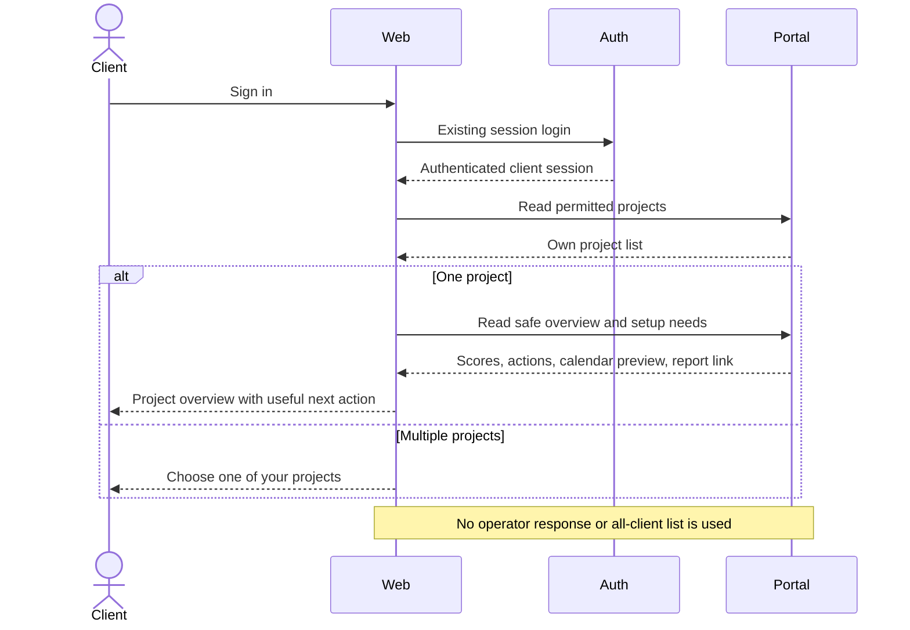

### SQ02 — Staged website understanding and client correction

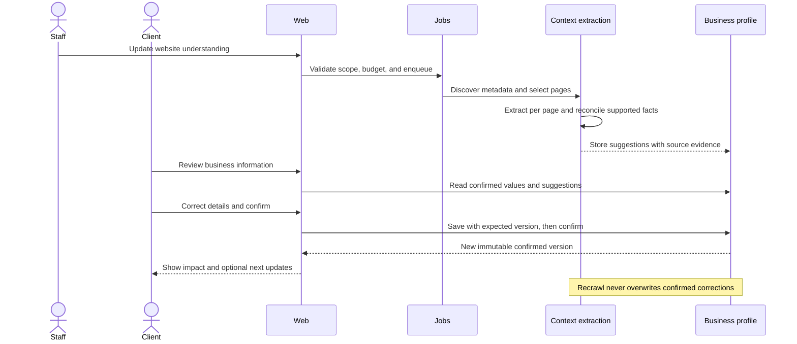

### SQ03 — Target locations and actual measurement scope

```mermaid
sequenceDiagram
    actor User
    participant Web
    participant Profile
    participant Adapter as Provider capability mapping
    participant Measurement
    User->>Web: Select US customers and New York city target
    Web->>Adapter: Preview supported geographic scope
    Adapter-->>Web: Country supported; city support per provider
    User->>Web: Confirm supported targets or explicit fallback
    Web->>Profile: Save confirmed market version
    User->>Web: Authorized update results
    Web->>Measurement: Enqueue with market version and cost approval
    Measurement->>Adapter: Send validated effective location
    Adapter-->>Measurement: Observation and requested/effective scope
    Measurement-->>Web: Stored results with location disclosure
```

### SQ04 — Discover and confirm online accounts

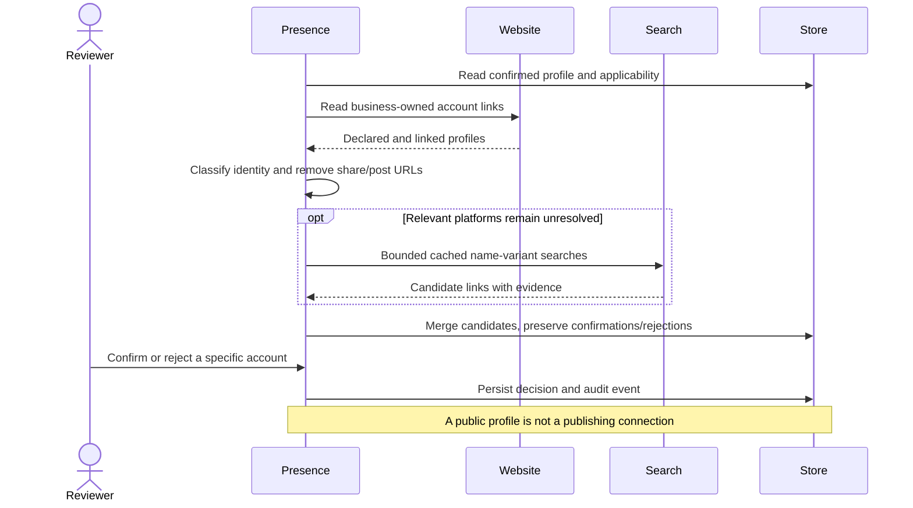

### SQ05 — Website facts to combined insights

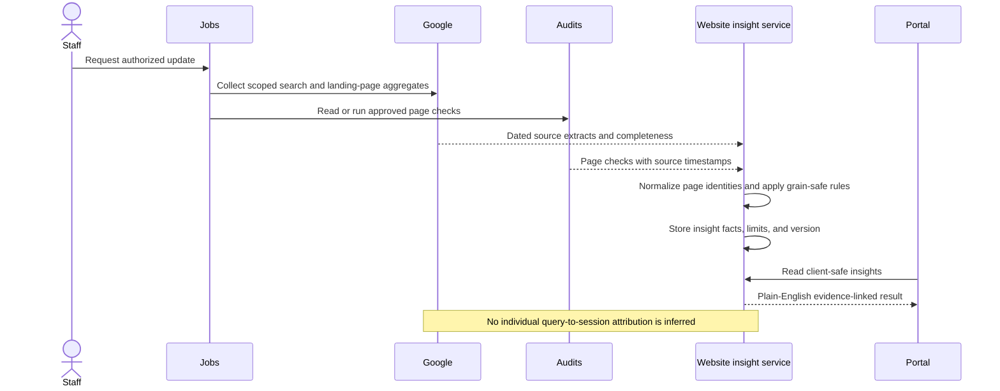

### SQ06 — Competitor discovery and comparison reuse

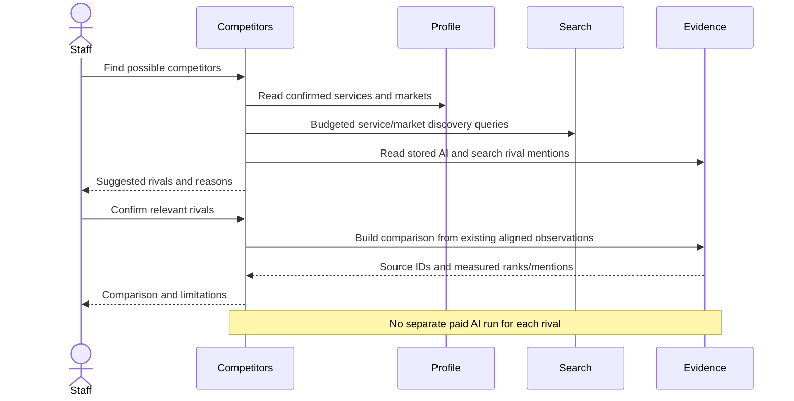

### SQ07 — Keyword gap to content without duplicates

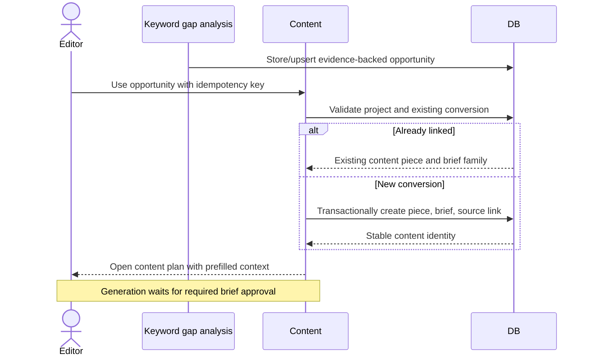

### SQ08 — Writing style and reliable draft generation

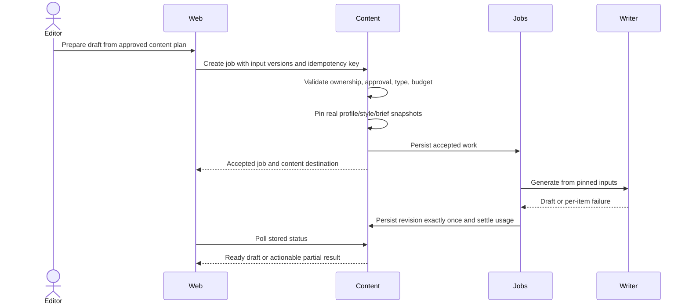

### SQ09 — One calendar, approval, and safe publishing

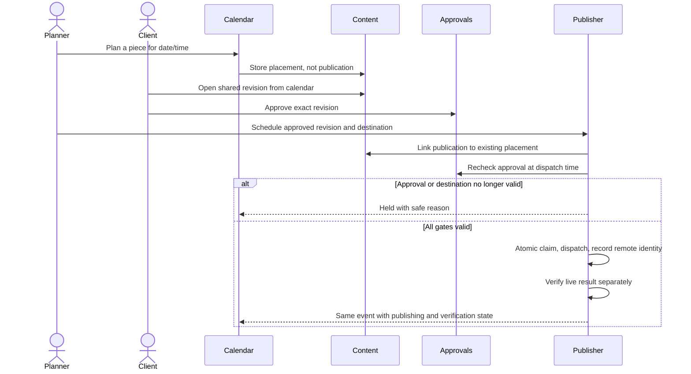

### SQ10 — Score calculation and honest overview

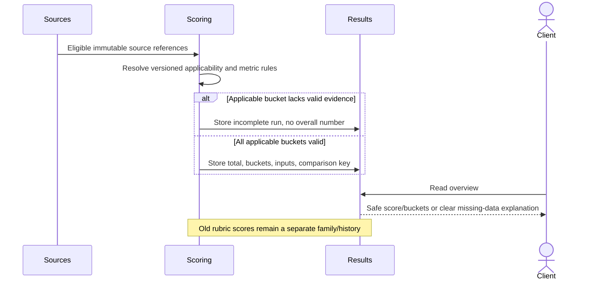

### SQ11 — High-level commitment to verified plan progress

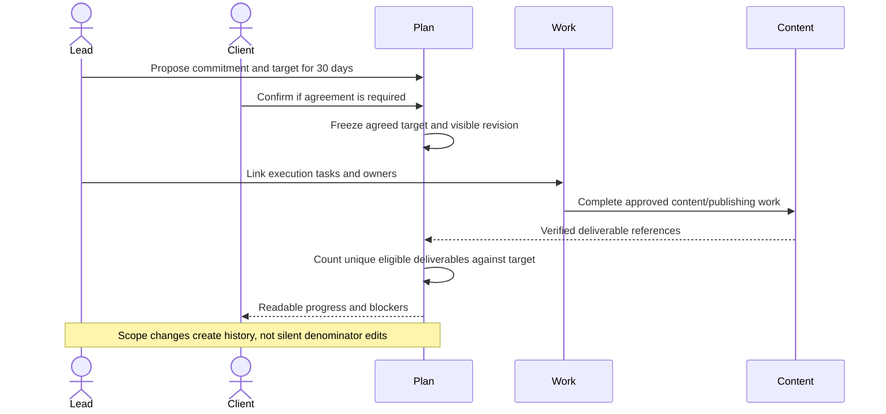

### SQ12 — Report release stays frozen and consistent

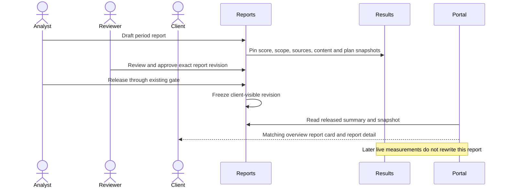

### SQ13 — Client correction versus recrawl conflict

```mermaid
sequenceDiagram
    actor Client
    participant Profile
    participant Crawl
    Client->>Profile: Confirm corrected service description v4
    Crawl->>Profile: Suggest older website wording from new scan
    Profile->>Profile: Compare field evidence and override decision
    Profile-->>Client: New suggestion available; your confirmed wording is unchanged
    alt Client keeps current wording
        Client->>Profile: Reject suggestion
        Profile->>Profile: Record rejection against suggestion fingerprint
    else Client accepts change
        Client->>Profile: Confirm new draft
        Profile->>Profile: Create v5 and preview downstream impact
    end
```

### SQ14 — Unsupported channel remains a manual plan

```mermaid
sequenceDiagram
    actor Planner
    participant Web
    participant Capabilities
    participant Schedule
    Planner->>Web: Plan a launch email
    Web->>Capabilities: Read supported creation and delivery modes
    Capabilities-->>Web: Manual planning supported; automated sending unavailable
    Web-->>Planner: Choose manual delivery, with explanation
    Planner->>Schedule: Save content plan and intended send date
    Schedule-->>Web: Planned manual entry linked to content
    Note over Web,Schedule: No send, ad spend, or external publication is triggered
```

## 20. Sequential implementation and rollout

### 20.1 Working rules

Implement **one module slice end-to-end at a time**, following the repository's analysis/approval/testing/documentation requirements. A shared dependency may need a small contract extension first, but do not scaffold a dozen unfinished modules or switch on screens backed by stubs.

For each phase: write/update the module analysis, identify approved existing tools, record options for genuinely new dependencies/providers, obtain required tool-choice approval, implement backend/data contracts, implement web experience, verify, document, and then proceed. This plan does not preapprove new npm packages or commercial integrations.

Because input quality affects every downstream screen, foundation work comes before cosmetic rollout of the new score. Low-risk copy/redirect design can be prepared early; user-facing removal of working routes happens only when their replacement exists.

### 20.2 Build phases and exit gates

| Phase | Module-sized slice | Deliverables | Exit gate |
|---|---|---|---|
| P00 | Contract inventory and product decisions | Confirm R35/R36 handling, nav/copy direction, score proposal, publishing scope, role edits. Record runtime capability baseline without changing production data. | Signed-off scope and approved tools; feature fixtures available. |
| P01 | Client projection hardening | Allowlisted plan DTOs; released-summary consistency; permission tests for future client reads. | No private staff data in client JSON; report card/detail agree. |
| P02 | Business information | Reuse profile versions, suggestion review, override retention, stable field evidence; replace stale Site Context UI. | Client correction survives recrawl; explicit downstream rebuild. |
| P03 | Structured website extraction | Metadata selection, staged extraction/reconciliation, bounded jobs/costs, source review. | Coverage fixtures pass; failed stage resumes without losing confirmed data. |
| P04 | Target markets | Structured confirmed country/city/language targets, mapping support preview, explicit effective scope. | India HQ/US buyers fixture measures US; unsupported city disclosed. |
| P05 | Online presence | Unified inventory, applicability, match evidence, rejection memory, social summaries. | No irrelevant GBP penalty; ambiguous account never auto-owned. |
| P06 | Competitors | Service/market discovery, candidate review, snapshot-based comparison reuse. | Partners/directories excluded; page load makes no paid calls. |
| P07 | Keyword gaps/opportunities | Observed-corpus gap analysis and canonical idea records; design the conversion contract for P08. | Unknown ranks handled; repeated analysis does not duplicate ideas. |
| P08 | Content identity/workspace | Brief family repair, canonical list/states, revisions, idempotent idea conversion, shared-content portal APIs. | Rename-safe history; repeated conversion deduplicated; clients cannot read unshared drafts. |
| P09 | Writing style and generation | Editable confirmed style; real input snapshots; durable generation; contextual dialog. | Restart/idempotency/type-capability tests pass. |
| P10 | Content calendar/publishing linkage | Plan placements, range reads, guarded reschedule, one component, old-calendar redirects. | Month complete beyond 200 entries; approval gates/DST tests pass. |
| P11 | Thirty-day commitments/actions | High-level plan, progress rules, visible revision policy, actor action queue. | Verified progress and correct client actions; execution detail remains staff-only. |
| P12 | Unified Website | Normalize Google/audit/page data, insight rules, page detail, page-analysis migration. | Grain-safe joins and missing-source cases pass; no attribution fabrication. |
| P13 | Unified AI visibility | Own-business/question composition, preserved versions/history, comparison links. | Scope/denominator truth preserved; no duplicate prompt destination. |
| P14 | New scoring methodology | Approved submetrics/weights, applicability, immutable runs, comparison rules. | Fixture-calculated scores match exactly; incomplete data has no fake total. |
| P15 | Overview/results/report adoption | Simplified overview/client Results; new frozen report sections; safe summaries. | Live/report separation and full approval/release journey pass. |
| P16 | Final navigation/copy rollout | Migrate remaining links, role menus, mobile/accessibility/usability pass. | No broken legacy deep links; nontechnical tasks succeed. |

The ordering may be adjusted to land safe UI-only renames sooner, but dependency gates remain: market/profile accuracy before market-based discovery, content identity before schedule linkage, source data before composite scoring, safe portal contracts before client exposure. Within P12, complete Google data extensions before the Website composition/UI; do not mark a phase complete with a missing source layer disguised by placeholders.

### 20.3 Migration strategy

1. Inventory current rows, relationships, ambiguous brief families, duplicate recommendations, scheduled publications, confirmed profiles, and released reports using read-only queries. No production cleanup by assumption.
2. Add nullable/backward-compatible fields and new tables/indexes. Keep old readers working.
3. Backfill with stable mapping tables and dry-run counts. Classify uncertain records for manual review.
4. Add new readers and compare them against old source truth in tests/staging. Do not dual-write independent competing business objects.
5. Expose new feature per project/audience through an existing suitable rollout mechanism or an approved small configuration extension.
6. Redirect old list routes once replacements work; retain detail URLs and compatibility API behavior.
7. Monitor errors, duplicate rates, stale data, denied access, and user-task completion.
8. Remove dead UI/adapters only after consumers are checked. Never delete historical facts, approvals, or reports as part of navigation cleanup.

The worktree currently contains untracked PostgreSQL schema/migration work under `backend/prisma/schema.postgres.prisma` and `backend/scripts/migrate-to-postgres.js`. Those are user-owned and were not changed for this plan. Confirm the active database/migration strategy before creating schema changes; do not overwrite or silently reconcile those files. Test migrations against the chosen deployment database and a backup/restore rehearsal.

### 20.4 Rollback

Rollback should route affected users to the previous working UI and disable new writes/collection while preserving all new records. Use backward-compatible reads or translation where new content/placements exist. Do not drop tables or delete successful publications to roll back a frontend release.

Score rollout can revert to showing a clearly named legacy score or no complete broad score, but must not label legacy values as the new Cailyx metric. Report revisions released under the new methodology remain frozen and readable with their versioned explanation.

### 20.5 Rollout checks

Test on representative projects: new empty business, online SaaS, local service business, multi-market/multilingual business, one-brand project, multi-brand project, missing Google access, only one connected source, stale partial evidence, no eligible social data, large content calendar, and a paused project with scheduled publications.

Use a small internal/staging cohort first. Budgeted live tests and external publishing tests require approved credentials/scope and a designated test destination; never publish to a real client's channel merely to check a release.

## 21. Verification and completion checklist

### 21.1 Test layers

| Layer | Required checks |
|---|---|
| Unit | Score formulas/states, page normalization, grain-safe calculations, applicability, identity decisions, status mapping, calendar timezone conversion. |
| Contract | DTO validation, pagination/range envelopes, scope ownership, allowed client fields, error reason codes, idempotency replay/conflict. |
| Integration | Context→profile suggestions; market→provider mapping; opportunity→brief→generation; plan placement→approval→publication; report snapshot consistency. |
| Concurrency/recovery | Two writers editing same profile/style/schedule; duplicate conversion requests; worker crash/retry; multi-instance publication claim; session refresh while polling. |
| Frontend | Route migration, filters/back behavior, loading/partial errors, permission-specific controls, no technical client error dumps. |
| Accessibility | Keyboard/modal focus, labelled inputs, status announcements, contrast, chart alternatives, mobile agenda/reschedule form. |
| Security | Cross-project nested IDs, other-client read attempts, unshared drafts via calendar/search/counts, SSRF/redirect targets, HTML sanitization, raw-answer/secret leakage. |
| End-to-end | The client and staff journeys below using controlled fixtures and authorized integrations. |

### 21.2 End-to-end acceptance journeys

1. New client signs in, confirms business details and US targets while headquartered elsewhere, and connects the correct Google properties.
2. A recrawl suggests different wording; the confirmed client correction survives until deliberately changed.
3. An online-only SaaS sees relevant software/professional profiles without an unsupported missing-local-profile penalty.
4. Two similar company names produce an ambiguous account candidate; client rejects it, and the next scan does not re-add it as owned.
5. A partner link is not promoted into a competitor; a service/market rival is suggested with evidence and confirmed.
6. Competitor comparison reuses the existing source observations; repeat reads spend nothing and do not change historical comparison scope.
7. A measured keyword gap opens a prefilled content plan; double-click/retry returns the same content piece.
8. Staff approves the content plan, uses a confirmed writing style, starts generation, closes the browser, and later receives one completed revision after a simulated worker restart.
9. Client sees only the shared review revision; a newer private staff revision remains invisible through every endpoint.
10. Calendar shows the planned piece before approval; publication remains blocked until exact-revision approval and valid destination exist.
11. Rescheduling across a DST boundary requires a valid explicit time; staff/project/client calendar views agree on the same instant.
12. Editing approved content stops pending dispatch until the new revision is approved; retry cannot create duplicate remote content.
13. Website insight correctly relates page health/search/landing facts without multiplying sessions by the number of query rows.
14. Missing Analytics leaves visitor metrics unavailable while Website checks and Google Search results remain useful.
15. Incomplete score data shows measured bucket values without inventing a numeric overall score; comparable complete runs show a valid change.
16. Plan progress counts verified unique deliverables against a frozen agreed target; changed scope is visible.
17. Released report score/card/detail remain identical after later live-score updates and a new draft report revision.
18. Nontechnical client can find a requested approval, explain whether content is planned or published, and correct their target location without seeing internal setup details.

### 21.3 Documentation and repository completion

For each completed module, follow AGENTS.md: module README with architecture/API/dependencies/environment/consumers/PRD alignment/testing; SPEC/REQUIREMENTS/SETUP-STATUS in the module where applicable; approved analysis in `docs/analysis`; `docs/API.md` and Swagger/OpenAPI updated; plan/module-status/changelog updated; production readiness updated when dependencies/integrations/configuration change.

Run the current valid TypeScript/build/lint commands in `web/` and `backend/`; verify actual package scripts rather than blindly using obsolete `frontend/` paths. Run feature tests and the required authorized end-to-end checks. Record what ran and what remains unverified; no completion claim based only on a successful typecheck.

Check public method/component documentation, no new `any` types, DTO input validation, clean imports/exports, and `.env.example` for approved new configuration. Never commit secrets. Keep intentional automated tests in the project's test conventions; remove one-off scratch artifacts after verification.

This documentation-only planning task does not need an application build and does not mark any implementation module complete.

## 22. Decisions requiring confirmation

These decisions can be taken phase by phase. They should not be silently treated as settled because a proposed design appears above.

| Decision | Recommended direction | Why / what waits |
|---|---|---|
| D01 Score buckets and weighting | Approve a measurable version of the six-bucket proposal, or reduce it; strict incomplete-data policy initially. | Required before scoring implementation/activation. |
| D02 Client content creation | Default to team-created content and client review; enable client self-service only explicitly. | Determines permissions and visible primary actions. |
| D03 Plan agreement/release | Staff draft → reviewed/shared proposal → agreed commitment where required. | Current portal plan has no full editorial-release equivalent; choose the necessary policy. |
| D04 Client edit permissions | Named editor/owner may confirm profile, markets, style, and account ownership. | Avoid giving all invited seats write authority. |
| D05 Search Trackers | Keep as staff search-measurement setup, explain before any redesign. | R35 does not approve removal of tracking/history. |
| D06 Buyer Research | Clarify whether this means customer questions, buyer-stage mapping, or original research. | Do not duplicate the new Customer questions feature under another title. |
| D07 Research Campaigns | Keep staff-only until purpose/scope relative to jobs and measurement plans is confirmed. | Avoid deleting campaign history or shipping another overlapping client section. |
| D08 Data Assets | Clarify original research/data products versus uploaded evidence/reference files. | Different lifecycle, permissions, and publishing implications. |
| D09 Claims | Keep factual review enforcement; decide whether a standalone staff catalogue remains useful. | Sidebar simplification must not remove approval checks. |
| D10 Automated email/social/ads | Planning/manual mode first; separate approved provider analysis for automation. | Current implementation does not support all advertised channel execution. |
| D11 City targeting fallback | Explicit country fallback or leave unsupported, selected by an authorized user. | No false city-specific measurement claims. |
| D12 Database migration | Confirm active schema/database strategy before feature migrations. | Preserve user-owned PostgreSQL migration work. |
| D13 New canonical route paths | Adopt short consolidated routes with redirects; retaining old paths temporarily is acceptable. | Visible labels can improve without breaking bookmarks. |
| D14 Paid collection cadence | Per-project schedule/caps based on approved service and evidence needs. | No blanket daily multi-provider runs. |

No clarification is needed to preserve R34 refreshes, to remove duplicate primary destinations once replacements exist, or to use simpler client language. The unresolved items above are deliberately separated from the confirmed work.

## Appendix A — Backend additions and extensions

These are the remaining backend changes required by this plan, **not a restatement of the previous plan's G01–G20 gaps**. Many previous gaps are now implemented. Priority means dependency/risk, not an instruction to work on several modules simultaneously.

### A01 — Safe client projections and report-summary consistency · P0 · Extend

**Why:** The simpler client UI needs safe JSON, not merely fewer visible fields. Current plan projections retain operational fields; report-summary score sources can diverge from frozen report detail.

**Owner/files:** `delivery-plan/delivery-plan.service.ts`, its DTO/types, `client-portal/client-portal.service.ts`, `reporting/report-lifecycle.service.ts`, `results/results.service.ts`.

**Work:** Define allowlisted client work/cycle/commitment types; omit internal hours, actor IDs, private source IDs, internal notes, provider diagnostics, and costs unless a specific field is deliberately part of the client contract. Preserve public ownership labels and permitted resource IDs needed for navigation. Resolve report summary values from the released snapshot. Add safe-projection helpers without exposing broad generic serializers.

**Done when:** Contract tests inspect response JSON, not screenshots, for another project's IDs/private fields; released card/detail stay consistent during draft revision edits.

### A02 — Business-profile evidence and correction retention · P0 · Extend

**Why:** Editable context is already partly implemented; missing integration/evidence must not produce a competing source of truth.

**Owner/files:** `business-profile/*`, `aeo-audit/aeo-context.service.ts`, profile/context Prisma models.

**Work:** Field-level source suggestions, explicit accept/reject, override retention, optimistic editing, downstream impact preview, and extension of approved rebuild targets. Read effective confirmed values through one typed service. Record missing/cleared fields distinctly.

**Done when:** Confirmation is attributable and immutable; recrawl cannot undo corrections; conflicting concurrent edits return a recoverable 409.

### A03 — Staged website understanding · P1 · Extend

**Why:** Current one-pass synthesis and path heuristics do not provide the requested structured selection and field-level supported understanding.

**Owner/files:** `aeo-audit/aeo-context.service.ts`, `aeo-audit.types.ts`, context DTO, existing fetcher/jobs/budget services.

**Work:** Persistent page inventory/selection, metadata-based classification, source coverage quotas, per-page extracts, deduplication/conflict handling, validation, resumable stages, request/token/cost caps, and exact-host/redirect validation. Reuse existing LLM/fetch providers; no vendor switch implied.

**Done when:** Fixtures distinguish services from pricing tiers/team names; unsupported facts are removed; failed extraction retains usable suggestions; invalid/private URLs fail safely.

### A04 — Confirmed target locations and adapter support mapping · P0 · Extend/New resource

**Owner/files:** `business-profile/*`, `aeo-audit/aeo-audit.service.ts`, measurement adapter contracts, `measurement/adapters/cloro.adapter.ts`, `serp-intelligence/*`, keyword-research location DTOs.

**Work:** Typed target-market versions, country/city/language mappings, requested/effective scope persistence, explicit fallback policy, removal of silent defaulting in confirmed-market workflows, and comparability-key updates. Preserve historical ccTLD/default-derived results as historical rather than relabelling them confirmed.

**Done when:** The selected buyer market reaches the provider payload; unsupported city precision is never reported as observed; changing markets creates a comparison break.

### A05 — Applicability and stronger account resolution · P1 · Extend

**Owner/files:** `digital-presence/presence.service.ts`, `presence.discovery.service.ts`, `presence.serp.service.ts`, `presence.types.ts`, DTO/controller.

**Work:** Persist applicability reasons/overrides, extend matching with domain/description/role evidence, retain manual-confirmed precedence, remember rejected matches, expose consolidated inventory, and add constrained portal confirmation/correction routes. Apply applicability consistently to data pulls and scores, not UI alone.

**Done when:** An irrelevant platform creates neither a missing-profile card nor score penalty; founder/share/reel links do not become company accounts; walled profiles stay unknown/found rather than missing.

### A06 — Honest social metrics · P1 · Extend

**Owner/files:** `digital-presence/presence.apify.service.ts`, `presence.service.ts`, social/profile/post snapshot models.

**Work:** Store collection period, account identity, sampling coverage, deduped post IDs, profile follower snapshots, metric availability, and source limitations. Define posting cadence from observed post dates rather than fetch counts. Implement reply/comment metrics only if existing approved collection actually supplies them.

**Done when:** Re-fetching the same posts does not inflate activity; “growth” requires separate dated snapshots; unsupported engagement fields remain absent.

### A07 — Evidence-based competitor discovery · P1 · Extend

**Owner/files:** `competitors/competitors.service.ts`, DTO/controller, shared SERP service, business-profile reader.

**Work:** Service/customer/market queries, stored AI/SERP candidate extraction, identity/role normalization, source explanations, stable rejection history, manual additions, bounded jobs and costs. Use existing provider adapters where approved; do not buy a new competitor database silently.

**Done when:** Known partner/directory/client-brand fixtures are not auto-promoted; confirmed competitor lists survive refresh; discovery cost is bounded and recorded.

### A08 — Reusable aligned competitor comparison · P1 · Extend

**Owner/files:** `competitors`, `serp-intelligence`, measurement/results cohort/evidence services.

**Work:** Comparison snapshots with cohort/market/time/competitor-set version, derived mentions/ranks from existing observations, richer prospective SERP fields where required, and no paid calls on reads. Document rank depth and missing raw evidence.

**Done when:** Repeated comparison reads do not collect data; adding a rival creates a new derived snapshot without rewriting old reports; unsupported historical URLs/ranks are not invented.

### A09 — Keyword gap opportunities · P1 · New calculation over existing data

**Owner/files:** `keyword-research`, `serp-intelligence`, `competitors`, canonical content-opportunity reader/writer.

**Work:** Scope-bound observed-corpus gap rules, relevance/demand enrichment, known-not-found versus unknown rank, source snapshots, duplicate suppression, dismiss/reopen policy, and filters. Keep existing manual research and priority ranking separate from verified gap identity.

**Done when:** A gap explains the exact client/rival result that supports it; no volume/CPC/difficulty data is fabricated; the same idea is not duplicated on every run.

### A10 — Content identity and consolidated reader · P0 · Extend

**Owner/files:** `content/content.service.ts`, DTO/types/controller, `growth-execution`, `ContentBrief`, `GrowthAsset`, `ContentRevision`.

**Work:** Stable brief families, links among idea/piece/brief/revision, idempotent promotion, unified filtered list/counts, explicit status axes, and taxonomy separating executable website tasks from publishable content.

**Done when:** Renaming preserves history; equal titles do not merge unrelated pieces; retries return the existing conversion; content counts distinguish pieces and placements.

### A11 — Editable writing-style profile and actual generation inputs · P0 · New versioned record, existing extraction reused

**Owner/files:** `content`, `digital-presence/presence.brand-voice.service.ts`, generation DTO/input resolution.

**Work:** Draft/confirmed style versions, extracted suggestion linkage, client permissions, actual style/profile snapshot resolution, project ownership validation, and historical fingerprints. Keep old label-only jobs identifiable as legacy.

**Done when:** Inspecting a generated revision proves which real style/profile text was used; recrawl cannot replace the confirmed style; cross-project version references fail.

### A12 — Durable contextual generation · P0 · Extend

**Owner/files:** `content` job methods and runner integration, existing `jobs`, `budgets`, and activity infrastructure.

**Work:** Immediate accepted response, transactional enqueue, idempotent output writes, worker claim/recovery, failed-item-only retries, cancellation policy, cost reservation/settlement, and polling. Maintain approved-brief requirements and type capability validation.

**Done when:** Closing the page/restarting a worker does not lose the task or duplicate successful output; retries cannot bypass budget/approval or alter pinned inputs.

### A13 — Client content and sharing contracts · P0 · New projection

**Owner/files:** `content`/client-portal controller and projection services, approvals integration, attachment access policy.

**Work:** Safe list/detail/selected revisions, explicit visibility policy, counts/search/history filtering, safe linked plan/schedule state, and client editing only if explicitly enabled. Preserve existing portal approval endpoints.

**Done when:** A user cannot reach private content through a guessed asset/revision ID, count, calendar, attachment, or notification; the shared older revision stays visible while a new private draft exists.

### A14 — Canonical calendar and planned placements · P0 · New planning record + publishing extension

**Owner/files:** content schedule service, `publishing`, calendar projections in operations/portal.

**Work:** Planned-before-approval record, stable event ID, server range/pagination, timezone semantics, guarded reschedule/cancel, publication linkage, manual-mode evidence, and cross-instance dispatch protection. Extend publication reads where needed, but do not relax publication creation gates.

**Done when:** One placement yields one event through all stages; all rows in a large window are reachable; another client's content never leaks; DST/concurrent-dispatch cases are safe.

### A15 — Commitments and actor-required actions · P1 · Extend

**Owner/files:** `delivery-plan`, approvals/onboarding readers, operations summaries.

**Work:** Outcome/target groups under cycles, unique-deliverable progress, frozen targets/scope history, chosen plan-release policy, actor-specific action projection, and safe client DTOs. Reuse milestones where appropriate rather than create a second equivalent concept.

**Done when:** Plan shows goals instead of the entire gap list; action cards have actual permitted next actions; submitting evidence does not silently verify work.

### A16 — Website source extracts, page identity, and insights · P1 · Extend/New composition

**Owner/files:** `google/analytics.service.ts`, `search-console.service.ts`, audit/page-analysis owners, proposed `website-insights`.

**Work:** Required dimensions/metrics, compatible queries, completeness/range metadata, safe normalized page joins, deterministic insight catalogue, source freshness, client projection, optional grounded narrative. Reuse client connection delegation and validate source-property binding.

**Done when:** Search rows do not multiply visitor totals; wrong-property data is refused; missing/stale sources remain explicit; insights trace to inspectable facts.

### A17 — Unified AI read model · P1 · Extend

**Owner/files:** `aeo-audit`, `query-set`, `measurement`, `results`.

**Work:** Own-business summary/question aggregates, selected-set/period pagination, sample/failed-run disclosure, safe portal detail, and deep links to Competitors. Keep advanced run controls internal.

**Done when:** Prompt edits preserve historical versions; not-checked questions are not treated as zero; client detail excludes prohibited raw observation data.

### A18 — Broad Cailyx score · P1 after metric approval · Extend

**Owner/files:** `scoring`, rubric DTO/types, results comparability, schema migrations.

**Work:** Score family/version, approved metric adapters, applicability, optional total/state union, weighted evidence coverage, immutable inputs, and distinct comparison keys. Existing `ScoreRun.total` is non-null: choose a compatible extension/companion record rather than inserting fake zero for incomplete new runs. Legacy endpoints/readers must retain old behavior until explicitly migrated.

**Done when:** Every displayed value reproduces from pinned inputs; missing data is not poor performance; irrelevant platforms are excluded by recorded policy; historical scores remain unchanged.

### A19 — Overview and report adoption · P1 · Extend

**Owner/files:** `results`, `projects`/client-portal read composition, `reporting`, operations.

**Work:** Efficient audience-safe overview, live-versus-released score distinction, calendar/action previews from canonical readers, frozen new source/version references in reports, and plain-language templates.

**Done when:** Dashboard and report links identify the data actually shown; a new draft or live run cannot change the released snapshot; read requests do not trigger collection.

### A20 — Channel generation/delivery expansion · P2, separately approved

**Owner:** content writers and publishing provider adapters, one integration at a time.

**Work:** Add email/social/FAQ or other generation only with a real writer and tested output contract. Add CMS/social/email/ads delivery only after approved provider analysis, authorization scope design, remote resource mapping, retries/idempotency, verification, revocation, and test destination setup. Compare two or three options with current pricing/constraints when the integration is actually proposed; this plan does not invent or preapprove vendors.

**Done when:** Each advertised capability works end to end with approved test credentials and documented failure behavior. Until then, plan/manual-only labels remain. No fake OAuth URL or “published” badge.

## Appendix B — Request and response examples

### B.1 Proposed contract catalogue and verb policy

The following are **design contracts**, not claims about existing callable routes. Prefixes: `PAPI=/api/projects/:projectId`, `CAPI=/api/portal/projects/:projectId`. All responses are project-scoped; list responses have consistent pagination metadata. Existing endpoints referenced in section 17 remain the compatibility foundation.

| Resource | Proposed methods | Notes |
|---|---|---|
| Overview | `GET PAPI/overview`, `GET CAPI/overview` | No write or paid collection. |
| Required actions | `GET PAPI/actions-required`, `GET CAPI/actions-required` | Actor comes from session; client cannot query another assignee. |
| Website summary/pages | `GET PAPI/website-insights`, `GET PAPI/website-pages`, `GET PAPI/website-pages/:pageId`; matching safe CAPI reads | Bounded period/filter contract; source and page IDs scope-checked. |
| Website update | `POST PAPI/website-insight-jobs` | Authorized explicit update; returns job. |
| AI composition | `GET PAPI/ai-visibility`, `GET CAPI/ai-visibility` | Questions/history are filters or separately paginated child reads, not a full unbounded payload. |
| Market versions | `GET/PUT PAPI/target-markets`, `GET .../versions`, `POST .../confirm`, `POST .../support-preview`; permitted CAPI equivalents | Preview validates mappings without starting a paid measurement. |
| Profile suggestions | Extend existing candidates read; `POST PAPI/business-profile/suggestions/:id/decision` and permitted CAPI equivalent | Accept/reject into working draft; confirmation still explicit. |
| Applicability | `GET/PATCH PAPI/presence/applicability`; permitted safe CAPI equivalent | Expected version, reason, field-level permission. |
| Account decisions | Existing confirm/correct APIs; add reject/reconsider decision route and minimal CAPI equivalents | Persist rejection instead of delete/recreate loop. |
| Competitor discovery | Extend existing discover with explicit evidence-based mode or a named discovery-job route | Do not silently change legacy “promote explicit list” behavior into paid searching. |
| Competitor comparisons | Extend `GET PAPI/competitors/gap` or add versioned comparisons reader; safe CAPI read | Exact cohort/market/period and source snapshot. |
| Opportunities | `GET PAPI/content-opportunities`, `GET .../:id`, `PATCH .../:id`, `POST .../:id/use` | Status edit is permissioned; use is idempotent. Client reads only shared ideas if enabled. |
| Workspace | `GET PAPI/content-workspace`; `GET CAPI/content`, `GET CAPI/content/:assetId` | Client list/detail returns only shared content/revisions. |
| Writing style | `GET/PUT PAPI/writing-style`, `GET .../versions`, `POST .../confirm`; permitted CAPI equivalents | Generate suggestions through explicit staff action reusing voice extraction, not GET. |
| Generation | Extend `POST/GET PAPI/content-jobs` and detail/retry | Add an explicit async contract/opt-in compatibility mode before replacing synchronous behavior. |
| Schedule intentions | `GET/POST PAPI/content-schedules`, `GET/PATCH .../:scheduleId`, `POST .../:scheduleId/cancel` | Create/update needs content-write/schedule permission, not automatically publish permission. |
| Manual delivery evidence | `POST PAPI/content-schedules/:scheduleId/manual-delivery` and permissioned verification transition | Record claimed delivery time, approved revision, safe destination URL/evidence, and actor; independently verified state remains separate. |
| Calendar projection | `GET PAPI/content-calendar`, `GET CAPI/content-calendar`, `GET /api/operations/content-calendar` | Same event model, different permitted scopes. |
| Commitments | Extend cycle/milestone APIs or `GET/POST PAPI/plan-commitments`, `PATCH .../:id`, explicit propose/release/confirm transitions | Final resource choice in delivery-plan analysis; do not implement both parallel models. |
| Score family | Extend existing `/scoring` reads and `/scoring/run` with explicit family/version | Legacy requests retain legacy family; new UI opts into broad score. |

For high-volume question/page/idea lists, return one paginated collection per request or separate independently paginated fields. Do not return a single ambiguous cursor for several lists with different sort orders.

### B.2 Common error and state contract

```json
{
  "error": {
    "code": "CONTENT_VERSION_CHANGED",
    "message": "This content has changed. Review the latest version before continuing.",
    "retryable": false,
    "action": "open-latest-version",
    "requestId": "support-reference"
  }
}
```

Client errors contain safe messages and optional form-field errors; raw exceptions remain staff diagnostics. Request IDs may be copyable for support but need not dominate the UI.

| HTTP | Intended handling |
|---|---|
| 200/201 | Read/update/create completed as documented; inspect business state, not status code alone. |
| 202 | Accepted durable asynchronous work; not completed/published. |
| 400/422 | Validation errors; show relevant fields and keep entered values. |
| 401 | Existing refresh/login handling; no loop or lost unsaved text. |
| 403 | Permission denied; do not retry as a network error. |
| 404 | Missing or inaccessible resource; do not reveal another tenant's existence. |
| 409 | Version/state/idempotency conflict; reload/compare or resolve, not blind retry. |
| 429 | Respect retry window; no new duplicate operation. |
| 501/503 | Unsupported/not-ready capability or temporary unavailable dependency; translate safely for clients. |

An unmeasured metric is a successful data response with a `state`, not a transport error. A failed panel fetch is not an empty dataset.

### B.3 Proposed score response

Illustrates an incomplete run; omitted bucket rows are represented by the explicit summary in this shortened example, not permission to omit them from a real response.

```json
{
  "family": "digital-performance",
  "methodologyVersion": 1,
  "state": "incomplete",
  "measuredAt": "2026-09-16T06:00:00Z",
  "window": { "from": "2026-08-19", "to": "2026-09-15" },
  "coverage": { "measuredApplicableWeight": 80, "applicableWeight": 100 },
  "buckets": [
    {
      "key": "website-health",
      "label": "Website health",
      "state": "measured",
      "value": 82,
      "weight": 25,
      "updatedAt": "2026-09-15T23:10:00Z"
    },
    {
      "key": "google-visibility",
      "label": "Google search",
      "state": "not-measured",
      "weight": 20,
      "reasonCode": "SEARCH_SOURCE_NOT_READY",
      "message": "We still need Google search results for this period."
    }
  ],
  "comparison": {
    "state": "unavailable",
    "reason": "This score is not complete yet."
  }
}
```

There is deliberately **no `total`** in the incomplete branch. The production response includes every configured bucket and its state. Coverage is not a confidence percentage. A complete response adds a numeric total and the calculation reference; a not-applicable bucket has a recorded reason and no score.

### B.4 Proposed Website insight response

```json
{
  "id": "insight_123",
  "type": "search-demand-page-issue",
  "title": "An important page needs attention",
  "explanation": "People found this page in Google, but it could not be opened in our latest website check.",
  "page": { "id": "page_123", "title": "Payroll software", "url": "https://example.com/payroll" },
  "facts": [
    { "label": "Google clicks", "value": 84, "period": "19 Aug–15 Sep" },
    { "label": "Latest website check", "value": "Could not open", "date": "16 Sep" }
  ],
  "limitations": ["The website check and search results cover different times."],
  "action": { "kind": "open-page", "pageId": "page_123", "label": "View page details" }
}
```

Staff detail also includes exact source IDs, source windows/timezones, check/rule versions, and normalization mappings. Do not claim the inaccessible page caused all 84 visitors to fail; the counts and check time do not establish that.

### B.5 Proposed opportunity conversion request

`POST PAPI/content-opportunities/:id/use`, with `Idempotency-Key` header scoped to this project/operation:

```json
{
  "expectedOpportunityVersion": 3,
  "mode": "new-piece",
  "assetType": "article",
  "title": "Choosing payroll software for a small team",
  "marketVersionId": "market_v4",
  "language": "en-US"
}
```

```json
{
  "created": true,
  "contentId": "asset_123",
  "briefFamilyId": "brief_family_123",
  "briefId": "brief_v1",
  "briefState": "draft",
  "opportunityId": "opportunity_123",
  "nextAction": "review-content-plan"
}
```

A replay returns the same identities with an appropriate replay/created flag. Update-existing mode requires a validated existing page/content identity; a missing or foreign source fails before any row is created. Do not enqueue generation implicitly from this contract.

### B.6 Proposed writing-style draft

```json
{
  "expectedVersion": 4,
  "summary": "Clear, practical, and friendly. Use short sentences and explain unfamiliar terms.",
  "tone": ["helpful", "confident"],
  "preferredWords": ["your team"],
  "avoidWords": ["revolutionary", "guaranteed results"],
  "exampleText": "Spend less time checking payroll and more time supporting your team.",
  "callToAction": "Book a short demo",
  "channelOverrides": []
}
```

Saving creates/updates a working draft under existing-style version semantics; confirmation creates an immutable active version. Backend supplies authorship/confirmation fields from the authenticated actor, never trusting client-submitted `confirmedBy`.

### B.7 Proposed asynchronous generation extension

An explicit compatibility choice is required because current POST waits for generation. One acceptable rollout is an additive `executionMode: "async"` request field returning 202; existing callers retain documented behavior until migrated. Alternatively introduce a versioned route. Do not change legacy clients silently.

```json
{
  "executionMode": "async",
  "briefId": "approved_brief_v3",
  "assetType": "article",
  "writingStyleVersionId": "style_v5",
  "businessProfileVersionId": "profile_v7",
  "contentId": "asset_123",
  "outputCount": 1
}
```

```json
{
  "jobId": "job_123",
  "state": "queued",
  "contentId": "asset_123",
  "acceptedAt": "2026-09-16T08:00:00Z",
  "message": "Your draft is being prepared."
}
```

The request shape is proposed; adapt field naming to existing content-job DTOs during implementation. Resolve and validate actual immutable inputs before acceptance. The frontend derives safe route targets from resource identities rather than following arbitrary backend-provided external URLs.

### B.8 Proposed schedule request and calendar event

```json
{
  "contentId": "asset_123",
  "channel": "website",
  "deliveryMode": "manual",
  "localDate": "2026-09-22",
  "localTime": "10:00",
  "timezone": "Asia/Kolkata",
  "clientVisible": true,
  "expectedContentVersion": 3
}
```

```json
{
  "id": "schedule_123",
  "contentId": "asset_123",
  "title": "Choosing payroll software for a small team",
  "type": "article",
  "channel": "website",
  "scheduledAt": "2026-09-22T04:30:00Z",
  "timezone": "Asia/Kolkata",
  "state": "awaiting-approval",
  "deliveryMode": "manual",
  "publicationState": "not-started",
  "verificationState": "not-checked",
  "version": 1
}
```

`clientVisible: true` alone cannot expose an unshared draft: the server checks the content/revision sharing policy. Visibility is either rejected until sharing is explicit, or restricted to an approved safe plan title under a documented policy. Never leak a private title while hiding only the body.

Automated scheduling additionally requires a supported connected destination and the publishing workflow. Rescheduling sends expected schedule version and change reason; if dispatch already claimed the publication, return a clear conflict instead of pretending the original send was stopped.

For manual delivery, a permitted staff member records the approved revision, actual delivery time, external URL or other evidence, and a note. The system labels it “Reported as published” until the configured verification succeeds. Email send evidence is not proof of inbox delivery, and a remote saved draft is not a live article. This evidence action does not perform an external send or bypass content review requirements.

### B.9 Proposed required-action item

```json
{
  "id": "approval:approval_123",
  "kind": "content-approval",
  "title": "Review your product article",
  "reason": "Your approval is needed before we can publish it.",
  "dueAt": "2026-09-21T11:30:00Z",
  "status": "action-needed",
  "action": { "kind": "open-approval", "approvalId": "approval_123", "label": "Review article" }
}
```

The actor is resolved from the session and approval policy. This projection contains no independent writable “done” state; the approval decision resolves the source.

### B.10 Proposed commitment representation

```json
{
  "id": "commitment_123",
  "title": "Publish useful articles for your product launch",
  "workstream": "content",
  "period": { "from": "2026-09-16", "to": "2026-10-15" },
  "target": { "value": 10, "unit": "unique-published-articles" },
  "progress": { "verified": 3, "inProgress": 4, "notStarted": 3 },
  "state": "in-progress",
  "agreementState": "agreed",
  "message": "Three articles are published. Four are being prepared.",
  "scopeVersion": 1
}
```

Define whether manual publication with supplied evidence satisfies the unit and who verifies it. A webhook-created remote draft does not satisfy `published-articles`. Progress counters must come from linked unique eligible records, not arbitrary editable percentages.

## Appendix C — Requirement-by-requirement acceptance tests

| ID | Observable pass condition | Important negative test |
|---|---|---|
| R01 | Project overview shows a genuine versioned broad score or a clear incomplete state. | Artifact counts/legacy score are never relabelled broad performance. |
| R02 | Bucket cards match configured applicable score components and source snapshot. | No hardcoded four-card assumption or zero for unknown. |
| R03 | Initial overview contains only agreed concise summaries and useful links. | Full audit/run inventories do not dominate client landing. |
| R04 | Every action item has a current authorized action for that user. | Internal unassigned audit gaps do not become client obligations. |
| R05 | Plan is grouped by relevant high-level workstream and actual period. | Empty ads/email sections are not shown for every client. |
| R06 | Commitments show goals/targets/progress with detailed execution behind staff links. | Closing a task alone cannot imply an outcome goal was achieved. |
| R07 | All visible calendar scopes use the same content-only reader/component. | Work deadlines, report releases, and audit runs do not reappear as content events. |
| R08 | Event title opens existing content detail and selected placement. | No redundant calendar-only content editor or intermediate dead-end. |
| R09 | One Website destination offers health/search/visitor views. | Old links remain usable and lead to the correct preserved context. |
| R10 | Combined insights trace to compatible, grain-safe page/source facts. | Query fanout cannot multiply sessions; no invented query conversion attribution. |
| R11 | AI results and customer questions are one coherent experience. | Editing a current question cannot mutate historical observations. |
| R12 | Detailed competitor comparisons have one home. | Own-business AI summary does not duplicate the full rival workflow. |
| R13 | Business information is outside Research/Performance navigation. | Extracted suggestions cannot impersonate client-confirmed facts. |
| R14 | Selected source pages have metadata/relevance/coverage reasons. | Selection does not merely take the first N sitemap URLs. |
| R15 | Staged extraction persists supported per-page facts and reconciled suggestions. | Missing evidence or model failure does not result in invented services/markets. |
| R16 | Client corrections remain authoritative after recrawl. | Concurrent edits and rejected suggestions cannot silently overwrite them. |
| R17 | Single-brand users open useful details directly; multiple brands remain distinct. | Company and founder identities are not merged. |
| R18 | One Online presence screen combines inventory and useful activity. | It does not imply public discovery grants publishing access. |
| R19 | Clear account states replace redundant discovery tabs. | A not-checked platform is not labelled missing. |
| R20 | Discovery reads website links first and performs bounded alias searches for relevant unresolved platforms. | Repeated page loads do not spend search credits. |
| R21 | Account confirmation is evidence-backed and rejection is remembered. | Similar names, share links, login walls, and personal profiles do not become false ownership. |
| R22 | Applicability controls collection, recommendations, score, and display consistently. | Relevant missing profiles are not hidden just because absent; irrelevant profiles incur no penalty. |
| R23 | Social activity and writing style are separate outputs. | Captions alone do not fabricate reply rate or customer engagement. |
| R24 | Clients can edit/confirm style in Content; generation consumes actual pinned style. | Version label text alone cannot satisfy the generation-input test. |
| R25 | Rival suggestions use service/market/source relevance and confirmation. | Partner/customer/directory website mentions are not auto-tracked competitors. |
| R26 | Comparison reads existing aligned observation snapshots. | Rival additions do not trigger redundant paid measurement or rewrite released reports. |
| R27 | Verified ranking gaps are surfaced from the measured keyword corpus. | Failed/null captures do not become “not ranking”; full-market coverage is not claimed. |
| R28 | Opportunity starts a correctly prefilled content plan or existing-page update. | Double-click/retry cannot create duplicate pieces/briefs. |
| R29 | Keyword ideas have one canonical content view; manual research remains secondary. | Independent duplicate keyword lists/states do not diverge. |
| R30 | Confirmed buyer locations determine requested/effective provider scope. | HQ/ccTLD/default US cannot silently override US/city targets or unsupported precision. |
| R31 | Unified workspace shows meaningful linked stages and stable piece identity. | Equal titles cannot merge distinct pieces; one piece is not counted per revision. |
| R32 | Generation starts from a contextual action and continues durably. | A modal does not bypass approved-brief gates or lose work on page close. |
| R33 | Page analysis opens from Website/page detail and remains usable. | Existing analysis/history is not deleted during nav cleanup. |
| R34 | Update-existing-content workflow remains discoverable and linked to its page. | A refresh does not overwrite the existing live revision or automatically count as a new article. |
| R35 | Pending research tools remain staff-accessible with clear decision status. | No deletion or new client exposure without clarification. |
| R36 | Claims/data tools remain preserved; client review can show simple factual checks. | Navigation simplification cannot bypass claim gates or delete data. |

### Cross-cutting client-language acceptance

Run a copy audit on rendered client routes, including error and empty states. A client must not see a raw provider exception, API variable, JSON payload, model ID, database ID, or technical diagnosis as their only explanation. Source names/dates and necessary product names remain visible when helpful. Staff-only diagnostic routes are excluded from the no-jargon rule but still require readable explanations.

Conduct task-based usability checks with nontechnical participants: “What do you need to do?”, “What is scheduled next?”, “Has this article been published?”, “How can you correct what Cailyx knows about your business?”, and “Why is this number unavailable?” Record misunderstandings and revise copy/navigation before broad rollout. Do not declare the UX easy solely because the titles were renamed.

## Appendix D — Source map and implementation touchpoints

Paths below are the inspected starting points. Line numbers in the separate research notes identify specific findings; those numbers will move during implementation. Source behavior takes precedence over stale comments and historical README claims.

### D.1 Frontend

| Area | Source files / directories | Planned change |
|---|---|---|
| Navigation and audience shells | [navigation.ts](web/src/lib/navigation.ts), [OpsShell.tsx](web/src/components/layouts/OpsShell.tsx), [ClientShell.tsx](web/src/components/layouts/ClientShell.tsx) | Consolidated groups, roles, simple names, real project context. |
| Project pages | `web/src/app/(ops)/projects/[projectId]/` | Preserve detail identities; compose replacement screens and redirects. |
| Client project pages | `web/src/app/(client)/client/projects/[projectId]/` | Safe overview/content/calendar/business/result experiences. |
| Research adapters | [research.ts](web/src/services/research.ts), [research-library.ts](web/src/services/research-library.ts) | Reuse source contracts; add composed reads rather than component-level raw joins. |
| Content | [content.ts](web/src/services/content.ts), content pages under staff project routes | Stable workspace, contextual generation, writing-style profile. |
| Current calendar | [calendar.ts](web/src/services/calendar.ts), project calendar and content/calendar pages | Replace work/report-date model with canonical content projection. |
| Planning | [delivery-plan.ts](web/src/services/delivery-plan.ts), [planning.ts](web/src/services/planning.ts), [portal-plan.ts](web/src/services/portal-plan.ts) | Commitments, action-needed queue, safe client DTOs. |
| Client data | [portal-results.ts](web/src/services/portal-results.ts), [portal-profile.ts](web/src/services/portal-profile.ts), [portal.ts](web/src/services/portal.ts) | Preserve measurement unions, ownership, and frozen-release semantics. |
| API/error boundary | [api.ts](web/src/lib/api.ts), `web/src/app/api/`, existing session handlers | Stable reason mapping and existing protected same-origin sessions. |
| Shared UI | `web/src/components/patterns/`, `web/src/components/ui/`, `web/src/components/charts/` | Reuse rather than introduce an unapproved design system. |

### D.2 Backend

| Finding / responsibility | Primary source |
|---|---|
| Existing endpoint inventory | [openapi.json](backend/openapi.json), [api-docs.html](backend/api-docs.html); controllers are runtime contract owners. |
| Current fixed scoring model | [scoring.service.ts](backend/src/modules/scoring/scoring.service.ts), [scoring README](backend/src/modules/scoring/README.md), `ScoreRun`/`ScoreRubric` in [schema.prisma](backend/prisma/schema.prisma). |
| Context selection and one synthesis pass | [aeo-context.service.ts](backend/src/modules/aeo-audit/aeo-context.service.ts). |
| Editable confirmed business facts | [business-profile.service.ts](backend/src/modules/business-profile/business-profile.service.ts), [controller](backend/src/modules/business-profile/business-profile.controller.ts), [README](backend/src/modules/business-profile/README.md). |
| Existing country selection/defaults | [aeo-audit.service.ts](backend/src/modules/aeo-audit/aeo-audit.service.ts), [Cloro adapter](backend/src/modules/measurement/adapters/cloro.adapter.ts), [SERP service](backend/src/modules/serp-intelligence/serp-intelligence.service.ts). |
| Website-first profile discovery | [presence.discovery.service.ts](backend/src/modules/digital-presence/presence.discovery.service.ts). |
| Already implemented alias search | [presence.serp.service.ts](backend/src/modules/digital-presence/presence.serp.service.ts). |
| Expected platforms and social summaries | [presence.service.ts](backend/src/modules/digital-presence/presence.service.ts), [presence.types.ts](backend/src/modules/digital-presence/presence.types.ts). |
| Extracted writing style | [presence.brand-voice.service.ts](backend/src/modules/digital-presence/presence.brand-voice.service.ts), `PresenceBrandVoice` schema model. |
| Stored-list competitor discovery and result reuse | [competitors.service.ts](backend/src/modules/competitors/competitors.service.ts), [controller](backend/src/modules/competitors/competitors.controller.ts). |
| Manual keyword demand and priority ranking | [keyword-research.service.ts](backend/src/modules/keyword-research/keyword-research.service.ts), [controller](backend/src/modules/keyword-research/keyword-research.controller.ts). |
| Separate Google aggregate summaries | [search-console.service.ts](backend/src/modules/google/search-console.service.ts), [analytics.service.ts](backend/src/modules/google/analytics.service.ts), Google controller/connection services. |
| Content identity, brief history, inline generation | [content.service.ts](backend/src/modules/content/content.service.ts), [content.types.ts](backend/src/modules/content/content.types.ts), [controller](backend/src/modules/content/content.controller.ts). |
| Recommendations versus editorial plans | [growth-execution.service.ts](backend/src/modules/growth-execution/growth-execution.service.ts), GrowthAsset/ContentBrief schema definitions. |
| Existing publication safety and adapter limitations | [publishing.service.ts](backend/src/modules/publishing/publishing.service.ts), [scheduler](backend/src/modules/publishing/publication-scheduler.service.ts), [README](backend/src/modules/publishing/README.md). |
| Existing delivery cycles/work/projection | [delivery-plan.service.ts](backend/src/modules/delivery-plan/delivery-plan.service.ts), [controller](backend/src/modules/delivery-plan/delivery-plan.controller.ts). |
| Comparable results and safe aggregates | [results.service.ts](backend/src/modules/results/results.service.ts), [cohort.service.ts](backend/src/modules/results/cohort.service.ts), [evidence.service.ts](backend/src/modules/results/evidence.service.ts). |
| Frozen released reports and summary mismatch | [report-lifecycle.service.ts](backend/src/modules/reporting/report-lifecycle.service.ts), [client-portal.service.ts](backend/src/modules/client-portal/client-portal.service.ts). |
| Contract cross-check and exact inspected locations | [Research notes](docs/analysis/platform-change-contract-research.md). |

### D.3 External primary references used for Website constraints

- [Google Search Analytics query reference](https://developers.google.com/webmaster-tools/v1/searchanalytics/query): aggregate dimensions, time-window conventions, row limits/pagination, and incomplete coverage caveat.
- [Google Analytics Data API schema](https://developers.google.com/analytics/devguides/reporting/data/v1/api-schema): landing-page and session-source dimensions and metric definitions to validate against before implementation.

These references support the Website integration constraints, not a promise that every proposed dimension combination is accepted. Implementers must check compatibility and test the approved property/report requests.

### D.4 What is intentionally not changed by this planning task

No frontend/backend application code, dependencies, credentials, databases, active schedules, publications, reports, or user-owned migration files were changed. This task creates the implementation plan and its source-research note, and records that documentation work in the changelog. The previous [design_plan.md](design_plan.md) remains intact.

**Completion target for the future implementation:** a nontechnical client can understand their performance, confirm their business details, approve content, follow the next 30 days, and see what is scheduled—while staff retain accurate evidence, safe execution controls, and a single coherent workflow behind each action.
